# Armed-Context Preflight Architecture Planning — 2026-07-08

Status:
**Planning complete — validation domains separated; fail-closed architecture recommended; system remains disarmed; no code/config/authorization changes in this gate**

Gate type:
Read-only architecture and governance planning

Prerequisites:
`EV02 NO-TRADE DISARM AND RB-G9 CLOSURE — 2026-07-08.md` · `FRESH MICRO-LIVE SINGLE-TRADE EXECUTION GATE — 2026-07-08.md` · `Sessions/SESSION — RB-G9-20260707-EV02 — 2026-07-08/RB-G9 — REVIEW.md` · `FRESH ARMING TRANSITION EXECUTION GATE — 2026-07-07.md` · `VALIDATE LIVE SYSTEM STATIC VALIDATOR DRIFT REMEDIATION PLANNING — 2026-07-07.md`

Planning date:
**2026-07-08**

Strategy readiness:
**NOT READY**

OR-20260630-008:
**not_promoted** (unchanged)

**Code changed:** **No** · **Tests changed:** **No** · **Config changed:** **No** · **`.env` changed:** **No** · **Runtime stub created:** **No** · **New authorization created:** **No** · **Submit/broadcast invoked:** **No** · **Position/reconciliation/recovery/capital:** **none** · **System armed:** **No**

---

## 1. Prominent post-gate state

> **DISARMED · DRY · NO TRADE**
>
> **VALIDATION ARCHITECTURE PLANNED — NOT IMPLEMENTED**
>
> **EV02 CLOSED — DO NOT REUSE**

---

## 2. Files inspected (read-only)

| File | Purpose |
|------|---------|
| `EV02 NO-TRADE DISARM AND RB-G9 CLOSURE — 2026-07-08.md` | Root cause · disarm evidence · post-disarm 85/85 |
| `FRESH MICRO-LIVE SINGLE-TRADE EXECUTION GATE — 2026-07-08.md` | Phase 1 abort · armed probes that passed |
| `Sessions/SESSION — RB-G9-20260707-EV02 — 2026-07-08/RB-G9 — REVIEW.md` | ABORTED_BEFORE_BROADCAST classification |
| `FRESH ARMING TRANSITION EXECUTION GATE — 2026-07-07.md` | C1–C3 arming · dry preflight before arming |
| `FRESH ARMING TRANSITION EXECUTION PREPARATION REVIEW — 2026-07-07.md` | Arming sequence · dry evidence requirement |
| `VALIDATE LIVE SYSTEM STATIC VALIDATOR DRIFT REMEDIATION PLANNING — 2026-07-07.md` | V1–V4 drift design · dry-only intent |
| `POST-VALIDATOR REMEDIATION VERIFICATION REVIEW — 2026-07-07.md` | 85/85 dry baseline |
| `ARMED-STATE NO-TRADE DISARM AND RB-G9 GATE — 2026-07-07.md` | EV01 closure validation pattern |
| `validate_live_system.js` | Dry-oriented static validator · `dryRunMode === true` hard requirement |
| `run_safety_tests.js` | Monolithic 85-test manifest · sequential fail-fast |
| `test_n6_estop_drill.js` | E0 production posture guard · LIVE abort |
| `test_r16_live_path_coupling.js` | Mocked LIVE path · already posture-agnostic |
| `test_emergency_stop_validation.js` | Fake-signer e-stop containment (temp fixtures) |
| `test_micro_live_preflight.js` | Temp-runtime preflight · dry posture only |
| `live_executor.js` | `computeLiveArmedStatus` · `collectLiveSubmissionGateFailures` · R15 guard · `--status` |
| `live_config.json` | Current disarmed posture · hash `0996882e…` |
| `Authorizations/README.md` | EV02 records CONSUMED/CLOSED |

---

## 3. Structural conflict statement

The Fresh Micro-Live Single-Trade Execution Gate required **four conditions simultaneously**:

| # | Condition | Source | Armed LIVE state |
|---|-----------|--------|------------------|
| **1** | `liveArmed: true` · `LIVE_ARMED` posture | Arming transition C1–C3 · execution gate Phase 0 | **Required** |
| **2** | `validate_live_system.js` **PASS** | Execution gate Phase 1 policy | **Impossible** — validator hard-fails unless `dryRunMode === true` (`validate_live_system.js:176`) |
| **3** | `run_safety_tests.js` **fully green** | Execution gate Phase 1 policy | **Impossible** — `test_n6_estop_drill.js` E0 aborts if production `executionMode === "LIVE"` (`test_n6_estop_drill.js:314`) |
| **4** | Armed execution context (`executionMode: LIVE`, `dryRunMode: false`, `FOMO_ENABLE_LIVE_SUBMISSION=YES`) | Signed arming + stub + micro-live auth chain | **Required** |

**Formal impossibility:** Conditions 1 and 4 require `dryRunMode: false` and `executionMode: LIVE`. Conditions 2 and 3 require the opposite production posture (or refuse to run against LIVE production). **All four cannot hold at once.**

This is not an operator error or transient failure. It is a **structural architecture mismatch** between:

- **Disarmed readiness tooling** (Phase 1 validator + full safety suite including N6), and
- **Armed execution posture** (intentional LIVE configuration required for micro-live).

EV02 correctly aborted. The gate policy was internally inconsistent with the authorized armed state.

---

## 4. Validation-domain model

Three formally separated domains with **no shared PASS inference across posture boundaries**:

```mermaid
flowchart LR
  subgraph A [Domain A — Disarmed Readiness]
    D1[validate_live_system.js]
    D2[run_safety_tests.js full incl N6]
    D1 --> D2
    D2 --> ELIG[Eligible for arming workflow only]
  end

  subgraph B [Domain B — Armed-Context Execution Preflight]
    ARM[LIVE_ARMED posture]
    B1[validate_armed_preflight.js]
    B2[run_armed_preflight_manifest.js]
    ARM --> B1 --> B2 --> EXEC[Eligible for quote/confirm/execution gate only]
  end

  subgraph C [Domain C — Post-Disarm Closure]
    DIS[C1–C3 rollback + stub removed]
    C1[validate_live_system.js]
    C2[run_safety_tests.js full incl N6]
    DIS --> C1 --> C2 --> CLOSED[Session closed · flat state]
  end

  ELIG -->|Arming gate C1–C3| ARM
  EXEC -->|Disarm gate| DIS
```



| Domain | When | Establishes |
|--------|------|-------------|
| **A — Disarmed Readiness Validation** | Before any arming authorization execution | Codebase + dry posture safe to **begin** arming workflow |
| **B — Armed-Context Execution Preflight** | After arming, immediately before quotes/confirmation | Armed posture + auth + stub + guards safe to **proceed** within execution gate |
| **C — Post-Disarm Closure Validation** | After C1–C3 rollback and stub removal | System returned to known-good dry state; session may close |

**Critical rule:** Domain B evidence **does not replace** Domain A evidence. Domain C **re-validates Domain A** after disarm. No domain may treat another domain's skipped checks as PASS.

---

## 5. Domain A — Disarmed Readiness Validation

### Required production posture

| Field | Required value |
|-------|----------------|
| `executionMode` | `PIPELINE_DRY_RUN` (or legacy `DRY_RUN`) |
| `dryRunMode` | `true` |
| `liveArmed` | `false` |
| `operationalPosture` | `PIPELINE_OBSERVING` or equivalent dry posture |
| `FOMO_ENABLE_LIVE_SUBMISSION` | unset / not `YES` |
| `FOMO_ALLOW_LOOP_LIVE` | unset / not `YES` |
| Runtime R15 stub | **absent** |
| Executor loop | **0** running `--loop` processes |
| Positions / reconciliation / recovery | **0 / 0 / none** |
| Capital exposure | **none** |

### Required commands (unchanged)

```text
node validate_live_system.js          → exit 0 · 0 failures
node run_safety_tests.js              → exit 0 · 85/85 PASS (includes N6 E0–E10)
```

### What Domain A establishes

- Static codebase integrity (config schema, secret scan, Jupiter adapter structure, dashboard controls, JSONL validity)
- Full regression safety including N6 destructive e-stop drill in temp harness
- Dry pipeline behavior (`test_pipeline_dry_run.js`, handoff tests)
- **Eligibility to begin a future signed arming workflow only**

### What Domain A does **not** establish

- Live submission readiness
- Armed guard satisfaction
- Quote/build path proof under LIVE posture
- Micro-live execution authorization consumption

---

## 6. Domain B — Armed-Context Execution Preflight

### Required production posture

| Field | Required value |
|-------|----------------|
| `executionMode` | `LIVE` |
| `dryRunMode` | `false` |
| `liveArmed` | `true` |
| `operationalPosture` | `LIVE_ARMED` |
| `FOMO_ENABLE_LIVE_SUBMISSION` | `YES` |
| `emergencyStop` | `false` |
| Signed R15 session authorization | valid · unused · unexpired |
| Signed arming authorization | valid · bound to session |
| Signed micro-live execution authorization | valid · unexpired |
| Runtime R15 stub | **present** · loader-valid · session-bound |
| Executor loop count | **0** |
| Positions / reconciliation / recovery | **0 / 0 / none** |
| Capital exposure | **none** |
| `FOMO_ALLOW_LOOP_LIVE` | unset unless explicitly authorized elsewhere |

### Required checks (conceptual manifest)

| Category | Check | Method |
|----------|-------|--------|
| **Posture gate** | Refuse to run unless LIVE_ARMED | Entry guard in armed validator |
| **Authorization** | R15 · arming · micro-live · stub session IDs match | Read signed markdown + machine stub |
| **Process isolation** | No executor `--loop` · stale lock documented | Process enumeration + singleton guard |
| **Flat state** | 0 open positions · 0 pending reconciliation · 0 recovery | Read JSON/JSONL |
| **Signer/wallet** | `EXPECTED_WALLET_PUBLIC_ADDRESS` matches `walletPublicAddress` | Env + config compare *(no secret print)* |
| **RPC read-only** | Dedicated RPC reachable · balance read | Read-only `getBalance` |
| **Live submission gates** | All `collectLiveSubmissionGateFailures` pass | `live_executor.js --status` or exported helper |
| **R15 record** | `assertMicroLiveApprovalRecord` PASS | No-submit probe |
| **BUY guard** | Pre-submit blocked without confirmation path | No-submit `enterPosition` probe |
| **Candidate constraints** | Size ≤ cap · liquidity floor · slippage caps | Config + candidate packet cross-check |
| **Quote/build adapter** | Shared Jupiter `/swap/v1` reachable · no v6 host | Read-only HTTP probe · static source scan subset |
| **E-stop armed-safe** | N6 replacement probe (see §12) | Controlled no-submit path |
| **Capital / OR** | No exposure · OR not_promoted | Read-only status |

### Explicit exclusions from Domain B

| Excluded | Rationale |
|----------|-----------|
| `validate_live_system.js` dryRunMode=true requirement | Dry-only · posture-invalid when armed |
| `test_n6_estop_drill.js` full E1–E10 against production LIVE | Mutates temp harness mimicking LIVE; E0 explicitly forbids production LIVE |
| `test_pipeline_dry_run.js` as armed pass substitute | Asserts PIPELINE_DRY_RUN behavior |
| Any test requiring production `dryRunMode: true` | Posture conflict |

### What Domain B establishes

- Armed posture is **internally consistent** and **fail-closed** for the execution gate window
- **Eligibility to proceed** to fresh quotes and final per-trade confirmation only

---

## 7. Domain C — Post-Disarm Closure Validation

Identical to **Domain A** requirements, executed **after** C1–C3 rollback and stub removal.

| Step | Verification |
|------|--------------|
| C1 | `FOMO_ENABLE_LIVE_SUBMISSION` unset |
| C2 | `executionMode: PIPELINE_DRY_RUN` |
| C3 | `dryRunMode: true` |
| Stub | absent |
| `liveArmed` | `false` |
| Full validator | PASS |
| Full safety suite incl N6 | PASS |
| Flat state | 0 positions · 0 reconciliation · no recovery · no capital |

EV02 closure demonstrated this pattern successfully (85/85 · validator PASS · hash `0996882e…`).

---

## 8. Implementation options compared

### Option A — Context flag on existing validator

`node validate_live_system.js --context armed-preflight`

| Criterion | Assessment |
|-----------|------------|
| Fail-closed | **Moderate** — wrong context flag could run wrong rule set; must hard-refuse unknown context |
| Auditability | **Good** — single tool · shared result format |
| Accidental misuse | **High** — operator may run default (dry) context while armed and misread PASS/FAIL |
| Code duplication | **Low** — shared check functions |
| Test drift | **High** — one file serves two postures; regressions may break one context silently |
| Operator clarity | **Moderate** — one command · two modes · easy to forget flag |
| Backward compatibility | **Good** if default remains dry-only |

### Option B — Separate armed preflight script *(recommended)*

`node validate_armed_preflight.js` + `node run_armed_preflight_manifest.js`

| Criterion | Assessment |
|-----------|------------|
| Fail-closed | **Strong** — script entry refuses unless production posture is LIVE_ARMED |
| Auditability | **Strong** — distinct artifacts · separate exit semantics · explicit manifest file |
| Accidental misuse | **Low** — dry operators never invoke armed script; armed script fails closed if disarmed |
| Code duplication | **Moderate** — shared check library extracted from `validate_live_system.js` for posture-independent checks |
| Test drift | **Low** — dry validator frozen; armed manifest versioned independently |
| Operator clarity | **Strong** — command name encodes intent |
| Backward compatibility | **Strong** — zero change to existing dry commands |

### Option C — Filtered `run_safety_tests.js` manifest

`node run_safety_tests.js --context armed` or env-based exclusion

| Criterion | Assessment |
|-----------|------------|
| Fail-closed | **Weak** — skip lists are easy to misconfigure; risk of silent exclusion |
| Auditability | **Poor** — "85 tests" no longer means same thing |
| Accidental misuse | **High** — filtered run reported as "safety suite green" while tests skipped |
| Code duplication | **Low** |
| Test drift | **High** — manifest coupling to monolithic runner |
| Operator clarity | **Poor** — violates "full green" language unless renamed |
| Backward compatibility | **Risky** — changes meaning of existing command |

---

## 9. Recommended architecture

**Recommend Option B** — dedicated armed-context toolchain with a **governed manifest**, plus **unchanged Domain A/C commands**.

### Proposed command surface (future implementation)

| Domain | Static | Dynamic / tests |
|--------|--------|-----------------|
| **A — Disarmed** | `node validate_live_system.js` | `node run_safety_tests.js` |
| **B — Armed** | `node validate_armed_preflight.js` | `node run_armed_preflight_manifest.js` |
| **C — Closure** | Same as A after disarm | Same as A after disarm |

### Shared library (future)

Extract posture-independent checks from `validate_live_system.js` into e.g. `live_validation_common.js`:

- JSONL validity · position caps · dashboard endpoints · Jupiter adapter structure · secret scan · wallet format · swap config fields

Both validators import shared checks; **only dry validator enforces dryRunMode=true**.

### Orchestration wrapper (future, optional)

`node preflight_gate.js --domain disarmed|armed|closure` — thin dispatcher that **never** co-mingles results; emits single JSON receipt:

```json
{
  "domain": "armed-preflight",
  "posture": { "liveArmed": true, "executionMode": "LIVE", "dryRunMode": false },
  "configHashSha256": "...",
  "checks": [ { "id": "AP-01", "status": "PASS|FAIL|INAPPLICABLE", "detail": "..." } ],
  "failures": 0,
  "warnings": 2,
  "skippedDryOnly": ["validate_live_system.dryRunMode", "test_n6_estop_drill.E0-LIVE-guard"],
  "armedReplacements": ["test_n6_armed_estop_probe"],
  "exitCode": 0
}
```

**INAPPLICABLE is not PASS.** Receipt must list replacement evidence IDs.

---

## 10. Prohibited behavior

| Prohibition | Rationale |
|-------------|-----------|
| Armed mode skipping failed tests generically | Hides real failures |
| Broad waiver flag (`SKIP_SAFETY=1`, `FOMO_DISABLE_TESTS=YES`) | Fail-open bypass |
| Environment variable that turns safety tests off | Same |
| Silent exclusion from manifest without receipt | Audit gap |
| Treating skipped / inapplicable checks as PASS | EV02 root cause would recur |
| Reusing dry validator PASS while armed | Posture-invalid inference |
| Running N6 full drill against production LIVE | E0 guard exists for safety |
| Disarm via failed armed preflight | Armed preflight failure → abort execution · disarm is separate gate |

---

## 11. Armed-context check manifest

### Required checks (armed preflight)

| ID | Check | Replacement for |
|----|-------|-------------------|
| **AP-01** | Production posture LIVE_ARMED (`liveArmed`, `executionMode`, `dryRunMode`, FOMO flag) | — |
| **AP-02** | Signed authorizations valid (R15 · arming · micro-live · stub creation) | — |
| **AP-03** | Runtime stub present · session-bound · ack fields | — |
| **AP-04** | Executor loop count = 0 · no `--loop` PID | — |
| **AP-05** | Singleton lock state documented (stale OK if no loop) | — |
| **AP-06** | Open positions = 0 | — |
| **AP-07** | Pending reconciliation = 0 | — |
| **AP-08** | Recovery actions = none / documented | — |
| **AP-09** | Capital exposure = none | — |
| **AP-10** | Signer env present · wallet match *(no secret dump)* | — |
| **AP-11** | Dedicated RPC read-only OK | — |
| **AP-12** | `collectLiveSubmissionGateFailures` all pass | dry validator arming structure checks |
| **AP-13** | R15 `assertMicroLiveApprovalRecord` PASS | — |
| **AP-14** | BUY no-submit guard probe PASS | — |
| **AP-15** | Candidate packet bounds (size · CS rules) | — |
| **AP-16** | Jupiter quote/build read-only probe (lite-api `/swap/v1`) | partial dry Jupiter static checks |
| **AP-17** | N6 armed-safe e-stop probe (§12) | `test_n6_estop_drill.js` |
| **AP-18** | Config hash matches arming baseline or documented drift | — |
| **AP-19** | OR-20260630-008 not_promoted | — |
| **AP-20** | `test_r16_live_path_coupling.js` (mocked LIVE path) | — |

### Conditionally inapplicable (dry-only) — with replacements

| Dry check | Why inapplicable when armed | Armed replacement |
|-----------|----------------------------|-------------------|
| `validate_live_system`: `dryRunMode === true` | Armed requires `false` | **AP-01** posture gate |
| `validate_live_system`: `executionMode is non-live` | Armed requires `LIVE` | **AP-01** posture gate |
| `test_n6_estop_drill.js` E0–E10 (full) | E0 aborts production LIVE; drill uses temp harness assuming dry production | **AP-17** N6 armed-safe probe |
| `test_pipeline_dry_run.js` | Requires PIPELINE_DRY_RUN execution path | **AP-12** + **AP-14** LIVE guard probes |
| `test_pipeline_candidate_handoff.js` dry branch | Asserts dry-only handoff | **AP-14** no-submit BUY probe |

### Posture-independent checks (run in both domains via shared library)

- Secret scan · JSONL validity · open position caps · duplicate detection · dashboard control endpoints · Jupiter v6 removal · maxSubmitRetries policy · swap config schema · daily stop read · paper_trades hash unchanged during validation

---

## 12. N6 armed-safe replacement design

**Do not run `test_n6_estop_drill.js` against production LIVE.** Preserve E0 guard permanently.

### Proposed new probe: `test_n6_armed_estop_probe.js`

| Step | Action | Safety boundary |
|------|--------|-----------------|
| **N6A-0** | Preflight: production must be LIVE_ARMED; record config hash | Abort if disarmed |
| **N6A-1** | Read-only: `emergencyStop === false` in production config | No mutation |
| **N6A-2** | Temp harness only (`TRACKTA_RUNTIME_ROOT`); copy production cfg with `emergencyStop: false` | No production write |
| **N6A-3** | Controlled no-submit: invoke `submitSwap` / guard path with mocked RPC · **no broadcast** | Same pattern as R16 T11 |
| **N6A-4** | Set `emergencyStop: true` **in temp config only** | Production unchanged |
| **N6A-5** | Assert new entry blocked · `EXECUTION_ABORT_CODES` / guard precedence | Fail-closed |
| **N6A-6** | Assert e-stop blocks before signer/submit stage | Halt gate precedence |
| **N6A-7** | Postflight: production config hash unchanged | Same as N6 E10 |

### Evidence equivalence claim

N6A proves **halt gate precedence and entry blocking** under LIVE configuration without:

- Mutating production `live_config.json`
- Running destructive drill against production posture
- Submitting or broadcasting

Full N6 E1–E10 remains mandatory in **Domain A and C only**.

---

## 13. Validator context design (`validate_live_system.js`)

### Posture-independent checks (shared library — future)

| Section | Examples |
|---------|----------|
| CONFIG SAFETY (partial) | JSON valid · boolean flags · compounding/martingale disabled · position caps |
| ENVIRONMENT / SECRET SAFETY | `.env.example` · production secret scan · redaction helper |
| WALLET ADDRESS | format · dedicated wallet |
| POSITION SIZE | maxOpenTrades · loss caps |
| SWAP EXECUTION CONFIG | slippage · fee · retry policy |
| EMERGENCY STOP STATE | consistency rules *(read-only when armed)* |
| EXECUTION LOGGING SCAFFOLD | structural source checks · Jupiter adapter · RPC routing |
| JSONL VALIDITY | audit files |
| POSITIONS / DUPLICATES | open count |
| DAILY STOP | read-only |
| DASHBOARD CONTROL | endpoint presence |
| READ-ONLY DATA INTEGRITY | paper_trades hash |

### Dry-only checks (remain in `validate_live_system.js` only)

| Check | Line ref |
|-------|----------|
| `dryRunMode === true (Phase 1 required)` | `:176` |
| `executionMode is non-live` (pass when not LIVE) | `:175` |
| Result banner "dry run" semantics | `:655` |

### Armed-context variants (in `validate_armed_preflight.js` only)

| Check | Expected when armed |
|-------|---------------------|
| `executionMode === LIVE` | PASS |
| `dryRunMode === false` | PASS |
| `liveArmed === true` | PASS |
| `FOMO_ENABLE_LIVE_SUBMISSION === YES` | PASS |
| `emergencyStop === false` | PASS |
| Runtime stub present | PASS |
| No executor loop | PASS |

### Exit codes and machine-readable format

| Command | Exit 0 | Exit 1 | Exit 2 (proposed) |
|---------|--------|--------|-------------------|
| `validate_live_system.js` | 0 failures | ≥1 failure | — |
| `validate_armed_preflight.js` | 0 failures · posture OK | check failure | **wrong posture / refused** |

Machine-readable: extend existing `{ failures, warnings }` export with `{ domain, posture, checks[], configHashSha256, authorizationRefs[] }`. Human stdout unchanged for backward compatibility.

---

## 14. Transition invariants

```text
Dry Verified (A)
  → Arming Authorized (governance sign-off)
  → Arming Transition (C1–C3)
  → LIVE_ARMED
  → Armed Preflight PASS (B)
  → Candidate Selection / Confirmation Prep
  → Final Per-Trade Confirmation
  → Execution Gate (quotes → BUY → SELL)
  → Disarm (C1–C3 rollback + stub removal)
  → Closure Validation (C)
  → RB-G9 filed
```

| Invariant | Rule |
|-----------|------|
| Armed preflight timing | **After** arming · **immediately before** quote/confirmation |
| Dry evidence freshness | Domain A PASS within **30 minutes** before arming transition |
| Armed evidence freshness | Domain B PASS within **15 minutes** before quote presentation |
| Final guard probe | **Immediately before** submit (existing BUY guard · no-submit acceptable until confirm) |
| Drift invalidates | Any config/code/process/auth change voids all prior domain evidence |
| No inference | Preparation gate sign-off ≠ execution preflight PASS |

---

## 15. Evidence freshness rules

| Evidence type | Max age before use | Invalidated by |
|---------------|-------------------|----------------|
| Domain A validator + 85/85 | **30 min** before arming C1 | config hash change · code change · any test failure |
| Arming transition receipt | Current session only | disarm · session close |
| Domain B armed preflight | **15 min** before quote/confirmation | any AP check failure · process spawn · auth expiry |
| Signer/RPC read-only probe | **15 min** before quote | RPC mismatch · balance below floor |
| Final pre-submit guard | **Immediate** (same gate phase) | any state change after confirmation |

Store receipts: `Sessions/SESSION — …/preflight_evidence.json` with timestamps · config hash · command exit codes · check IDs.

---

## 16. Invalidation triggers

| Trigger | Effect |
|---------|--------|
| `live_config.json` hash drift | Void Domain A/B evidence · re-run applicable domain |
| `.env` flag change (C1/C3) | Void arming + armed preflight |
| Code change (any production `.js`) | Void all domains |
| Process change (executor loop started) | Void Domain B · abort execution gate |
| Authorization expiry/revocation | Void arming + B |
| Stub create/remove/session mismatch | Void B |
| Signer/RPC/wallet mismatch | Void B |
| Any safety check failure | Void applicable domain |
| E-stop active or ambiguous | Void B · block execution |
| Open position / pending reconciliation / recovery | Void B · block execution |
| OR-20260630-008 promotion | Void live-readiness chain · separate governance |
| Session reuse attempt | **Forbidden** — new R15 required |

---

## 17. Proposed governance sequence (future implementation)

| Step | Gate | Type |
|------|------|------|
| 1 | **Armed-Context Preflight Architecture Decision** | Taylor sign-off on Option B + manifest |
| 2 | Implementation Authorization | Governance-only · scope bounded |
| 3 | Implementation Gate | Code + tests · no arming |
| 4 | Regression Test Gate | Dry 85/85 unchanged · armed manifest tests added |
| 5 | Dry Proof Gate | Domain A/C on disarmed system |
| 6 | Armed No-Submit Proof Gate | Domain B on intentionally armed fixture session *(not production trade)* |
| 7 | Runbook Update | Operator docs · gate prerequisites amended |
| 8 | **Fresh R15 Session** | New session ID only after 1–7 complete |

**No step 8 without steps 1–7.** EV02 must not be reused.

---

## 18. Required regression coverage (future implementation gate)

| Test | Requirement |
|------|-------------|
| Dry `validate_live_system.js` | Unchanged behavior · still requires `dryRunMode: true` |
| Dry `run_safety_tests.js` | Still 85/85 · N6 E0 still aborts production LIVE |
| `validate_armed_preflight.js` | Exit 2 if disarmed · exit 1 on check failure |
| Armed manifest | Cannot report INAPPLICABLE as PASS |
| Armed manifest | Fails if executor loop exists |
| Armed manifest | Fails on signer/RPC/stub/session mismatch |
| Armed manifest | Never calls submit/broadcast |
| `test_n6_armed_estop_probe.js` | Production config hash unchanged |
| Execution gate doc | Requires Domain B · not Domain A dryRun check |
| Disarm gate doc | Requires Domain C identical to A |

---

## 19. Required output summary

| Item | Value |
|------|-------|
| **Planning note path** | `ARMED-CONTEXT PREFLIGHT ARCHITECTURE PLANNING — 2026-07-08.md` |
| **Structural conflict** | Four simultaneous requirements (LIVE_ARMED + dry validator PASS + full safety incl N6 + LIVE config) are **mutually exclusive** |
| **Validation-domain model** | **A** Disarmed Readiness · **B** Armed-Context Execution Preflight · **C** Post-Disarm Closure |
| **Recommended architecture** | **Option B** — `validate_armed_preflight.js` + `run_armed_preflight_manifest.js` · dry commands unchanged |
| **Armed-context manifest** | AP-01 through AP-20 (§11) |
| **N6 armed-safe replacement** | `test_n6_armed_estop_probe.js` (§12) |
| **Validator context design** | Shared library + dry-only vs armed-only gates (§13) |
| **Transition invariants** | Dry Verified → Arming → LIVE_ARMED → Armed Preflight → Confirm → Execute → Disarm → Closure (§14) |
| **Evidence freshness** | 30 min dry · 15 min armed · immediate pre-submit (§15) |
| **Invalidation triggers** | Config/code/process/auth/safety/state drift (§16) |
| **Governance sequence** | Decision → auth → implement → regression → dry proof → armed no-submit proof → runbook → fresh R15 (§17) |
| **Regression coverage** | §18 |
| **Current system remains disarmed** | **Yes** |
| **Production code changed** | **No** |
| **Tests changed** | **No** |
| **Config/environment changed** | **No** |
| **Runtime stub created** | **No** |
| **New authorization created** | **No** |
| **Submit/broadcast invoked** | **No** |
| **Position/reconciliation/recovery/capital** | **none** |
| **OR-20260630-008 status** | **not_promoted** |
| **Readiness/profitability claims** | **No** |

---

## 20. Recommended next gate

**Armed-Context Preflight Architecture Decision**

*(Taylor sign-off on Option B, manifest AP-01–AP-20, N6 armed-safe replacement, and amended execution gate prerequisites — no implementation in decision gate.)*
