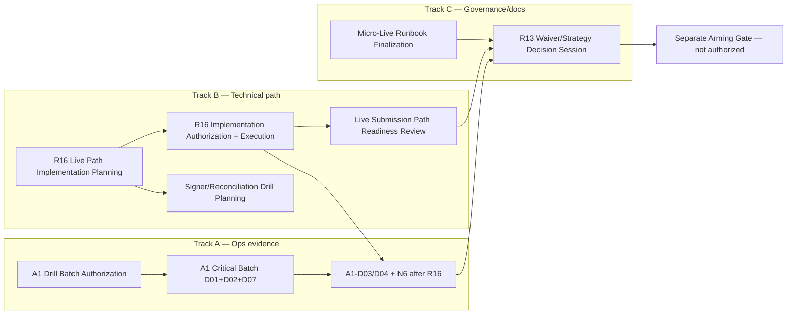

# Post-R14 Pre-Arming Architecture Review — 2026-07-05

Status:
**Review complete — sequencing judgment recorded; no code, config, runtime, or readiness action**

Gate type:
Opus architecture/governance review — post-R14 pre-arming path selection

Prerequisites:
`R14 PRE-ARMING FIX IMPLEMENTATION — 2026-07-05.md` · `PRE-ARMING BLOCKER STATUS REVIEW — 2026-07-05.md` · `PRE-ARMING IMPLEMENTATION PLANNING — 2026-07-05.md`

Live readiness achieved:
**No**

Human soak readiness:
**Not authorized**

OR-20260630-008:
**not_promoted** (unchanged)

**Code changed:** **No** · **Config changed:** **No** · **Runtime processes started:** **No**

---

## 1. Files Inspected (read-only)

| File | Purpose |
|------|---------|
| `R14 PRE-ARMING FIX IMPLEMENTATION — 2026-07-05.md` | G1/G2/G5 closed; 76/76 safety suite; residual G3/G4/N4–N9 |
| `PRE-ARMING BLOCKER STATUS REVIEW — 2026-07-05.md` | N1–N10 board; G1/G2/G5 open at review time (now closed) |
| `PRE-ARMING IMPLEMENTATION PLANNING — 2026-07-05.md` | Gate order; combine/separate rules; N1–N10 matrix |
| `A1 STATE DURABILITY DRILL PLANNING — 2026-07-05.md` | A1-D01–D09; A1-EV1 deferred; drill classes |
| `MICRO-LIVE RUNBOOK GAP REVIEW — 2026-07-05.md` | RB-G1–G14; C1–C15 runbook stack |
| `R7B STRATEGY EVIDENCE ASSESSMENT — 2026-07-05.md` | LR-02/LR-03 not met; defer collection |
| `ACTIVE_MANIFEST.md` | Posture boundaries; R12–R16 status; safety suite reference |

---

## 2. Current State Summary

| Track | Status |
|-------|--------|
| **Process/control (B2A 12h)** | **Closed** |
| **R14 N1–N3 + G1/G2/G5** | **Closed** for micro-live pre-arming |
| **LR-06 R14** | **IMPLEMENTED** (micro-live pre-arming scope) |
| **Safety suite** | **76/76 PASS** (post G1/G2/G5 tests) |
| **Posture** | `PIPELINE_DRY_RUN` · `dryRunMode: true` · `liveArmed: false` · `capitalExposure: none` |
| **N4–N9** | **Open** |
| **N10 `liveArmed false`** | **Held invariant** |
| **Arming / live readiness** | **Not authorized** |

### Residual R14 (non-blocking for this review’s sequencing)

| ID | Status | Notes |
|----|--------|-------|
| **G3** | Open | Manual 200 bps override surface absent — **correct** until R13/R15 ack exists |
| **G4** | Deferred | Protected MEV route — scaling only |
| **Legacy positions** | Accepted | Missing `poolLiquidityUsd` fail-closed on SELL — intentional |

---

## 3. Remaining Blocker Map (N4–N9 + N10)

| # | Blocker | Area | Severity | Type | Blocks arming? | Blocks R16/A1/doc work? |
|---|---------|------|----------|------|----------------|-------------------------|
| **N4** | A1 durability drills (min D01, D02, D03, D07) | State / ops | **High** | Runtime DRY/CRASH | **Yes** | **No** — drills are the work |
| **N5** | Signer path + reconciliation validation | Submit safety | **Critical** | Review + drill | **Yes** | **No** — planning can proceed; execution drills after R16 plan |
| **N6** | E-stop / kill-switch live-path drill | Safety | **Critical** | Runtime SIM/DRY | **Yes** | **No** |
| **N7** | Micro-live runbook finalization | Operator | **High** | Doc (+ optional tabletop) | **Yes** | **No** |
| **N8** | R13 / Taylor signed authorization | Governance | **Critical** | Human sign-off | **Yes** | **No** for technical gates |
| **N9** | R16 live path implementation coupling | Code | **Critical** | Plan → code → SIM/drill | **Yes** | N/A — primary technical gap |
| **N10** | `liveArmed` false until separate gate | Invariant | **Invariant** | Held | N/A | **No** |

### LR cross-reference (updated post-R14)

| ID | Status |
|----|--------|
| LR-01 | Open — R13 (N8) |
| LR-02 / LR-03 | Open — R7b not met; waiver path only |
| LR-04 | Open — signer/submission (N5, N9) |
| LR-05 | Partial — drills planned, not run (N4) |
| LR-06 | **Closed** (micro-live pre-arming) |
| LR-07 | not_promoted — optional |
| LR-08 | Partial — runbook gaps (N7) |
| LR-09 | Open — reconciliation drill (N5-R, A1-D04) |

---

## 4. Architecture Judgments

### 4.1 Safest overall path after R14

Use **three parallel tracks** that converge before arming:

**Principle:** Doc/planning and DRY ops drills may proceed in parallel. Live-path-specific drills and human authorization converge last. R7b weakness does **not** stall Tracks A or B.

### 4.2 R16 vs A1 — which first?

| Question | Judgment |
|----------|----------|
| **R16 planning vs A1 critical drills** | **A1 Drill Batch Authorization first**, then **R16 Live Path Implementation Planning** immediately after (or parallel authorization in same Taylor session as separate gates). R14 just changed `live_executor.js`; A1-D01/D02/D07 validate post-R14 operational integrity before R16 adds submit-path coupling. |
| **R16 implementation vs A1-D03/D04/N6** | **R16 implementation before** live-path crash, reconciliation, and e-stop drills. Those drills must exercise the final submit → confirm → position-write semantics. |
| **A1 critical batch vs R16 implementation** | **A1 critical batch (D01+D02+D07) before R16 implementation** — establishes clean stop/lock/dedup baseline under current code. |

**Summary:** **A1 critical drills → R16 plan → R16 implementation → A1 live-path drills + N6 → R13 → arming.**

### 4.3 Signer/reconciliation vs R16

| Phase | Order |
|-------|-------|
| **Planning** | **After R16 Live Path Implementation Planning** — signer hooks and reconciliation touchpoints are defined by R16 scope |
| **Drills / readiness review** | **After R16 implementation** — drills must target the implemented path, not the current PIPELINE_DRY_RUN stub |

Signer work must not precede R16 planning; implementing R16 without a signer readiness plan is acceptable only until the pre-arming authorization gate, not until arming.

### 4.4 R7b strategy evidence weakness

| Blocks | Does not block |
|--------|----------------|
| R13 signed authorization (N8) | R16 planning or implementation |
| Live authorization / arming | A1 drills (DRY) |
| Capital exposure | Runbook doc consolidation |
| Claiming live readiness | Signer/reconciliation **planning** |

R7b insufficiency is a **governance gate** (LR-02/LR-03), not a **engineering gate**. Technical pre-arming work should continue; Taylor must either meet thresholds later or sign an explicit R13 research-exception waiver before arming.

### 4.5 G3 manual slippage

No action until R13/R15 ack surface exists. Default 100 bps path remains the only operator path — **correct posture**.

---

## 5. Gates Safe to Combine vs Must Stay Separate

### Safe to combine (one receipt each; still separate authorizations if Taylor prefers)

| Combined gate | Items | Rationale |
|---------------|-------|-----------|
| **A1 Critical Drill Batch** | A1-D01 + D02 + D07 | Short DRY; same posture; one session |
| **Reconciliation drill bundle** | A1-D04 + N5-R reconciliation dry-run | Same failure mode |
| **Doc review batch** | A1-D08 + A1-D09 + runbook gap closure (planning sections) | All doc/SIM; credit-friendly |
| **Pre-arming technical planning session** | R16 planning + runbook C8/C15 alignment | Same coupling concern; keep scope bounded |

### Must stay separate

| Gate | Why |
|------|-----|
| **A1-D03 Crash/Interruption** | CRASH class; distinct abort criteria |
| **N6 E-Stop Live-Path Drill** | Safety-critical; own receipt |
| **R16 Implementation Execution** | Code blast radius; own authorization |
| **R13 Waiver/Strategy Decision Session** | Human accountability |
| **Pre-Arming Implementation Authorization** | Confirms N1–N9 satisfied |
| **Arming gate** | `liveArmed` / mode — never with planning or drills |
| **Micro-live execution gate** | Capital — never combined |
| **OR Promotion Review** | Unrelated optional track |

**Do not combine:** R13 human session with R16 code implementation or A1 runtime drills in a single gate.

---

## 6. Highest-Risk Remaining Blocker

**N9 — R16 live path implementation coupling**

R14 enforcement (quote age, slippage, liquidity floor, session/daily stops) is implemented for the pipeline path, but micro-live still lacks a verified **submit → confirm → position-write → reconcile** coupling with signer gates and e-stop interlocks. Without R16, the first authorized submit remains the highest catastrophic-risk gap.

**Runner-up:** **N5 — Signer path / secret-safe validation** (wrong signer, secret exposure, or uncontrolled submit).

**Governance runner-up:** **N8 — R13/Taylor authorization** (unaccountable arming if skipped).

---

## 7. Recommended Next Sequence

| Order | Gate | Type | Rationale |
|-------|------|------|-----------|
| **1** | **A1 Drill Batch Authorization** | Authorization doc | Post-R14 code change; authorize D01+D02+D07 before R16 adds complexity |
| **2** | **A1 Critical Drill Batch Execution** | Runtime DRY | Close minimum N4 evidence cheaply |
| **3** | **R16 Live Path Implementation Planning** | Doc | Scope highest technical gap; informs signer + runbook C8/C15 |
| **4** | **Micro-Live Runbook Finalization** | Doc | Can overlap with step 3 planning; operator-facing consolidation |
| **5** | **R16 Implementation Authorization + Execution** | Code + tests | Submit-path coupling; no arming |
| **6** | **Signer/Reconciliation Drill Planning** | Doc | After R16 plan; before live-path drills |
| **7** | **A1-D03/D04 + N6 E-Stop drills** | Runtime | After R16 implementation |
| **8** | **Live Submission Path Readiness Review** | Doc + harness | N5 closure |
| **9** | **R13 Waiver/Strategy Decision Session** | Human | N8 + RB-G2; before arming only |
| **10** | **Pre-Arming Implementation Authorization** | Authorization | Confirms N1–N9 |
| **11** | **Separate Arming Gate** | Not authorized | N10 held |

**Deferred unless Taylor separately authorizes:** A1-EV1 (24h A1d), passive R7b collection, G4 protected routes, G3 manual slippage surface.

---

## 8. Recommended Next Gate

**A1 Drill Batch Authorization**

---

## 9. Explicit Non-Actions (This Gate)

| Non-action | Confirmed |
|------------|-----------|
| Modify `live_config.json` / `live_executor.js` / `.env` | **No** |
| Run A1 drills | **No** |
| Start runtime loops | **No** |
| Enable live / `liveArmed` | **No** |
| Capital exposure | **No** |
| OR promotion | **No** |
| Claim live/soak readiness | **No** |
| Secrets inspected | **No** |

---

## 10. Safety Confirmation

| Item | Value |
|------|-------|
| `.env` opened | **No** |
| Secrets inspected | **No** |
| `process.env` dumped | **No** |
| `executionMode` LIVE set | **No** |
| `liveArmed` true set | **No** |
| `FOMO_ALLOW_LOOP_LIVE=YES` set | **No** |
| Runtime processes started | **No** |
| OR-20260630-008 status | **not_promoted** |
| Promotion authorized | **No** |
| Live readiness claimed | **No** |
| Human soak readiness claimed | **No** |
| Capital exposure enabled | **No** |

---

**Review authority:** Architecture/governance judgment gate (Opus review, 2026-07-05)
