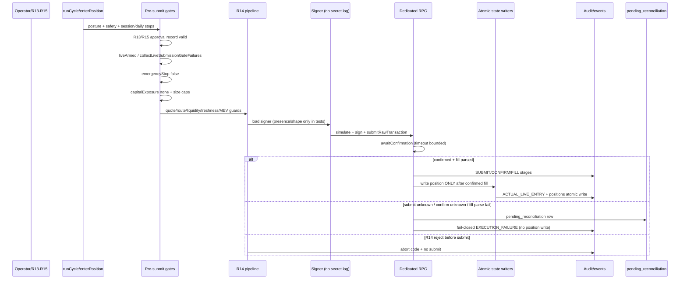

# R16 Live Path Implementation Planning — 2026-07-05

Status:
**Planning complete — live path coupling specified; no code, config, runtime, or readiness action**

Gate type:
Implementation planning gate — submit → confirm → position-write coupling design

Prerequisites:
`A1 CRITICAL DRILL BATCH EXECUTION — 2026-07-05.md` · `POST-R14 PRE-ARMING ARCHITECTURE REVIEW — 2026-07-05.md` · `R14 PRE-ARMING FIX IMPLEMENTATION — 2026-07-05.md` · `R14 IMPLEMENTATION VERIFICATION REVIEW — 2026-07-05.md`

Live readiness achieved:
**No**

Human soak readiness:
**Not authorized**

OR-20260630-008:
**not_promoted** (unchanged)

**Code changed:** **No** · **Config changed:** **No** · **Runtime processes started:** **No**

---

## 1. Files Inspected (read-only)

| File | Purpose |
|------|---------|
| `A1 CRITICAL DRILL BATCH EXECUTION — 2026-07-05.md` | N4 partial; isolated D01/D02/D07 residuals |
| `POST-R14 PRE-ARMING ARCHITECTURE REVIEW — 2026-07-05.md` | R16 highest technical blocker; sequencing |
| `PRE-ARMING BLOCKER STATUS REVIEW — 2026-07-05.md` | N9 R16; N5 signer; integration matrix |
| `MICRO-LIVE RUNBOOK GAP REVIEW — 2026-07-05.md` | C8 confirm-before-write; RB-G5/G6/G8 |
| `R14 PRE-ARMING FIX IMPLEMENTATION — 2026-07-05.md` | G1/G2/G5 closed; G3/G4 residual |
| `R14 IMPLEMENTATION VERIFICATION REVIEW — 2026-07-05.md` | LR-06 implemented for micro-live pre-arming |
| `ACTIVE_MANIFEST.md` | Posture, lock, state ownership, safety suite |
| `docs/R12_MICRO_LIVE_READINESS_CHECKLIST.md` | Go/no-go; pre-session gates |
| `docs/R13_FINAL_MICRO_LIVE_APPROVAL_GATE.md` | Signed approval fields; R7b bypass policy |
| `docs/R16_MICRO_LIVE_IMPLEMENTATION_GAP_REVIEW.md` | June gap inventory (partially superseded by R14 ship) |
| `docs/R8_RISK_CONTROLS_REVIEW.md` | Risk caps defined, not armed |
| `r16_micro_live_gap_check.js` | Read-only gap status helper |
| `live_executor.js` (grep/read-only) | `submitSwap`, `completeLiveSwapFromPipeline`, gates, reconciliation |
| `test_signer_guard.js` | Signer guard regression surface |

**Note:** `docs/R16_MICRO_LIVE_IMPLEMENTATION_GAP_REVIEW.md` (2026-06-28) lists R14 as “not implemented on live path.” **R14 E1–E9 enforcement is now shipped** in `live_executor.js` for quote/submit pipeline paths. This plan treats R14 as **integrated baseline** and scopes **remaining R16 coupling gaps**.

---

## 2. Current Posture (unchanged)

| Invariant | Value |
|-----------|-------|
| `executionMode` | `PIPELINE_DRY_RUN` |
| `dryRunMode` | `true` |
| `liveArmed` | `false` (computed gates unsatisfied) |
| `capitalExposure` | `none` |
| Safety suite | **76/76 PASS** (post-R14) |

---

## 3. Intended R16 Live Path Sequence

End-to-end **micro-live first submit** path (BUY entry; SELL exit mirrors with position-sourced liquidity):

### Step-by-step (normative)

| # | Step | Owner function(s) | Fail-closed rule |
|---|------|-------------------|------------------|
| 1 | **Pre-submit posture check** | `safetyCheck()`, `readinessChecks()`, `resolveExecutionMode()` | Block if not `LIVE` + armed posture for real submit |
| 2 | **R13/R15 approval check** | *New* `assertMicroLiveApprovalRecord()` | No submit without valid signed session/trade approval |
| 3 | **Signer availability check** (no secret exposure) | `collectLiveSubmissionGateFailures()`, `loadSignerFromEnvForRealExecution()` | Missing/malformed signer → abort; never log secret |
| 4 | **R14 quote/route validation** | `executeQuotedSwapAttempt()` → E1–E9 | Stale quote, impact, slippage, liquidity, partial fill guards |
| 5 | **Simulate transaction** | `simulateSwapTx()` | Simulation failure → no sign |
| 6 | **Sign transaction** | `completeLiveSwapFromPipeline()` Step 9a | Sign bytes zeroed after use; no persistence |
| 7 | **Submit transaction** | `submitRawTransaction()` | Dedicated RPC only; `SUBMISSION_UNKNOWN` → reconciliation |
| 8 | **Confirm transaction** | `awaitConfirmation()` | Timeout → `CONFIRMATION_UNKNOWN` reconciliation; on-chain err → no position |
| 9 | **Classify outcome** | `parseFillFromTransaction()`, `detectPartialFill()`, `evaluateRealizedSlippage()` | Partial fill / halt bps → abort |
| 10 | **Write position/state atomically** | `enterPosition()` → `live_positions_store` | **Only after** `submitSwap` returns confirmed LIVE result |
| 11 | **Write audit/event evidence** | `writeLiveEvent()`, `logExecutionStage()`, `audit_writer` | Secret-redacted; R14 metadata fields |
| 12 | **Reconcile tx vs local state** | `writePendingReconciliation()`, dashboard panel | Ambiguous outcomes operator-required |
| 13 | **Fail-closed / rollback path** | No auto-retry on ambiguous submit; no position on failure | `reset_live_safety.js` / e-stop for halt |

**SELL exit path:** Same pipeline via `executeLiveExitImpl()` → `submitSwap("SELL")` with `poolLiquidityUsd` from position (G5 closed).

---

## 4. R16 Implementation Matrix

| Step | Current coverage | Required implementation | Fail-closed behavior | Evidence artifact | Test needed | Risk if skipped |
|------|------------------|-------------------------|----------------------|-------------------|-------------|-----------------|
| **1 Posture** | `safetyCheck`, `readinessChecks`, `runCycle` emergency halt | Explicit LIVE-path guard at `submitSwap` entry re-checking `emergencyStop`, mode, dryRun | Any mismatch → `REAL_PATH_DISABLED` / abort | `--status` capture; audit GUARD stage | liveArmed false blocks submit | Submit under halt/wrong mode |
| **2 R13/R15 approval** | `r13_*`, `r15_*` read-only helpers only | Load + validate signed approval record path; per-trade ack for manual slippage (G3) | Missing/expired/over-cap approval → abort before sign | `analysis/r15_manual_approval_record.json` (gitignored) + audit row | approval missing blocks submit | Unattended / unaccountable live |
| **3 Signer gate** | `loadSignerFromEnvForRealExecution`, `collectLiveSubmissionGateFailures`, `test_signer_guard.js` | Wallet match vs config; single-load discipline; test hooks only in harness | Missing/malformed/mismatch → `SIGNER_LOAD_FAILED` | Signer guard tests; audit SIGNER_LOAD stage (no secret) | signer unavailable prevents submit | Wrong wallet / leak |
| **4 R14 pre-submit** | **Shipped** E1–E9 in `executeQuotedSwapAttempt` | Wire any LIVE-only gaps: exit liquidity already G5; G3 flag surface | Each abort code fail-closed before sign | Existing R14 tests + LIVE-path fixture tests | R14 rejection prevents submit | Bad fills / illiquid exit |
| **5 Simulate** | `simulateSwapTx` in pipeline | Require sim success before sign on LIVE | Sim fail → no sign/submit | execution_audit SIMULATION stage | sim failure blocks submit | On-chain revert |
| **6 Sign** | `completeLiveSwapFromPipeline` Step 9a | Harden in-flight registry (duplicate tx guard) | Second concurrent submit for same intent → abort | Audit SIGNED stage (prefix only) | duplicate submit prevention | Double spend |
| **7 Submit** | `submitRawTransaction` | Keep dedicated RPC refusal; no public fallback | RPC/HTTP failure → reconciliation or abort | Audit SUBMIT + `pending_reconciliation.jsonl` | submit failure → no position | Ghost/intent leak |
| **8 Confirm** | `awaitConfirmation` | Bounded poll; block-height capture on timeout | Timeout → reconciliation, **no position write** | CONFIRMATION audit + reconciliation row | confirmation timeout → pending state | False OPEN position |
| **9 Outcome classify** | `parseFillFromTransaction`, partial fill, realized slippage | LIVE exit parity for fill unavailable handling | Partial fill → abort + reconcile | FILL_PARSE audit | fill parse fail → reconcile not position | Wrong PnL / size |
| **10 Position write** | `enterPosition` writes after `submitSwap` return; `live_positions_store` atomic | Introduce explicit **PENDING_SUBMIT** optional state OR document invariant: LIVE `submitSwap` only returns after confirm | **Never** write OPEN on submit-only or unconfirmed | `live_positions.json` + entry event | submit fail → no position; confirm timeout → no position | Capital/state corruption |
| **11 Audit/events** | `audit_writer`, `writeLiveEvent`, R14 metadata in pipeline | Ensure LIVE rows include quoteAge, mevRouteMode, realizedSlippageBps, capitalExposure none | Redact secrets; forbid raw signed bytes | `execution_audit.jsonl`, `live_trades.jsonl` | audit without secrets | Blind ops / leak |
| **12 Reconcile** | `writePendingReconciliation`, `buildReconciliationContext` | Dashboard/read path honesty; operator runbook for SUBMISSION_UNKNOWN / CONFIRMATION_UNKNOWN / FILL_PARSE_UNKNOWN | Ambiguous → operatorActionRequired | `pending_reconciliation.jsonl` line | position write after submit only with confirm | Orphan capital |
| **13 Fail-closed rollback** | `reset_live_safety.js`, emergency stop in cycle | Hard-block sign/submit when `emergencyStop` mid-flight (re-check) | No auto-resume; no blind rebroadcast (R14 E4 already) | control events + posture log | e-stop blocks submit (N6 drill later) | Loss during halt |

---

## 5. Integration Points

### 5.1 R14 enforcement (shipped — extend, do not re-open scope)

| Surface | Integration |
|---------|-------------|
| Quote freshness E1 | `assertQuoteFresh` before build/submit |
| Realized slippage E2 | Post-fill in `completeLiveSwapFromPipeline` |
| Route revalidation E3 | LIVE submit-time re-quote |
| Retry/re-quote E4 | `submitSwap` attempt loop |
| Partial fill E5 | Before position write |
| MEV posture E6 | Audit + scaling guard |
| Priority fee E8 | `capPriorityFeeToTradeSize` |
| Liquidity E9 | BUY + SELL (G5) `poolLiquidityUsd` |

**R16 task:** Ensure LIVE path cannot bypass pipeline by alternate entry; add LIVE-specific fixture tests asserting abort before sign.

### 5.2 A1 durability / state writes

| Surface | Integration |
|---------|-------------|
| `live_positions_store.js` | Atomic position write **after** confirmed fill only |
| `config_store.js` | No LIVE config mutation during submit path |
| `observation_dedup.json` | Observation idempotency (D07 weak residual — production re-run optional) |
| `executor_singleton_guard.js` | Single `--loop` owner; stale lock hygiene (D02 passed) |
| Session/daily stops G1/G2 | `safetyCheck()` before entries |

**R16 task:** Document confirm-before-write invariant; optional PENDING artifact for operator visibility (not required for v1 if `submitSwap` synchronous confirm holds).

### 5.3 Signer guard

| Surface | Integration |
|---------|-------------|
| `loadSignerFromEnvForRealExecution` | LIVE-only; JSON 64-byte validation; wallet match |
| `test_signer_guard.js` | Regression — extend for LIVE gate matrix |
| `signer_simulation_harness.js` | SIM only until R16 impl tests |

**R16 task:** Fail-closed tests with mocked signer loader (`setSignerLoaderForTest`); **no real secret validation in planning or first impl gate**.

### 5.4 Reconciliation

| Surface | Integration |
|---------|-------------|
| `pending_reconciliation.jsonl` | SUBMISSION_UNKNOWN, CONFIRMATION_UNKNOWN, FILL_PARSE_UNKNOWN |
| Runbook C8/C10 | Operator procedures for ambiguous rows |

**R16 task:** Tests asserting reconciliation row written and **no** position append on each ambiguous class.

### 5.5 E-stop / kill switch

| Surface | Integration |
|---------|-------------|
| `emergencyStop` in config | Blocks `runCycle` entries; **must also block** `submitSwap` LIVE entry |
| R11 simulation | Not live-path drilled (N6 — after R16 impl) |

**R16 task:** Add LIVE-path e-stop re-check at start of `completeLiveSwapFromPipeline` / `submitSwap`.

### 5.6 Micro-live runbook (N7)

| Surface | Integration |
|---------|-------------|
| R15 session runbook | Maps to steps 1–2, 11–13 |
| R12 go/no-go | Preflight before arming gate (separate) |
| C7 per-trade gate | Feeds step 2 |

**R16 task:** Runbook finalization gate can proceed in parallel; implementation must expose hook points approval checker reads.

### 5.7 R13/R15 signed approval record

| Surface | Integration |
|---------|-------------|
| `r15_manual_approval_check.js` | Read-only status today |
| Example record | `examples/r15_manual_approval_record.example.json` |

**R16 task:** Executor consumes validated record (path from config or analysis gitignore file); blocks LIVE submit when absent/invalid.

---

## 6. Residual A1 Implications (Post Drill Batch)

| A1 item | R16 implication |
|---------|-----------------|
| D01 lock linger (temp) | LIVE submit must not proceed if singleton lock contested; graceful `--loop` stop hygiene before live session |
| D01 production-root not re-run | Recommend production-root D01 before arming; not blocking R16 **planning/impl** |
| D07 weak (zero candidates) | LIVE duplicate-submit guard must not rely on dedup alone; add in-flight tx/intent registry |
| D03/D04/D05 open | R16 impl may proceed; arming blocked until crash/reconcile/audit drills complete |
| B2A-era production lock metadata | Operator hygiene before live session; unrelated to R16 code |

---

## 7. Required Future Tests (R16 Implementation Gate)

All tests **mocked RPC/signer** — no real capital, no `.env` secrets in CI.

| # | Test | Assert |
|---|------|--------|
| T1 | Submit success → confirm → position write | OPEN position only after mocked confirmed fill |
| T2 | Submit failure → no position write | `live_positions.json` unchanged |
| T3 | Confirmation timeout → fail-closed pending | `pending_reconciliation` CONFIRMATION_UNKNOWN; no OPEN |
| T4 | Position write failure after confirm | Reconciliation/EXECUTION_FAILURE; operator flag (simulate store throw) |
| T5 | Duplicate submit prevention | Second concurrent BUY aborts or queues fail-closed |
| T6 | R14 rejection prevents submit | Stale quote / liquidity floor → abort before SUBMIT audit |
| T7 | Signer unavailable prevents submit | No `SOLANA_SIGNER_SECRET` → abort at guard |
| T8 | liveArmed false / gates fail prevents submit | `collectLiveSubmissionGateFailures` non-empty → abort |
| T9 | Capital exposure mismatch prevents submit | Audit `capitalExposure: none`; gate rejects armed capital |
| T10 | Audit artifact without secrets | No raw signer bytes/secret/env in audit rows |
| T11 | emergencyStop true prevents submit | Mid-path e-stop re-check aborts |
| T12 | R15 approval missing prevents submit | New approval gate blocks LIVE |
| T13 | SELL path parity | SELL with missing `poolLiquidityUsd` fail-closed (G5 regression) |

**Manifest:** Add to `run_safety_tests.js` after implementation gate (R14 tests remain regression).

---

## 8. Explicit Non-Goals (This Planning Gate and Default Impl Scope)

| Non-goal | Status |
|----------|--------|
| Live execution / real submit | **Not in this gate** |
| Signer secret validation drill | **Deferred** (N5) |
| `.env` edits | **Forbidden** |
| Arming / `liveArmed true` | **Forbidden** |
| Capital exposure | **Forbidden** |
| OR promotion | **Forbidden** |
| R13 sign-off / human soak claim | **Forbidden** |
| A1-D03 crash / D04 reconcile drills | **Separate gates** |
| G4 protected MEV RPC switch | **Deferred to scaling** |
| Production-root observation re-run | **Optional before arming** |

---

## 9. Recommended Implementation Split

| Gate | Type | Scope |
|------|------|-------|
| **1. R16 Implementation Authorization** | Human/doc | Taylor authorizes bounded R16 code+tests; no arming, no capital |
| **2. R16 Code Execution** | Code + mocked tests | Approval wiring, LIVE gate hardening, duplicate guard, e-stop re-check, tests T1–T13 |
| **3. R16 Verification Review** | Read-only review | Matrix closure vs plan; safety suite green; no live claim |

**Do not combine:** Authorization with code execution; code execution with arming; verification with R13 sign-off.

**May combine in Code Execution (one diff):** Approval checker + e-stop re-check + duplicate guard + tests, provided single review receipt.

---

## 10. Gap Status vs June R16 Doc (Updated)

| June R16 gap | July 2026 status |
|--------------|------------------|
| R14 slippage/MEV enforcement | **Closed** (LR-06 micro-live pre-arming) |
| Quote freshness / impact / retry | **Closed** in pipeline |
| SELL liquidity | **Closed** (G5) |
| Session/daily loss stops | **Closed** (G1/G2) |
| Sign → submit → confirm pipeline | **Partially implemented** in `completeLiveSwapFromPipeline` |
| R13/R15 approval in executor | **Open** |
| Duplicate live submit guard | **Open** |
| E-stop on LIVE submit path | **Open** (partial via cycle only) |
| Pending position / confirm-before-write tests | **Open** (invariant exists; tests weak) |
| Micro-live config loader | **Open** (R17 overlap) |
| Live-path integration tests | **Open** |

---

## 11. Recommended Next Gate

**R16 Implementation Authorization**

---

## 12. Safety Confirmation

| Item | Value |
|------|-------|
| `.env` opened | **No** |
| Secrets inspected | **No** |
| `process.env` dumped | **No** |
| `live_config.json` modified | **No** |
| `live_executor.js` modified | **No** |
| `executionMode` LIVE set | **No** |
| `dryRunMode` false set | **No** |
| `liveArmed` true set | **No** |
| `FOMO_ALLOW_LOOP_LIVE=YES` set | **No** |
| Runtime processes started | **No** |
| OR-20260630-008 status | **not_promoted** |
| Promotion authorized | **No** |
| Live readiness claimed | **No** |
| Human soak readiness claimed | **No** |
| Capital exposure enabled | **No** |

---

**Planning authority:** R16 Live Path Implementation Planning gate (2026-07-05)
