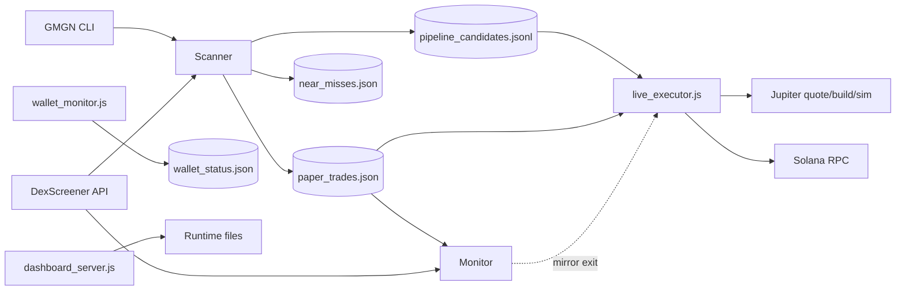

# Engineering Review — Solana Momentum Bot

Senior-engineer onboarding review for the first TracktaOS module. This document describes how the system works today, what the runtime files mean, where risk lives, and what to fix first. **Current safe posture:** `executionMode: PIPELINE_DRY_RUN`, `dryRunMode: true`, no live submission armed.

---

## Architecture

The bot is a **multi-process, file-coordinated** research and execution system. There is no central supervisor, message bus, or database. Processes communicate by reading and writing JSON/JSONL files in the project root and by polling external APIs (GMGN CLI, DexScreener, Jupiter, Solana RPC).

### Scanner

**Primary file:** `scanner_gmgn_trending.js` (`strategyVersion: gmgn_v4`)

The scanner is the discovery layer. Each pass:

1. Pulls GMGN trending tokens for intervals `1m`, `5m`, `1h` via `gmgn-cli` (`execSync`, 30s timeout).
2. Deduplicates tokens across intervals, keeping the row with stronger volume + 1h change.
3. Enriches each token with the highest-liquidity DexScreener pair.
4. Scores candidates with momentum and liquidity heuristics (`scoreCandidate`).
5. Takes the top 20 Dex-passing candidates and runs GMGN safety checks (`getGmgnInfo`, `getGmgnPool`, `rejectReason`).
6. For candidates with score ≥ 79, writes a paper trade and a pipeline candidate intent (unless cooldown/duplicate rules block).

**Outputs:** `paper_trades.json`, `pipeline_candidates.jsonl`, `near_misses.json` (for high-score rejections).

**Operational modes:** single pass, or `--watch` (60s loop).

**Legacy/alternate scanners** exist (`scanner.js`, `scanner_v3.js`, `scanner_trending.js`, backups). Treat them as historical; do not run in parallel with the active scanner.

### Monitor

**Primary file:** `monitor.js` (`monitorVersion: monitor_v4`)

The monitor owns **paper-trade lifecycle**. It runs in a 60s loop:

1. Loads open rows from `paper_trades.json`.
2. Polls DexScreener for current pair price.
3. Closes trades on target (+10%), stop (−5%), or timeout (20 minutes).
4. Flags suspicious stop hits (implied loss worse than −50%) as `NEEDS_REVIEW` instead of closing as a normal loss.
5. Optionally mirrors paper exits to live positions via `live_executor.executeLiveExit` (isolated try/catch).
6. On `NEEDS_REVIEW`, flags open live positions for manual review instead of auto-selling.

Paper monitoring is intentionally **decoupled** from live execution. Live executor load failures do not stop paper monitoring.

**Companion process:** `near_miss_followup.js` tracks rejected candidates at +20m, +60m, +120m into `near_miss_followups.json`.

### Execution

**Primary file:** `live_executor.js` (`live_executor_v2`, Phase 1)

The executor is the only component allowed to build swap transactions. It enforces a documented safety contract on every cycle:

| Mode | Behavior |
|------|----------|
| `DRY_RUN` | Legacy path; swap intents logged, no Jupiter pipeline beyond basic dry-run return |
| `PIPELINE_DRY_RUN` | Full quote → route validation → priority fee → tx build → simulation; **no signing or submission** |
| `LIVE` | Same pipeline plus signing, submission, confirmation, fill parse; gated by config + env flags |

**Entry path (LIVE/DRY_RUN):** `runCycle` → `safetyCheck` → `findCandidates` (strict thesis) → `enterPosition` → `submitSwap("BUY")`.

**Exit path:** `manageOpenPositions` (executor loop) or `executeLiveExit` (monitor mirror). Exits run even when `automationEnabled: false`; only `emergencyStop: true` halts all activity.

**Live arming requires all of:** `executionMode: LIVE`, `dryRunMode: false`, `automationEnabled: true`, `emergencyStop: false`, `SOLANA_SIGNER_SECRET`, `FOMO_ENABLE_LIVE_SUBMISSION=YES`, dedicated RPC, and `positionSizeSol ≤ 0.01` (stricter than config's 0.005 default ceiling of 0.10).

**Safety utilities:** `emergency_stop.js`, `reset_live_safety.js`, `panic.ps1`, `validate_live_system.js`, `validate_live_preflight.js`.

### Candidate Pipeline

The pipeline bridges scanner output to execution observation without mixing paper and live ledgers.

1. Scanner writes matching rows to `paper_trades.json` (with `status: OPEN`) and `pipeline_candidates.jsonl` (same fields plus `candidateIntentId`, no status).
2. `candidateIntentId` = `{timestamp}_{address}_{pairAddress}` — durable handoff identity.
3. In `PIPELINE_DRY_RUN`, `findPipelineObservationCandidates` merges:
   - queued intents from `pipeline_candidates.jsonl` (preferred), then
   - open paper trades as fallback.
4. Dedup uses intent keys seeded from `execution_audit.jsonl`, pair-level cooldown (60 minutes), and in-memory sets.
5. `observePipelineCandidate` runs the unsigned Jupiter pipeline and logs to `execution_audit.jsonl`.

**Important split:** Scanner filters are **wider** than executor thesis. A token can become a paper trade but be classified `non_thesis_observation` in pipeline dry-run. Live entries require strict thesis match.

### Persistence

Persistence is **local filesystem only**:

| Pattern | Files | Writers | Readers |
|---------|-------|---------|---------|
| Append-only JSONL | `paper_trades.json`, `near_misses.json`, `pipeline_candidates.jsonl`, `live_trades.jsonl`, logs | Scanner, monitor (rewrite on close), executor | Monitor, executor, dashboard, analysis scripts |
| Overwrite JSON | `live_config.json`, `live_positions.json`, `wallet_status.json`, `rpc_health.json`, `simulation_results.json` | Executor, wallet monitor, dashboard, safety scripts | All processes |
| Append-only audit | `execution_audit.jsonl`, `live_errors.jsonl`, `live_control_events.jsonl`, `wallet_history.jsonl`, `pending_reconciliation.jsonl`, `panic_events.jsonl` | Executor, safety scripts | Dashboard, operators |

**Characteristics:**

- Synchronous `fs.readFileSync` / `appendFileSync` / `writeFileSync` — no file locking, no atomic rename strategy.
- Multiple processes can race on the same files (especially `live_config.json` from dashboard + executor).
- No schema versioning beyond string fields like `strategyVersion` and `executorVersion`.
- Git ignores sensitive/ephemeral runtime files (see `.gitignore`).

For TracktaOS, treat persistence as a **migration boundary**: either wrap these files with a small state service or replace with a proper event store while preserving append-only audit semantics.

### Logging

Logging is first-class and designed for post-incident review:

| File | Purpose |
|------|---------|
| `execution_audit.jsonl` | Stage-by-stage execution trace (`EXECUTION_STAGE`, pipeline observations, cycle start/end) |
| `live_errors.jsonl` | Guard failures, abort codes, execution errors (secrets redacted) |
| `live_control_events.jsonl` | START, STOP, EMERGENCY, RESET from dashboard or scripts |
| `live_trades.jsonl` | Live event ledger: intended/actual entry/exit, closed trade summaries |
| `wallet_history.jsonl` | Periodic wallet balance snapshots (30 min) |
| `panic_events.jsonl` | Panic script incidents |
| `pending_reconciliation.jsonl` | Ambiguous on-chain outcomes requiring human review |

Redaction helpers strip signer material, API keys, and byte arrays from logs. Signed transaction bytes are never persisted.

**Naming inconsistency:** Root `live_executor.js` writes `live_trades.jsonl`, but `dashboard_server.js` still references `live_trades.json` in some panels (with a partial fallback to `.jsonl` in readiness checks). Operators should know both names appear in docs and older copies.

---

## State Files

Despite `.json` extensions on some ledgers, most trade files are **JSONL** (one JSON object per line). Below: active runtime files in the project root and their roles.

### Configuration

| File | Format | Purpose |
|------|--------|---------|
| `live_config.json` | JSON object | **Single source of operational truth:** execution mode, automation toggle, emergency stop, wallet address, position limits, daily stop thresholds, slippage caps, priority fee settings, and `thesis` filter bounds. Mutated by dashboard buttons and safety scripts. |

### Research ledgers

| File | Format | Purpose |
|------|--------|---------|
| `paper_trades.json` | JSONL | Paper trade ledger. Open rows have `status: OPEN`; closed rows become `WIN`, `LOSS`, `TIMEOUT`, or `NEEDS_REVIEW`. Includes entry/target/stop prices and scanner metadata. |
| `near_misses.json` | JSONL | Rejected candidates (score ≥ 70 that failed GMGN safety checks). Used for false-negative analysis. |
| `near_miss_followups.json` | JSONL | Time-series price measurements (+20m, +60m, +120m) for near misses. |
| `pipeline_candidates.jsonl` | JSONL | Scanner-to-executor handoff queue. Same core fields as paper trades plus `candidateIntentId`; no status field. |

### Live trading state

| File | Format | Purpose |
|------|--------|---------|
| `live_positions.json` | JSON array | Current open live positions (overwritten on change). |
| `live_trades.jsonl` | JSONL | Append-only live event history (entries, exits, aborts, daily stop triggers). |
| `live_trades.json` | JSONL (legacy name) | Referenced by dashboard and older copies of executor; may diverge from `.jsonl` if both exist. Prefer `live_trades.jsonl` for executor v2. |
| `pending_reconciliation.jsonl` | JSONL | Records ambiguous submissions/confirmations/fill parses. Requires manual resolution per `RECONCILIATION_RUNBOOK.md`. |

### Telemetry

| File | Format | Purpose |
|------|--------|---------|
| `wallet_status.json` | JSON object | Latest read-only wallet snapshot: balance, connectivity, latency, RPC endpoint metadata. |
| `rpc_health.json` | JSON object | Rolling RPC ping stats (success/failure counts, latency min/max/avg). |
| `wallet_history.jsonl` | JSONL | Historical wallet balance snapshots. |

### Simulation / analysis

| File | Format | Purpose |
|------|--------|---------|
| `simulation_results.json` | JSON object | Output summary from `simulate_live_executor.js` replay. |
| `simulation_intents.jsonl` | JSONL | Simulated would-enter events. |
| `simulation_rejections.jsonl` | JSONL | Simulated rejection reasons. |

### Audit / control

| File | Format | Purpose |
|------|--------|---------|
| `execution_audit.jsonl` | JSONL | Pipeline and cycle audit trail; also seeds observation dedup state. |
| `live_errors.jsonl` | JSONL | Errors and execution failures. |
| `live_control_events.jsonl` | JSONL | Operator control actions. |
| `panic_events.jsonl` | JSONL | Emergency panic script log. |

### Backups and archives (not active runtime)

| File | Purpose |
|------|---------|
| `paper_trades_backup.json`, `paper_trades_before_bot10.json` | Historical paper trade snapshots. |
| `near_misses_backup.json` | Historical near-miss snapshot. |
| `automation/`, `hardreset/`, `harness/`, `files/`, `phase1_files/` | Duplicate or snapshot code trees — **not** the canonical runtime path. |

---

## Strategy

Strategy is **short-horizon momentum on GMGN trending Solana tokens**, with conservative safety filters and fixed gross exit levels. Paper results are research signals; live execution adds slippage, fees, latency, and failure modes that paper does not model fully.

### Entry logic

A candidate enters the paper/pipeline flow when **all** of the following hold:

**Discovery (GMGN + DexScreener momentum score > 0):**

- Market cap $100k–$2.5M
- Liquidity ≥ $25k
- 5m volume ≥ $100, 1h volume ≥ $2,500
- Positive 5m and 1h price change; 5m change ≤ 60%
- 5m buys > sells
- ATH penalty applied if market cap is far below token ATH

**Safety (GMGN info + pool):**

- Pool liquidity ≥ $25k
- Holders ≥ 300
- Top-10 holder rate ≤ 30%
- Bot degen rate ≤ 10%
- Bundler rate ≤ 70%
- Rug ratio ≤ 0.20
- Creator hold ≤ 5%, dev hold ≤ 5%

**Logging threshold:**

- Composite score ≥ 79 → write paper trade + pipeline intent
- Cooldowns: no duplicate open position; no re-entry within 24h; no entry within 24h of a loss on same address; near-miss dedup 24h

**Live entry (when armed)** adds executor thesis match (below) plus wallet balance, slippage/route checks, and daily stop gates.

### Filters

Two filter layers exist:

| Layer | Where | Intent |
|-------|-------|--------|
| Scanner filters | `scanner_gmgn_trending.js` | Broad momentum + rug/bot/holder rejection |
| Execution thesis | `live_config.json` → `thesis` | Narrow band for live/autonomous observation |

**Execution thesis (Phase 1):**

- Source: `gmgn_trending`
- Score: 80–89 (scanner can log at 79)
- Market cap: $100k–$250k (scanner allows up to $2.5M)
- Bot degen rate: < 5% (scanner allows up to 10%)
- Top-10 holder rate: 10–20% (scanner allows up to 30%)
- Valid `pairAddress`, positive `entryPrice`, positive liquidity

This mismatch is intentional for research (observe wider set, trade narrower set) but easy to misread in dashboards.

### Exits

Exits are **rule-based and symmetric** across paper and live:

| Trigger | Condition | Paper status | Live status |
|---------|-----------|--------------|-------------|
| Target | price ≥ entry × 1.10 | `WIN` | `WIN` |
| Stop | price ≤ entry × 0.95 (unless anomaly) | `LOSS` | `LOSS` |
| Timeout | age ≥ 20 minutes | `TIMEOUT` | `TIMEOUT` |
| Anomaly | stop hit but implied loss < −50% | `NEEDS_REVIEW` | flagged, not auto-sold |

Paper monitor runs every 60s. Live executor `manageOpenPositions` runs each cycle in non-pipeline modes. Monitor can mirror paper exits to live.

### Stop losses

- **Nominal stop:** 5% below entry (`entryPrice × 0.95`).
- **Anomaly guard:** if DexScreener price implies > 50% loss at stop trigger, assume bad data (liquidity collapse, wrong pair, stale quote) and halt automated exit.
- **Daily stop (live entries):** block new entries after 3 losing closes or −0.10 SOL realized in local calendar day.
- **Emergency stop:** halts entries **and** exits until `reset_live_safety.js` (automation stays off after reset).

Stops are evaluated on **DexScreener USD pair price**, not on-chain fill prices. Live slippage can cause actual loss to exceed 5% even when the signal fires correctly.

### Profit targets

- **Nominal target:** 10% above entry (`entryPrice × 1.10`).
- Gross target only — excludes priority fees, swap fees, and slippage.
- No trailing stop, partial take-profit, or scale-out logic.
- Timeout exit closes at market if neither target nor stop hit within 20 minutes.

---

## Technical Debt

### Architecture and operations

1. **File-based IPC without coordination** — concurrent writers (scanner, monitor, executor, dashboard) can corrupt or lose updates; no advisory locks or write-ahead pattern.
2. **Multi-process orchestration via PowerShell** — `start_fomo.ps1` hardcodes an old path (`C:\Users\nalle\sol-momentum-bot`); no health checks, restart policy, or dependency ordering beyond fixed sleep.
3. **Duplicate code trees** — `automation/`, `hardreset/`, `harness/`, `files/`, `phase1_files/` contain copies of executor, monitor, dashboard. High risk of editing the wrong file.
4. **No package-level test runner** — `"test": "exit 1"`; safety tests are manual `node test_*.js` invocations.
5. **GMGN CLI subprocess dependency** — blocking `execSync`, shell:true, no structured retry/backoff; scanner fails soft per interval but has no circuit breaker.

### Data model

6. **`.json` files that are JSONL** — `paper_trades.json` and `near_misses.json` confuse tooling and validators.
7. **`live_trades.json` vs `live_trades.jsonl` split** — dashboard and executor disagree on canonical filename.
8. **Thesis/scanner filter drift** — score 79 vs 80, MC cap 2.5M vs 250k, bot/top10 thresholds differ; not surfaced clearly at handoff time.
9. **In-memory observation dedup** — executor seeds from audit log on startup but pair cooldown state is partially in-memory; restart behavior depends on audit completeness.

### Execution

10. **Price oracle single-source** — DexScreener for monitor, entry reference, and exit triggers; no cross-check against Jupiter quote or pool reserves.
11. **Post-fill slippage is diagnostic only** — pre-route validation is the real guard; confirmed fills can exceed caps without blocking exit.
12. **Fill parse failure → reconciliation** — correct safety posture, but no automated dashboard workflow for open reconciliation items.
13. **`PIPELINE_DRY_RUN` does not manage open live positions** — if live were enabled later, mode transitions need explicit runbook (pipeline loop skips `manageOpenPositions`).

### Security and config

14. **Config mutable at runtime from dashboard** — good for ops, but no auth on local Express server (port 3000); anyone on the host can toggle automation.
15. **Public wallet address in committed `live_config.json`** — not a secret, but couples repo to a specific wallet identity.
16. **Env flag proliferation** — multiple overlapping arming switches (`FOMO_ENABLE_LIVE_SUBMISSION`, `FOMO_ALLOW_LOOP_LIVE`, config fields) increase operator error risk.

### TracktaOS readiness

17. **No chain abstraction** — all identifiers, APIs, and CLI calls are Solana-specific inline strings.
18. **No unified candidate schema** — handoff fields are implicit conventions duplicated across scanner, tests, and executor.
19. **Runtime data mixed with repo** — large JSONL histories, backups, and zip archives in tree; migration scope unclear.

---

## Failure Modes

### Financial loss (live trading armed)

| Failure | Mechanism | Impact |
|---------|-----------|--------|
| Slippage + fees exceed stop | 5% paper stop ≠ 5% on-chain exit; thin pools move faster than DexScreener polling | Loss greater than expected per trade |
| Stale/wrong DexScreener price | Monitor/executor trigger on API price that does not match executable Jupiter route | Late exit, wrong trigger type, or anomaly flag while price continues falling |
| Rug / liquidity removal | Safety filters reduce but do not eliminate honeypots and soft rugs | Total or near-total loss on position |
| Failed sell / stuck token | SELL simulation passes at entry time but pool dies at exit; RPC errors on exit | Open bag, manual salvage required |
| Submission unknown | TX submitted but HTTP response lost (`pending_reconciliation.jsonl`) | Double-submit risk if operator retries blindly; or untracked fill |
| Fill parse failure after confirm | On-chain success but bot cannot parse balances | Position state wrong while funds moved |
| Daily stop bypass | Stops block **entries**, not exits; large loss on single trade still possible | One trade can exceed daily SOL budget |
| Emergency stop during open trade | Halts exits until reset | Cannot auto-exit into a crash; manual intervention required |
| Priority fee mis-estimation | Dynamic fee caps may still land behind competing bots | Entry fails or fills late at worse price |

### Malfunction (research / dry-run)

| Failure | Mechanism | Impact |
|---------|-----------|--------|
| Scanner silent degradation | GMGN CLI timeout/error per interval | Missed opportunities; false sense of "no setups" |
| Duplicate paper trades | Separate processes, no lock on append | Inflated stats, duplicate observations |
| Monitor rewrite race | `saveTrades` rewrites entire file while scanner appends | Corrupted JSONL or lost rows |
| Observation dedup too aggressive | Intent/pair cooldown hides valid re-entries | Under-sampled pipeline data |
| Observation dedup too weak | Restarts without audit seed | Duplicate pipeline dry-run work |
| Config race | Dashboard writes config while executor reads | Transient inconsistent gates |
| Wrong file edited | Duplicate folders | "Fix" does not affect running process |
| `start_fomo.ps1` wrong path | Hardcoded directory | Processes start in wrong tree or fail |
| Public RPC rate limits | Wallet monitor / simulation on public endpoint | False "disconnected" wallet, aborted preflight |
| npm test absent | Regressions caught only manually | Safety regression ships unnoticed |

### False confidence

| Failure | Mechanism | Impact |
|---------|-----------|--------|
| Paper win rate ≠ live edge | Paper ignores fees, MEV, failed txs, partial fills | Premature live approval |
| Pipeline dry-run success ≠ live fill | Simulation uses current route; live latency changes pool state | Overtrust of `OBSERVED` audit rows |
| Near-miss follow-up survivorship | Tracks rejected names that still moved | Strategy tuning toward hindsight |

---

## Highest-Value Improvements

Ranked by expected impact on capital safety, operability, and TracktaOS evolution.

### 1. Unified state layer with atomic writes and single canonical paths

Replace ad-hoc file races with one module that owns read/modify/write for `live_config.json`, ledgers, and positions — append via temp-file rename, optional file locks, and one name for `live_trades.jsonl`. **Impact:** prevents silent corruption across scanner/monitor/executor/dashboard; prerequisite for any multi-chain supervisor.

### 2. Process supervisor with health checks and correct paths

Fix `start_fomo.ps1` path, add liveness probes (last log timestamp, stuck open positions), automatic restart with backoff, and explicit "safe mode" if config drifts from `PIPELINE_DRY_RUN`. **Impact:** production operability; reduces overnight failures.

### 3. Close the scanner ↔ executor thesis gap in observability

Do not necessarily merge filters yet — but tag every handoff row with `thesisMatch: true/false` and surface counts on dashboard. Block live entries on mismatch (already enforced) and make paper stats separable by thesis band. **Impact:** stops false validation from wide paper logs.

### 4. Multi-source price sanity for exits

Before stop/target exit, require Jupiter sell quote or pool reserve check within a tolerance of DexScreener; extend `NEEDS_REVIEW` when sources diverge. **Impact:** directly reduces bad exits and mistaken anomaly flags.

### 5. Reconciliation and emergency UX in dashboard

First-class panel for `pending_reconciliation.jsonl`, `panic_events.jsonl`, open live positions, and step-by-step links to `RECONCILIATION_RUNBOOK.md`. **Impact:** lowers human error during the highest-stress failures.

### 6. CI test harness for safety gates

Wire existing `test_*.js` scripts into npm test / GitHub Actions; fail on signer guard, handoff schema, pipeline dry-run, and observation pool regressions. **Impact:** preserves safety contract as TracktaOS refactors land.

### 7. Delete or quarantine duplicate code trees

Archive `automation/`, `hardreset/`, `harness/`, `files/`, `phase1_files/` outside the active package or mark read-only with a single `ACTIVE_MANIFEST.md`. **Impact:** eliminates wrong-file edits; reduces onboarding time.

### 8. Extract candidate schema and chain adapter interfaces

Define a versioned `CandidateIntent` schema and separate `SolanaExecutionAdapter` from strategy logic. **Impact:** foundation for cross-chain opportunity engine without copying executor safety gates per chain.

### 9. Replace GMGN CLI subprocess with structured API client

Retries, timeouts, rate-limit awareness, and test doubles. **Impact:** scanner reliability; easier container deployment in TracktaOS.

### 10. Authenticated dashboard + config change audit

Local auth token or bind-to-localhost-only with explicit confirm for automation toggles; log config diffs to `live_control_events.jsonl`. **Impact:** reduces accidental arming on shared machines.

### 11. Rename JSONL files to `.jsonl` and migrate dashboard readers

`paper_trades.jsonl`, deprecate `live_trades.json` references. **Impact:** tooling clarity; low risk, high hygiene.

### 12. Structured metrics export

Promote cycle stats, observation abort codes, and paper PnL to a metrics sink (even a single `metrics.jsonl` time series). **Impact:** supports Ori/TracktaOS intelligence layer described in roadmap.

---

## Onboarding Checklist

Before changing behavior or enabling live trading:

1. Run `node live_executor.js --status` — confirm `PIPELINE_DRY_RUN` and `dryRunMode: true`.
2. Read `live_config.json` and `docs/OPERATIONS.md`.
3. Confirm which root files are canonical (ignore duplicate folders).
4. Run `node test_pipeline_candidate_handoff.js` and `node test_signer_guard.js`.
5. Inspect tail of `execution_audit.jsonl` and `live_errors.jsonl` for recent anomalies.
6. If any live history exists, verify `live_trades.jsonl` vs `live_trades.json` consistency.
7. Do not enable live until pipeline observation data supports slippage/route assumptions and reconciliation runbook is understood.

---

*Review generated for TracktaOS Module 1 migration. Safe default: observe, paper trade, pipeline dry-run — live execution remains explicitly gated.*
