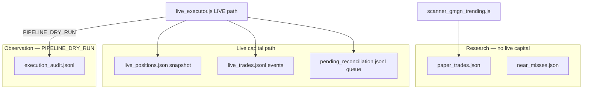

# M6a — Read-Only Reconciliation Panel (Plan)

**Sprint:** 2  
**Task:** M6a (plan only — no code changes in this document)  
**Goal:** Add a **read-only dashboard panel** so operators and Ori can see reconciliation queue status and compare **live / paper / state / audit** sources of truth — without retrying trades, editing ledgers, or mutating runtime files.  
**Reference:** [SPRINT_2_PLAN.md](./SPRINT_2_PLAN.md) § M6a / M6 · Success criterion **SC5** · [KNOWN_ISSUES.md](./KNOWN_ISSUES.md) — ambiguous on-chain outcomes  
**Runbook:** [RECONCILIATION_RUNBOOK.md](../RECONCILIATION_RUNBOOK.md) (repo root)  
**Follow-on:** M6 expands the same panel (row age emphasis, richer drill copy); A6 (Sprint 4) may **block automation** when queue non-empty — not M6a.

---

## What M6a is supposed to accomplish

When a live submission path hits an ambiguous outcome, the executor appends to `pending_reconciliation.jsonl` and **stops guessing** ([DECISIONS.md](./DECISIONS.md)). Today operators must open raw JSONL and cross-check other files manually. That increases double-submit risk and false confidence during promotion conversations.

M6a surfaces the queue and a **truth snapshot** on the dashboard — display only.

| M6a does | M6a does not |
|----------|--------------|
| Read and display `pending_reconciliation.jsonl` rows | Auto-retry trades or poll txSig status |
| Show open-row count + attention banner when non-empty | Clear, edit, or truncate reconciliation file |
| Link to `RECONCILIATION_RUNBOOK.md` | Block automation (A6 — Sprint 4) |
| Summarize counts from paper, live positions, live ledger, audit | Merge paper and live ledgers |
| Redact secrets; show public `txSig` truncated with lookup hint | Change executor write paths |
| Preserve `PIPELINE_DRY_RUN` observation behavior | Touch strategy or archive folders |

**Operator message after M6a:** *“Reconciliation queue: 0 open rows — pipeline observation uses `execution_audit.jsonl`, not this queue.”* Or: *“1 row requires human review — follow runbook; do not retry.”*

---

## Current state (inspected)

### Reconciliation writer — `live_executor.js`

**File:** `pending_reconciliation.jsonl` (`PENDING_RECONCILIATION_FILE`, line ~44)

**Writer:** `writePendingReconciliation(record)` (lines ~1536–1543) — append-only via `appendJsonl`; applies `redactSecrets()` to record fields.

**Context builder:** `buildReconciliationContext({ action, txSig, kind, tokenAddress, pairAddress, expectedPrice, positionSizeSol, submittedAt, builtSwap, currentBlockHeight, reason })`

**Triggered from LIVE submission path only** (after `PIPELINE_DRY_RUN` early return in `submitSwap`):

| `action` field | When |
|----------------|------|
| `SUBMISSION_UNKNOWN` | Submit HTTP timeout / lost response (`SUBMISSION_UNKNOWN` abort) |
| `CONFIRMATION_UNKNOWN` | Confirmation polling timeout / unknown finality |
| `FILL_PARSE_UNKNOWN` | Confirmed tx but fill parse failed |

**Typical row fields:** `timestamp`, `action`, `txSig`, `kind` (BUY/SELL), `tokenAddress`, `pairAddress`, `expectedPrice`, `positionSizeSol`, `submittedAt`, `lastValidBlockHeight`, `currentBlockHeight`, `operatorActionRequired: true`, `reason`.

**Exports:** `FILES.PENDING_RECONCILIATION_FILE`; `openPositions`, `readPositions`, `readLiveTrades` on `module.exports` (dashboard can reuse).

**No “resolved” flag** in file format today — every line in the file is treated as an **open** reconciliation item until an operator manually archives/clears per runbook (outside bot code). M6a displays **all parsed rows** as pending.

### Runbook — `RECONCILIATION_RUNBOOK.md` (repo root)

Documents three event types and explicit **do not retry** rule. Steps: stop live entries, lookup `txSig` on-chain, resolve manually, then update position/trade records before resume.

**Not under `docs/`** — dashboard link must use `/` or relative path `../RECONCILIATION_RUNBOOK.md` from docs pages; on dashboard HTML use plain path note: `RECONCILIATION_RUNBOOK.md` at repo root (operators open in IDE) or static markdown route if added later. **Minimal:** link to GitHub/raw path or `file://` note; **recommended:** relative link in dashboard subtitle: “See repo root `RECONCILIATION_RUNBOOK.md`” plus copy-paste path — no new static file server required.

### Dashboard — `dashboard_server.js` today

| Panel | Reads | Reconciliation? |
|-------|--------|-----------------|
| `phase1ReadinessPanel()` | `live_config.json`, `wallet_status.json`, `live_trades.jsonl` | **No** |
| `liveAutomationControlPanel()` | config, `liveStats()`, M7 `liveArmed` | **No** |
| `liveExecutionPanel()` | `liveStats()`, `groupLiveTrades()`, config | **No** |
| `liveVsPaperPanel()` | paper vs live stats | **No** |
| Paper sections | `paper_trades.json`, near misses | Research only |

**Gap:** No read of `pending_reconciliation.jsonl`, `live_positions.json`, or `execution_audit.jsonl` in dashboard HTML.

**Existing helpers:** `readJsonLines(file)` → `{ rows, invalid }`; `escapeHtml()`; `liveExecutor.FILES.*` pattern from Q5.

**Dashboard layout** (`renderDashboard`, ~2174–2186): system status → phase1 readiness → live automation → wallet → RPC → live execution → live vs paper → research panels. **Recommended M6a placement:** after `liveAutomationControlPanel()` (near M7 arming truth) or after `liveExecutionPanel()` — plan recommends **after live automation control** so reconciliation attention appears before wallet/RPC noise.

### Preflight — `validate_live_preflight.js`

`pendingReconciliationState()` — file absent, empty, or non-empty (binary). Used for live preflight, not dashboard. M6a can mirror “empty vs non-empty” semantics without calling preflight script.

### Other sources of truth (for comparison strip)

| File | Behavior | Role in reconciliation panel |
|------|----------|--------------------------------|
| **`paper_trades.json`** | JSONL; scanner append + monitor rewrite on close | **Research ledger** — open paper count; not live capital; do not conflate with reconciliation |
| **`live_positions.json`** | JSON array; executor **overwrites** on change | **Live state snapshot** — open position count/rows; may diverge from wallet during ambiguous tx |
| **`live_trades.jsonl`** | Append-only events via `writeLiveEvent` | **Live event history** — entries/exits/kill switch; canonical per Q5 |
| **`execution_audit.jsonl`** | Append-only pipeline/cycle audit | **Observation truth** in `PIPELINE_DRY_RUN` — `PIPELINE_DRY_RUN` stages; no on-chain submission; typically **empty reconciliation queue** |
| **`live_errors.jsonl`** | Append-only errors | Optional M6a footer: recent error count only (not primary) |
| **`wallet_status.json`** | Snapshot | Optional cross-check: balance/connectivity context only |

In **`PIPELINE_DRY_RUN`**, pipeline observations append to `execution_audit.jsonl` and **do not** write `pending_reconciliation.jsonl`. Panel must state that clearly so empty queue is not misread as “broken dashboard.”

---

## Sources of truth summary



| Question | Authoritative source | M6a display |
|----------|---------------------|-------------|
| Are ambiguous live txs pending review? | `pending_reconciliation.jsonl` | Row table + count |
| What live positions does the bot think are open? | `live_positions.json` | Count + optional mini table |
| What live events were recorded? | `live_trades.jsonl` | Open-event count / recent slice |
| What pipeline observations ran? | `execution_audit.jsonl` | Recent `PIPELINE_DRY_RUN` count |
| What paper research is open? | `paper_trades.json` | Open count (labeled **paper only**) |
| Is live submission armed? | M7 `computeLiveArmedStatus()` | Cross-link existing strip (no duplicate logic) |

---

## What the read-only panel should display

### A. Header strip (always visible)

| Element | Content |
|---------|---------|
| **Title** | `RECONCILIATION & TRUTH SNAPSHOT` (or similar) |
| **Queue badge** | `CLEAR` (green) when 0 rows · `ATTENTION REQUIRED` (red) when ≥1 row |
| **Row count** | `pending_reconciliation.jsonl: N row(s)` |
| **Mode context** | Current `executionMode` from config (expect `PIPELINE_DRY_RUN`) |
| **Safety banner** | Fixed text: *Do not retry automatically. Follow runbook. Display only — no mutations.* |
| **Runbook link** | Pointer to repo root [RECONCILIATION_RUNBOOK.md](../RECONCILIATION_RUNBOOK.md) |

### B. Pending reconciliation table (primary)

When file missing or empty: single calm message — *No pending reconciliation rows. Normal in PIPELINE_DRY_RUN unless live-path tests produced ambiguous submissions.*

When rows exist, columns (minimum):

| Column | Source field | Notes |
|--------|--------------|-------|
| Age | `timestamp` | Relative time (e.g. “2h ago”) — **M6** can polish; M6a shows ISO + age |
| Action | `action` | Link anchor to runbook section (`SUBMISSION_UNKNOWN`, etc.) |
| Kind | `kind` | BUY / SELL |
| Token | `tokenAddress` | Truncate mint |
| txSig | `txSig` | Truncate display (`abc12345…wxyz`); full sig in `title` attribute for copy; optional external Solscan link (read-only, new tab) |
| Size | `positionSizeSol` | SOL |
| Block hint | `lastValidBlockHeight` / `currentBlockHeight` | If present |
| Reason | `reason` | Truncated |

**No buttons:** Resolve, Retry, Clear, Dismiss.

### C. Truth comparison cards (secondary — read-only counts)

Compact card row comparing **parallel truths**:

| Card | Metric | Source |
|------|--------|--------|
| Reconciliation queue | `N` open rows | `pending_reconciliation.jsonl` |
| Open live positions | count | `liveExecutor.openPositions()` or read `live_positions.json` |
| Live ledger events | total lines / parse errors | `readJsonLines(LIVE_TRADES_FILE)` |
| Pipeline audit (24h optional) | recent `PIPELINE_DRY_RUN` stage count | `execution_audit.jsonl` tail scan (cap lines for perf) |
| Open paper trades | count | `paper_trades.json` where `status === OPEN` |
| Live armed | yes/no | `liveExecutor.computeLiveArmedStatus(cfg).liveArmed` |

**Divergence hint (text only):** If `pending_reconciliation.jsonl` non-empty **and** `openPositions > 0`, show amber note: *Wallet and bot state may diverge until runbook resolution.*

### D. Explicit non-goals in panel footer

- Paper trades ≠ live positions  
- `execution_audit.jsonl` success ≠ live fill success  
- Empty reconciliation queue ≠ “safe to arm live” (use M7 + M8)

---

## Minimal safe change

**Scope:** **`dashboard_server.js` only** — new `reconciliationPanel()` + styles + one line in `renderDashboard()`.

**No `live_executor.js` changes required** — use existing exports (`FILES`, `openPositions`, `readLiveTrades`, `computeLiveArmedStatus`, `resolveExecutionMode`, `loadConfig` via reading config file like other panels).

### Implementation sketch

1. **Constants**

```javascript
const PENDING_RECONCILIATION_FILE =
  liveExecutor?.FILES?.PENDING_RECONCILIATION_FILE || path.join(ROOT, "pending_reconciliation.jsonl");
const LIVE_POSITIONS_FILE =
  liveExecutor?.FILES?.LIVE_POSITIONS_FILE || path.join(ROOT, "live_positions.json");
const EXECUTION_AUDIT_FILE =
  liveExecutor?.FILES?.EXECUTION_AUDIT_FILE || path.join(ROOT, "execution_audit.jsonl");
const RECON_RUNBOOK = "RECONCILIATION_RUNBOOK.md"; // repo root — document in subtitle
```

2. **`reconciliationPanel()`**

- Read config for `executionMode` / `resolveExecutionMode`
- `readJsonLines(PENDING_RECONCILIATION_FILE)`
- `liveExecutor.openPositions()` (try/catch)
- `readJsonLines(LIVE_TRADES_FILE)` for count
- Optional: tail last 500 lines of `execution_audit.jsonl` counting `stage === "PIPELINE_DRY_RUN"` or `eventType === "EXECUTION_STAGE"` payloads (match existing audit shape)
- `readJsonLines(PAPER_FILE)` open count
- `computeLiveArmedStatus(cfg)` if executor loaded
- Render HTML; **never** `writeFileSync`, `appendFileSync`, POST handlers

3. **Styles** — reuse `.wc-rpc-warn` / `.ac-live-armed-*` patterns; add `.recon-clear` / `.recon-attention` badges

4. **`renderDashboard()`** — insert `${reconciliationPanel()}` after `liveAutomationControlPanel()`

### Optional doc touch (post-implementation)

| File | Change |
|------|--------|
| [KNOWN_ISSUES.md](./KNOWN_ISSUES.md) | Mark reconciliation UX **partially resolved** (M6a display; M6 full panel) |
| [OPERATIONS.md](./OPERATIONS.md) | One line: dashboard reconciliation panel location |

**Out of M6a scope (M6 / later):**

- Row-level runbook anchor deep links with drill checklist UI  
- Automated Solana RPC tx status polling  
- `pending_reconciliation` “resolved” schema / archive file  
- A6 automation block when queue non-empty  
- Executor export of `readPendingReconciliation()` helper  

---

## Preserve behavior

| Area | M6a impact |
|------|------------|
| `writePendingReconciliation` / LIVE path | **Unchanged** |
| `PIPELINE_DRY_RUN` / pipeline observation | **Unchanged** |
| Strategy / filters | **Unchanged** |
| Append-only files | **Read only** — no writes |
| Dashboard control buttons | **Unchanged** |
| `npm test` four-script suite | **Unchanged** (no new CI requirement) |
| Archive folders | **Untouched** |

---

## Risks

| Risk | Level | Mitigation |
|------|-------|------------|
| **Retry temptation** — UI looks like a workflow | High | No action buttons; runbook copy prominent |
| **False calm** — empty queue in PIPELINE_DRY_RUN | Medium | Mode banner explaining queue applies to live ambiguous path |
| **False alarm** — stale rows never cleared manually | Medium | Show row age; note manual archive per runbook |
| **Performance** — large `execution_audit.jsonl` | Low | Tail cap (e.g. last 500–1000 lines) for counts only |
| **Parse errors** in reconciliation file | Medium | Show `invalid` line count like other JSONL panels |
| **Scope creep** — on-chain polling or A6 blocking | Medium | M6a checklist in PR review |
| **txSig display** — operator needs full hash | Low | `title` tooltip + runbook “copy from file” fallback |
| **Paper vs live conflation** | Medium | Label paper card “research only” |

---

## Acceptance criteria

| # | Criterion | Verification |
|---|-----------|--------------|
| AC1 | Panel renders on main dashboard | Load `http://localhost:3000` |
| AC2 | **Empty queue** shows CLEAR badge + PIPELINE_DRY_RUN context | Default dev env |
| AC3 | **Non-empty queue** shows ATTENTION REQUIRED + row table | Local test row appended manually (not committed) |
| AC4 | Runbook referenced in panel | Visible link/path to `RECONCILIATION_RUNBOOK.md` |
| AC5 | Truth cards show paper / live positions / live ledger / audit counts | Visual review |
| AC6 | **No** retry/clear/resolve controls | HTML inspect |
| AC7 | No runtime file mutations from dashboard | Code review — read-only FS |
| AC8 | **SC5** — Ori can answer “any open reconciliation?” without opening JSONL | Reviewer quiz |
| AC9 | `npm test` still passes | `node run_safety_tests.js` |
| AC10 | Diff scope **`dashboard_server.js`** (+ optional docs) only | `git diff` |

---

## Verification steps (coding pass)

```powershell
# 1. Syntax
node --check dashboard_server.js

# 2. Empty queue (expected default in PIPELINE_DRY_RUN)
node dashboard_server.js
# Open http://localhost:3000 — reconciliation panel CLEAR, 0 rows

# 3. Simulated non-empty queue (local only — do NOT commit)
# Append one JSON line to pending_reconciliation.jsonl matching runbook schema
# Reload dashboard — ATTENTION REQUIRED, row visible, no action buttons

# 4. Safety suite unchanged
node run_safety_tests.js

# 5. Executor status unchanged
node live_executor.js --status
# Expect PIPELINE_DRY_RUN, liveArmed false
```

**Sample local test row (do not commit):**

```json
{"timestamp":"2026-06-22T12:00:00.000Z","action":"SUBMISSION_UNKNOWN","txSig":"5testSigForDashboardDrillOnlyDoNotSubmit1234567890123456789012345678901234","kind":"BUY","tokenAddress":"11111111111111111111111111111111","pairAddress":"test-pair","expectedPrice":1,"positionSizeSol":0.005,"operatorActionRequired":true,"reason":"M6a dashboard drill row"}
```

Remove drill row after verification.

---

## Implementation checklist

- [ ] Add `reconciliationPanel()` to `dashboard_server.js`
- [ ] Add styles for CLEAR / ATTENTION badges and table
- [ ] Wire into `renderDashboard()` after live automation panel
- [ ] Manual verification: empty + drill row
- [ ] `node run_safety_tests.js` — 4/4 pass
- [ ] Optional: update `KNOWN_ISSUES.md` (partial resolution)
- [ ] Single commit: e.g. “Add read-only reconciliation truth panel to dashboard (Sprint 2 M6a)”

---

## Rollback

Revert dashboard commit. Panel disappears; no executor or runtime data impact.

---

## Summary

| Question | Answer |
|----------|--------|
| What does M6a add? | **Read-only reconciliation queue + truth snapshot** on dashboard |
| Minimal code touch? | **`dashboard_server.js` only** |
| Primary file? | `pending_reconciliation.jsonl` |
| Comparison sources? | Paper open, live positions, live_trades.jsonl, execution_audit.jsonl, M7 liveArmed |
| Retries / mutations? | **Forbidden** |
| Builds toward | **M6** full panel · **A6** automation block (Sprint 4) |

**Do not modify application code until this plan is reviewed.**
