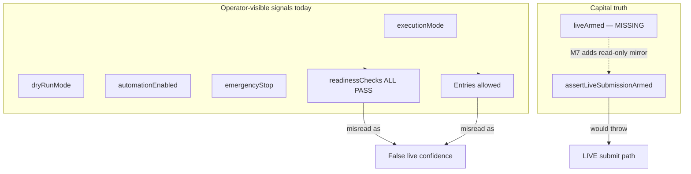

# M7 — `liveArmed` / Disarmed Truth (Plan)

**Sprint:** 2  
**Task:** M7 (plan only — no code changes in this document)  
**Goal:** Expose a single **liveArmed** boolean and clear **operational posture** so operators and Ori can tell whether the system is **observing only** or **capable of live on-chain submission**.  
**Reference:** [SPRINT_2_PLAN.md](./SPRINT_2_PLAN.md) § M7 · Success criterion **SC6** · [KNOWN_ISSUES.md](./KNOWN_ISSUES.md) — env flag proliferation  
**Acceptance (from sprint):** `--status` and dashboard show computed disarmed summary; no live gate armed in `PIPELINE_DRY_RUN`.

---

## What M7 is supposed to accomplish

Today the bot exposes **many overlapping signals** — `executionMode`, `dryRunMode`, `automationEnabled`, `emergencyStop`, env flags, readiness checklist rows, and dashboard badges — without one authoritative answer to:

> **Could this process submit a real signed transaction right now?**

In `PIPELINE_DRY_RUN` with `automationEnabled: true`, `--status` may show **“Entries allowed: true”** and **“Readiness: ALL PASS”** while **no live capital can move**. That is correct for pipeline observation but easy to misread as live readiness.

M7 adds **read-only aggregation** — no new gates, no arming paths, no behavior changes.

| M7 does | M7 does not |
|---------|-------------|
| Compute and display **`liveArmed`** from existing gate logic | Enable live trading or change `assertLiveSubmissionArmed` |
| Show **operational posture** (observing vs halted vs live-capable) | Merge or remove existing env flags |
| Clarify **`--status`** and dashboard automation panels | Change `readinessChecks()` pass/fail rules for START |
| Export a display helper for dashboard reuse | Touch strategy, thesis filters, or archive folders |
| Document gate breakdown when disarmed | Require dedicated RPC for `PIPELINE_DRY_RUN` observation |

**Operator message after M7:** *“liveArmed: false — PIPELINE OBSERVATION ONLY”* is the default and expected state during Sprint 2.

---

## Current state (inspected)

### Authoritative live submission gate — `live_executor.js`

**Function:** `assertLiveSubmissionArmed(cfg)` (lines ~1563–1587)

Called only on the **LIVE** path inside `submitSwap`, **after** pipeline dry-run returns early (line ~2027–2034). Throws if any condition fails.

| # | Gate | Check |
|---|------|--------|
| G1 | `executionMode` | `resolveExecutionMode(cfg) === "LIVE"` |
| G2 | `dryRunMode` | `cfg.dryRunMode === false` |
| G3 | `emergencyStop` | `cfg.emergencyStop === false` |
| G4 | `automationEnabled` | `cfg.automationEnabled === true` |
| G5 | Signer env | `process.env.SOLANA_SIGNER_SECRET` present |
| G6 | Live submission flag | `process.env.FOMO_ENABLE_LIVE_SUBMISSION === "YES"` |
| G7 | Position size | `0 < positionSizeSol <= 0.01` (first-live cap) |
| G8 | Dedicated RPC | `resolveRpcEndpoint(cfg, { requireDedicated: true, purpose: "submission" })` succeeds |

**Not in `assertLiveSubmissionArmed`:** `FOMO_ALLOW_LOOP_LIVE` (only gates `live_executor.js --loop` in LIVE mode via `liveLoopAllowed()`), wallet RPC connectivity, `wallet_status.json`.

### Config fields — `live_config.json` (current dev snapshot)

| Field | Current value | Role |
|-------|---------------|------|
| `executionMode` | `PIPELINE_DRY_RUN` | Primary mode selector |
| `dryRunMode` | `true` | Phase 1 safe default; synced by `loadConfig()` when in dry-run modes |
| `automationEnabled` | `true` | Gates **entries** (including pipeline observation cycles) |
| `emergencyStop` | `false` | Full halt when true |
| `walletPublicAddress` | set | Config identity; used in pipeline dry-run identity signer |
| `positionSizeSol` | `0.005` | Within first-live cap |

**Expected M7 result for this file:** `liveArmed: false` (fails G1, G2, G5, G6 at minimum).

### Mode resolution — `resolveExecutionMode` / `isAnyDryRun`

```106:115:live_executor.js
function resolveExecutionMode(cfg) {
  if (["DRY_RUN", "PIPELINE_DRY_RUN", "LIVE"].includes(cfg?.executionMode)) {
    return cfg.executionMode;
  }
  return cfg?.dryRunMode === false ? "LIVE" : "DRY_RUN";
}

function isAnyDryRun(cfg) {
  return resolveExecutionMode(cfg) !== "LIVE";
}
```

### Entry gate (not live arming) — `safetyCheck(cfg)`

Separate from live submission. Blocks entries when:

- `emergencyStop`
- `!automationEnabled`
- max open positions
- daily loss stops

Returns `{ allowed, reasons }`. Used in `--status` as **“Entries allowed”** — **does not mean liveArmed**.

### Readiness checklist — `readinessChecks(cfg)`

Used by dashboard **START** button and `--status` **“Readiness: ALL PASS”**.

- Validates config hygiene, emergency stop, wallet address string, size limits, forbidden flags, ledger parse, execution mode labels.
- In non-`LIVE` modes: passes **“Dry run mode ON”** and **“PIPELINE_DRY_RUN observation milestone”** without requiring signer or `FOMO_ENABLE_LIVE_SUBMISSION`.
- **Dedicated RPC** row passes when `isAnyDryRun(cfg)` even if no Helius env — informational deferral until LIVE.

**Gap:** `allPassed: true` in `PIPELINE_DRY_RUN` is **not** live readiness; operators may conflate it with capital-safe-to-arm.

### `--status` output today (default, no execution)

Prints (lines ~2834–2840):

- `executionMode`, `dryRunMode`, `automationEnabled`, `emergencyStop`
- `LIVE loop allowed` (+ `FOMO_ALLOW_LOOP_LIVE` hint in LIVE mode)
- `Entries allowed` from `safetyCheck`
- `Readiness: ALL PASS | FAILS: …` from `readinessChecks`

**Missing:** explicit `liveArmed`, posture label, gate failure summary for live submission.

### Dashboard — `dashboard_server.js`

| Surface | What it shows | Gap |
|---------|---------------|-----|
| **`liveAutomationControlPanel()`** | Badge: `RUNNING — PIPELINE DRY RUN`; dry-run banner; readiness list | No `liveArmed`; “RUNNING” can sound live |
| **`phase1ReadinessPanel()`** | `Real Trading: DISABLED` when `dryRunMode` | Good for Phase 1; doesn’t list env gates (signer, `FOMO_ENABLE_LIVE_SUBMISSION`) |
| **Legacy readiness block** (~1538) | `Real trading: DISABLED` / `BLOCKED` based on `dryRunMode` only | Confusing when `dryRunMode` false but not armed |
| **Live banner** (non-dryRun path) | “LIVE MODE — real execution remains blocked until Step 9” | Stale wording; doesn’t reflect `assertLiveSubmissionArmed` |

Dashboard loads `liveExecutor.readinessChecks(cfg)` but has **no** `computeLiveArmedStatus` equivalent today.

### Ori / issue registry

- [ORI_MEMORY.md](./ORI_MEMORY.md): Live submission **not armed** when no `FOMO_ENABLE_LIVE_SUBMISSION` / signer; advises on `PIPELINE_DRY_RUN` default.
- [KNOWN_ISSUES.md](./KNOWN_ISSUES.md) — **Env flag proliferation for live arming**: proposes single `liveArmed` in `--status` and dashboard (M7 scope).

---

## Gap summary



**Root cause:** Readiness and entry gates describe **observation/automation health**, not **live submission arming**. No single field answers Ori’s question: *“Is live capital at risk from automation?”*

---

## Define `liveArmed`

### Primary definition (conservative)

```text
liveArmed === true
  if and only if assertLiveSubmissionArmed(cfg) would succeed
  (zero failures in the G1–G8 table above)
```

```text
liveArmed === false
  otherwise — including all normal Sprint 2 operation in PIPELINE_DRY_RUN
```

**Important:** `liveArmed: true` means **capability**, not intent. It does not mean a trade is in flight. It means the configured process **could** reach signing/submission if the LIVE execution path were invoked with current config + env.

### Secondary field: `operationalPosture` (recommended)

A human-readable enum derived from config (display only):

| Posture | Conditions (simplified) |
|---------|-------------------------|
| `EMERGENCY_HALTED` | `emergencyStop === true` |
| `LIVE_ARMED` | `liveArmed === true` |
| `LIVE_MODE_DISARMED` | `executionMode === LIVE` (or legacy LIVE resolution) but `liveArmed === false` |
| `PIPELINE_OBSERVING` | `executionMode === PIPELINE_DRY_RUN` && `automationEnabled` && !emergency |
| `STOPPED` | `!automationEnabled` && !emergency && dry-run family |
| `DRY_RUN_LEGACY` | `executionMode === DRY_RUN` |

**Default Sprint 2 posture:** `PIPELINE_OBSERVING` or `STOPPED`, always with **`liveArmed: false`**.

### Related signals (do not conflate)

| Signal | Meaning | Same as liveArmed? |
|--------|---------|-------------------|
| `safetyCheck.allowed` | Entry cycle may proceed (observation or live path) | **No** |
| `readinessChecks.allPassed` | START button prerequisites | **No** |
| `dryRunMode` | Phase 1 dry-run flag | **No** (necessary but not sufficient) |
| `automationEnabled` | Entries enabled | **No** (pipeline observation uses this) |
| Wallet connected (`wallet_status.json`) | RPC read health | **No** (not in assertLiveSubmissionArmed) |
| `FOMO_ALLOW_LOOP_LIVE` | LIVE `--loop` only | **No** (show separately as `liveLoopAllowed`) |

---

## Minimal safe change

**Scope:** `live_executor.js` (compute + `--status` + export) and `dashboard_server.js` (display). Optional doc touch-up in `KNOWN_ISSUES.md` after implementation.

### 1. Add `computeLiveArmedStatus(cfg, options?)` in `live_executor.js`

Read-only helper mirroring `assertLiveSubmissionArmed` failure collection **without throwing**:

```javascript
// Pseudocode — keep in sync with assertLiveSubmissionArmed (G1–G8).
function computeLiveArmedStatus(cfg = loadConfig(), { positionSizeSol = cfg?.positionSizeSol } = {}) {
  const failures = [];
  const gates = {};
  // populate gates[name] = { ok, detail } for each G1–G8
  // use same resolveExecutionMode / resolveRpcEndpoint calls
  return {
    liveArmed: failures.length === 0,
    failures,
    gates,
    operationalPosture: derivePosture(cfg, failures), // enum string
    summary: liveArmed ? "Live submission gates satisfied" : "DISARMED — " + primaryReason(failures)
  };
}
```

**Rules:**

- **Single source of truth:** extract shared failure list builder used by both `assertLiveSubmissionArmed` and `computeLiveArmedStatus`, **or** call the same internal helper — behavior must stay identical.
- **Preferred minimal diff:** refactor `assertLiveSubmissionArmed` to call `collectLiveSubmissionGateFailures(cfg)` then throw if non-empty; `computeLiveArmedStatus` uses the same collector. This is a **structural extract**, not a logic change — still satisfies “do not modify execution behavior” if throw conditions unchanged.
- **Do not** add new failure conditions in M7.
- **Do not** read or require signer secret contents — only env presence boolean.

Export on `module.exports`: `computeLiveArmedStatus`.

### 2. Update `--status` (default branch)

Add after existing lines:

```text
liveArmed: false
operationalPosture: PIPELINE_OBSERVING
liveSubmissionGates: executionMode (PIPELINE_DRY_RUN); dryRunMode (true); signer (absent); …
```

When `liveArmed: true` (test harness only — not expected in Sprint 2 ops):

```text
⚠ liveArmed: true — LIVE SUBMISSION GATES SATISFIED
```

Keep existing fields for backward compatibility; prefix new block clearly.

### 3. Update dashboard (display only)

**`liveAutomationControlPanel()`** — add top strip:

- Large badge: **`LIVE ARMED: NO`** (green/red) or **`LIVE ARMED: YES`** (red pulse if yes)
- Subline: posture + one-line summary
- Collapsible/table: G1–G8 gate rows (ok/fail), redact env values

**`phase1ReadinessPanel()`** — add status card:

- **`Live armed`** → `NO — DISARMED` (default)
- Cross-link: “Observation entries may still run when automation is ON”

**Do not** change START/STOP/EMERGENCY handlers, `startDisabled` logic, or readiness pass rules in M7.

### 4. Optional test (recommended, small)

Add focused test script or extend existing guard test:

- Default `live_config.json` + empty env → `liveArmed === false`, posture not `LIVE_ARMED`
- Synthetic cfg + env satisfying all gates → `liveArmed === true` (test fixture only; do not commit armed config)

**Do not** expand `npm test` four-script suite unless explicitly approved — can remain manual like `test_rpc_endpoint_resolution.js`.

### 5. Documentation (post-implementation)

| File | Change |
|------|--------|
| [KNOWN_ISSUES.md](./KNOWN_ISSUES.md) | Mark **Env flag proliferation** partially resolved (M7 display); M8 owns checklist |
| [OPERATIONS.md](./OPERATIONS.md) | One paragraph: interpret `liveArmed` vs `Entries allowed` |
| [SPRINT_2_PLAN.md](./SPRINT_2_PLAN.md) | Check off M7 when done |

**Out of M7 scope:** M8 promotion checklist UI, config audit (A3), blocking automation on reconciliation (A6).

---

## Preserve behavior

| Area | M7 impact |
|------|-----------|
| `assertLiveSubmissionArmed` throw conditions | **Unchanged** (same failures) |
| `submitSwap` / signing / submission | **Unchanged** |
| `readinessChecks` / START button | **Unchanged** |
| `safetyCheck` / cycle entry gating | **Unchanged** |
| `PIPELINE_DRY_RUN` default | **Unchanged** |
| Strategy / thesis filters | **Unchanged** |
| Env var contracts | **Unchanged** — display only |
| Archive folders | **Untouched** |

---

## Risks

| Risk | Level | Mitigation |
|------|-------|------------|
| **Logic drift** — collector diverges from `assertLiveSubmissionArmed` | High | Shared `collectLiveSubmissionGateFailures`; unit test both paths |
| **False alarm** — `liveArmed: true` on dev machine with test env | Medium | Document; never set armed env in shared Sprint 2 ops |
| **False confidence inverted** — operators ignore `liveArmed` because readiness still ALL PASS | Medium | Dashboard copy: “Readiness ≠ live armed”; Ori briefing |
| **Scope creep** — M7 becomes M8 checklist or changes START rules | Medium | Display-only constraint in PR review |
| **Refactor perceived as behavior change** | Low | No new throw paths; run `npm test` before merge |
| **Stale LIVE banner text** | Low | Optional one-line banner fix in dashboard if touched (wording only) |
| **Leaking signer material** | High if mishandled | Gate rows show “present/absent” only, never secret values |

---

## Acceptance criteria

| # | Criterion | Verification |
|---|-----------|--------------|
| AC1 | **`liveArmed: false`** on default `PIPELINE_DRY_RUN` + `dryRunMode: true` | `node live_executor.js --status` |
| AC2 | **`operationalPosture`** reflects observing vs stopped vs emergency | Visual / status output |
| AC3 | Gate breakdown lists **why** disarmed (mode, signer, env flag, RPC, etc.) | Status + dashboard |
| AC4 | **`liveArmed: true`** only when all G1–G8 pass (synthetic test fixture) | Unit/manual test |
| AC5 | Dashboard shows **`LIVE ARMED: NO`** prominently in automation panel | Browser inspect |
| AC6 | **`Entries allowed: true`** may coexist with **`liveArmed: false`** — copy explains | Operator quiz |
| AC7 | **No execution behavior change** | `npm test` 4/4; diff excludes submit path logic changes except extract |
| AC8 | **SC6** — Ori can answer “is live armed?” from `--status` alone | Reviewer sign-off |
| AC9 | Archive folders untouched | `git diff` scope |

---

## Verification steps (coding pass)

```powershell
# 1. Default posture (expected: disarmed)
node live_executor.js --status
# Expect: liveArmed: false, operationalPosture: PIPELINE_OBSERVING (or STOPPED if automation off)
# Expect: executionMode: PIPELINE_DRY_RUN

# 2. Safety suite unchanged
node run_safety_tests.js
# Expect: 4/4 passed

# 3. Dashboard
node dashboard_server.js
# Open http://localhost:3000 — LIVE ARMED: NO visible on automation panel

# 4. Emergency stop drill (optional)
node emergency_stop.js
node live_executor.js --status
# Expect: liveArmed: false, posture EMERGENCY_HALTED

# 5. Synthetic armed fixture (local only — do NOT commit armed .env)
# Set LIVE + dryRunMode false + env flags in isolated branch/shell
# Expect: liveArmed: true ONLY when all G1–G8 satisfied
```

---

## Implementation checklist

- [ ] Add `collectLiveSubmissionGateFailures(cfg)` shared with `assertLiveSubmissionArmed`
- [ ] Add `computeLiveArmedStatus(cfg)` + `derivePosture(cfg, failures)`
- [ ] Export on `module.exports`
- [ ] Extend `--status` output with `liveArmed`, posture, gate summary
- [ ] Update `liveAutomationControlPanel()` with LIVE ARMED strip + gate table
- [ ] Update `phase1ReadinessPanel()` with Live armed card
- [ ] Manual verification per acceptance table
- [ ] Update `KNOWN_ISSUES.md` (env flag proliferation — partial)
- [ ] Single commit: e.g. “Expose liveArmed disarmed truth in status and dashboard (Sprint 2 M7)”

---

## Rollback

Revert M7 commit. `--status` and dashboard return to prior multi-signal layout. No runtime or arming behavior impact.

---

## Summary

| Question | Answer |
|----------|--------|
| What is `liveArmed`? | **True iff** existing `assertLiveSubmissionArmed` would pass (G1–G8) |
| Default in Sprint 2? | **`false`** — always in `PIPELINE_DRY_RUN` |
| Does automation ON mean live? | **No** — use `operationalPosture: PIPELINE_OBSERVING` |
| Minimal code touch? | **`live_executor.js`** (compute + status + export) + **`dashboard_server.js`** (display) |
| Enables live trading? | **No** — visibility only |
| Builds toward | **M8** promotion checklist |

**Do not modify application code until this plan is reviewed.**
