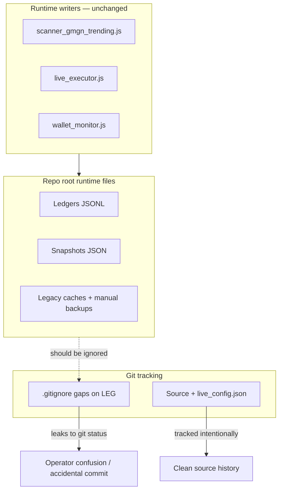

# Q10 — Gitignore Audit + Local Data Convention (Plan)

**Sprint:** 1  
**Task:** Q10 (plan only — no code changes in this document)  
**Goal:** Ensure runtime JSON/JSONL artifacts stay **local and untracked**, and encode the **local-data policy** (plus optional future `data/` convention) in `MIGRATION_NOTES.md`.  
**Reference:** [SPRINT_1_PLAN.md](./SPRINT_1_PLAN.md) § Q10 · Success criterion **SC9**  
**Acceptance (from sprint):** `git status` on a dev machine shows only intentional source changes; `MIGRATION_NOTES` states local-data policy.

---

## What Q10 is supposed to accomplish

Phase 0 established that git history should remain **source-only**. Runtime ledgers, backups, and scanner caches still live beside source at repo root — which is fine for local operation — but several artifacts are **not yet gitignored**, so `git status` surfaces operational history as untracked noise and invites accidental commits.

Q10 closes that gap with a **minimal `.gitignore` audit** and **documentation** — not a data migration, not a repo cleanup commit of local files.

| Q10 does | Q10 does not |
|----------|--------------|
| Audit and extend `.gitignore` for known runtime artifacts | Move runtime writers to a `data/` directory |
| Document local-only data policy in `MIGRATION_NOTES.md` | Commit local runtime files to “clean up” the tree |
| Note optional future `data/` convention for TracktaOS packaging | Change executor, scanner, or monitor file paths |
| Align docs with SC9 / KNOWN_ISSUES partial resolution | Touch strategy, `PIPELINE_DRY_RUN`, or archive folder code |
| Preserve tracked config (`live_config.json`) and npm manifests | Enforce runtime data deletion or `.gitignore` of archive trees |

**Operator message after Q10:** “If `git status` shows JSON ledgers or backups, that is expected locally — do not stage them. Source changes only.”

---

## Current state (inspected)

### Success criterion SC9 (from sprint plan)

> Runtime JSON remains gitignored; MIGRATION_NOTES documents local-only data convention

### `.gitignore` today (root)

**Well covered:**

| Pattern / file | Runtime artifacts protected |
|----------------|----------------------------|
| `*.jsonl` | All append-only ledgers (`execution_audit.jsonl`, `live_trades.jsonl`, `live_errors.jsonl`, `live_control_events.jsonl`, `pipeline_candidates.jsonl`, `simulation_*.jsonl`, etc.) |
| Explicit `.json` snapshots | `live_positions.json`, `wallet_status.json`, `rpc_health.json`, `simulation_results.json`, `paper_trades.json`, `near_misses.json`, `near_miss_followups.json` |
| Backups / archives | `backups/`, `archive/`, `*.zip`, `*.tar*`, `*.7z`, `*.bak` |
| Secrets | `.env`, key material patterns |

**Intentionally tracked JSON (must stay):**

| File | Why tracked |
|------|-------------|
| `live_config.json` (root) | Operational config template with safe defaults |
| `package.json`, `package-lock.json` | npm manifest |
| `automation/live_config.json`, `files/live_config.json`, `hardreset/live_config.json` | Archive snapshots (document-only; do not expand Q10 into archive edits) |

### Gap — files present locally but **not** gitignored

Inspected on dev machine (`git check-ignore` returns no match; `git status` shows `??`):

| File | Size (approx.) | Origin / notes |
|------|----------------|----------------|
| `boosts.json` | 43 KB | Legacy DexScreener boost cache (old scanners); not written by canonical `scanner_gmgn_trending.js` |
| `signals.json` | 10 B | Legacy / manual artifact (`[]`) |
| `trending.json` | 22 KB | Legacy trending cache; canonical scanner uses GMGN CLI in-memory |
| `live_trades.json` | 0 B | **Legacy** ledger name; executor v2 writes `live_trades.jsonl` only (Q5) |
| `near_misses_backup.json` | 367 KB | Manual operator backup |
| `paper_trades_backup.json` | 44 KB | Manual operator backup |
| `paper_trades_before_bot10.json` | 48 KB | Manual pre-migration snapshot |

**Already gitignored and absent from `git status`:** `paper_trades.json`, `near_misses.json`, `live_trades.jsonl`, `execution_audit.jsonl`, wallet/RPC snapshots, etc.

### Canonical runtime inventory (reference)

[ACTIVE_MANIFEST.md](../ACTIVE_MANIFEST.md) § “State and ledgers” lists canonical writers/readers. Preflight item 4 already says: *“Do not commit local runtime JSON/JSONL to source control.”* Q10 makes the gitignore match that statement.

### `MIGRATION_NOTES.md` today

**Strengths:**

- § “Runtime Data” inventories major ledgers and classifies them as data artifacts
- § “Backup And Archive Material” lists archive folders
- Safe-mode guidance (`PIPELINE_DRY_RUN`) is clear

**Gaps for Q10:**

- No explicit **local-only / never commit** policy statement with operator guidance
- No **future `data/` directory** convention for TracktaOS packaging
- § “Test Files” still says *“standalone Node test scripts rather than an npm test runner”* — outdated after Q6 (minor doc fix during implementation)
- Does not cross-reference `.gitignore` as enforcement mechanism

### Known issue registry

[KNOWN_ISSUES.md](./KNOWN_ISSUES.md) — **Runtime data mixed with source repository** lists `.gitignore` enforcement and `MIGRATION_NOTES.md` as the solution. Q10 partially resolves this (same pattern as Q9).

### CI / tests interaction

`run_safety_tests.js` preflight creates empty gitignored files when missing (`live_trades.jsonl`, `live_positions.json`, `paper_trades.json`, etc.). Q10 must **not** break this — ignored files remain creatable locally; CI fresh-clone behavior unchanged.

### Executor / scanner behavior

No Q10 requirement to change:

- `live_executor.js` paths (`LIVE_TRADES_FILE` → `live_trades.jsonl`)
- `scanner_gmgn_trending.js` writers (`paper_trades.json`, `near_misses.json`, `pipeline_candidates.jsonl`)
- `PIPELINE_DRY_RUN` or strategy filters

---

## Gap summary



**Root cause:** `.gitignore` was written for primary ledgers but not for legacy filenames (`live_trades.json`), legacy scanner caches (`boosts.json`, `trending.json`, `signals.json`), or manual `*_backup.json` / `*_before_*.json` snapshots.

---

## Minimal safe change

**Scope:** `.gitignore`, `MIGRATION_NOTES.md`, and optional small doc touch-ups. **No application code changes.**

### 1. Extend `.gitignore` (targeted additions only)

Add a commented block under existing runtime telemetry, e.g. **“Legacy runtime JSON + operator backups”**:

```gitignore
# Legacy runtime JSON + operator backups (repo root)
live_trades.json
boosts.json
signals.json
trending.json
*_backup.json
*_before_*.json
```

**Why these patterns:**

| Entry | Rationale |
|-------|-----------|
| `live_trades.json` | Sprint plan + Q5 legacy orphan; executor no longer reads it |
| `boosts.json`, `signals.json`, `trending.json` | Sprint plan explicit list; legacy/local caches |
| `*_backup.json` | Covers `near_misses_backup.json`, `paper_trades_backup.json`, etc. |
| `*_before_*.json` | Covers `paper_trades_before_bot10.json` and similar manual snapshots |

**Explicitly avoid:**

| Pattern | Risk |
|---------|------|
| `*.json` blanket | Would ignore `live_config.json`, `package.json` |
| `data/` directory ignore without writers using it | Misleading if empty dir never populated |
| Ignoring archive `*/live_config.json` | Out of scope; archive folders untouched |
| `git add` / commit of local runtime files | Violates sprint “do not commit to clean up” |

**Optional (comment-only in `.gitignore`, not required):** note that `*.jsonl` already covers `live_errors.jsonl`, `live_control_events.jsonl`, `simulation_intents.jsonl`, `simulation_rejections.jsonl`.

### 2. Update `MIGRATION_NOTES.md`

Add or expand sections:

#### A. **Local data policy (required)**

- Runtime JSON/JSONL at repo root is **environment-specific** and **must not be committed**
- Git enforcement: root `.gitignore` (link to ACTIVE_MANIFEST preflight #4)
- **Do not** `git add` ledgers/backups to “clean” the repo
- Fresh clones may have no runtime files until processes run or `npm test` preflight creates empty stubs

#### B. **Future `data/` convention (required — documentation only)**

Document as **TracktaOS packaging option**, not current behavior:

| Phase | Convention |
|-------|--------------|
| **Now (Sprint 1)** | All runtime paths remain repo root filenames listed in ACTIVE_MANIFEST |
| **Future (TracktaOS)** | Optional `data/` directory (or external volume mount) holding ledgers; writers/readers updated in a later sprint — **not Q10** |

Include a sample layout for migration planning only:

```text
data/
  paper_trades.json
  pipeline_candidates.jsonl
  live_trades.jsonl
  execution_audit.jsonl
  ...
```

State clearly: **no code moves in Q10**.

#### C. **Minor accuracy fixes (recommended)**

- Update Test Files section: `npm test` → `run_safety_tests.js` (Q6)
- Add cross-link to `.gitignore` and ACTIVE_MANIFEST runtime table

### 3. Optional doc touch-ups (post-implementation)

| File | Change |
|------|--------|
| [KNOWN_ISSUES.md](./KNOWN_ISSUES.md) | Mark **Runtime data mixed with source** partially resolved (Q10) |
| [ACTIVE_MANIFEST.md](../ACTIVE_MANIFEST.md) | One line: “Enforced by root `.gitignore` — see MIGRATION_NOTES local-data policy” |
| [OPERATIONS.md](./OPERATIONS.md) | Optional preflight bullet: verify runtime JSON not staged |

**Not required:** new npm test, CI workflow changes, or `data/` directory creation.

---

## Preserve behavior

| Area | Q10 impact |
|------|------------|
| `live_executor.js` | Unchanged — no path or logic edits |
| `scanner_gmgn_trending.js` / `monitor.js` | Unchanged |
| `PIPELINE_DRY_RUN` / strategy | Unchanged |
| `wallet_monitor.js` | Unchanged |
| Archive folders (`automation/`, etc.) | No edits |
| Tracked `live_config.json` | Remains tracked |
| `npm test` / CI preflight | Unchanged — still creates empty ignored stubs |
| Local runtime files on disk | **Preserved** — gitignore hides them, does not delete |

---

## Risks

| Risk | Level | Mitigation |
|------|-------|------------|
| **Over-broad ignore patterns** ignore source JSON | Medium | No `*.json`; explicit list + backup suffix patterns only |
| **Accidental commit of runtime data** during “cleanup” | Medium | Plan + MIGRATION_NOTES explicitly forbid staging ledgers |
| **Operator thinks data was deleted** | Low | Document that gitignore ≠ delete; files stay on disk |
| **Future `data/` doc read as mandate to refactor paths** | Medium | Label as future TracktaOS option; writers unchanged in Q10 |
| **`*_backup.json` ignores something needed in git** | Low | No tracked files match pattern today (`git ls-files` verified) |
| **Archive folder tracked configs** | Low | Do not expand Q10 into archive `.gitignore` changes |
| **Logic drift** — manifest lists file gitignore misses | Low | Cross-check ACTIVE_MANIFEST runtime table against new ignore entries |

---

## Acceptance criteria

| # | Criterion | Verification |
|---|-----------|--------------|
| AC1 | Legacy/cache files gitignored | `git check-ignore -v boosts.json signals.json trending.json live_trades.json` → match |
| AC2 | Manual backup snapshots gitignored | `git check-ignore -v near_misses_backup.json paper_trades_backup.json paper_trades_before_bot10.json` → match |
| AC3 | Primary ledgers still gitignored | `git check-ignore -v paper_trades.json live_trades.jsonl execution_audit.jsonl` → match |
| AC4 | Source JSON still tracked | `git ls-files live_config.json package.json` → listed |
| AC5 | `git status` shows source-only noise | After ignore update: no `??` for runtime JSON listed above; local ledgers may still exist on disk |
| AC6 | `MIGRATION_NOTES` states local-data policy | Doc review: never commit runtime; optional `data/` future note |
| AC7 | **SC9** satisfied | Reviewer confirms gitignore + migration doc |
| AC8 | **SC10** preserved | `node live_executor.js --status` → `PIPELINE_DRY_RUN` after Q10 |
| AC9 | No executor / strategy / archive code diff | `git diff` — `.gitignore` + docs only |
| AC10 | CI still green | `npm test` exits 0 |

**Manual test script (coding pass):**

```powershell
# 1. After .gitignore update — confirm ignore rules
git check-ignore -v boosts.json live_trades.json paper_trades_backup.json

# 2. Status should not list ignored runtime files (may still show untracked docs)
git status

# 3. Safety + mode smoke (SC10)
npm test
node live_executor.js --status

# 4. Confirm live_config still tracked
git ls-files live_config.json
```

---

## Implementation checklist

- [ ] Add legacy/backup ignore block to root `.gitignore`
- [ ] Verify no tracked file matches new patterns (`git ls-files '*.json'`)
- [ ] Update `MIGRATION_NOTES.md` — local-data policy + future `data/` convention
- [ ] Fix outdated npm test note in `MIGRATION_NOTES.md` (Q6 alignment)
- [ ] Optional: update `KNOWN_ISSUES.md`, `ACTIVE_MANIFEST.md`, `OPERATIONS.md`
- [ ] Manual verification per acceptance table
- [ ] Single commit: e.g. “Audit gitignore and document local runtime data policy (Sprint 1 Q10)”
- [ ] **Do not** stage or commit local runtime JSON files

---

## Rollback

Revert the `.gitignore` and doc commit. Runtime files on disk unaffected; git may again show untracked runtime JSON.

---

## Summary

| Question | Answer |
|----------|--------|
| What does Q10 add? | **Complete gitignore coverage** for known runtime/legacy/backup JSON + **documented local-data policy** |
| Minimal code touch? | **`.gitignore` + `MIGRATION_NOTES.md`** (+ optional doc cross-links) |
| Executor / path changes? | **None** |
| `data/` directory? | **Document only** — future TracktaOS packaging; no writer moves in Q10 |
| Key operator message? | **Runtime ledgers stay local; never commit them to clean git status** |

**Do not modify application code until this plan is reviewed.**
