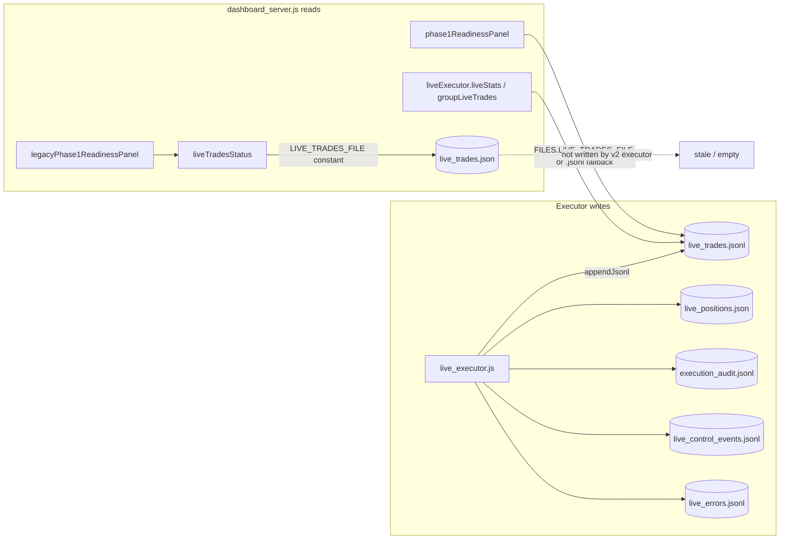

# Q5 — Dashboard Ledger Canonicalization Plan

**Sprint:** 1  
**Task:** Q5 (plan only — no code changes in this document)  
**Goal:** Canonicalize dashboard reads on `live_trades.jsonl` so operator UI truth matches the executor ledger.  
**Reference:** [SPRINT_1_PLAN.md](./SPRINT_1_PLAN.md) § Q5  
**Acceptance (from sprint):** Dashboard event count matches line count of `live_trades.jsonl` after an executor cycle.

---

## Problem statement

Root `live_executor.js` (v2) appends all live trade events to **`live_trades.jsonl`**. Root `dashboard_server.js` still defines a top-level constant pointing at **`live_trades.json`**. The running dashboard is therefore split:

- **Execution panels** (stats, recent trades, automation control) already pull data through `liveExecutor.liveStats()` / `groupLiveTrades()`, which read `.jsonl` via the executor.
- **Direct file reads** in the dashboard (constant + `liveTradesStatus()`) still target `.json`, which the executor never writes.

Operators can see a growing `.jsonl` file on disk while readiness-related helpers report “file missing” or zero events on `.json`. That is a false picture of system activity (ranked problem #5 in stabilization planning).

---

## Scope

### In scope

- Root **`dashboard_server.js`** — all live trade / ledger reads and user-visible filenames.
- Documentation updates tied to Q5 completion: `ACTIVE_MANIFEST.md`, `KNOWN_ISSUES.md` (mark split resolved), optional note in `MIGRATION_NOTES.md` if legacy `.json` exists locally.

### Out of scope (explicit)

| Area | Reason |
|------|--------|
| **Strategy** (`monitor.js`, scanner filters, thesis) | Sprint constraint |
| **`PIPELINE_DRY_RUN`** / execution mode logic | Sprint constraint |
| **`live_executor.js`** write path | Already canonical on `.jsonl`; no behavior change needed |
| **Archive copies** (`automation/`, `hardreset/`, `harness/`, `files/`, `phase1_files/`) | Q4 — do not edit |
| **`live_trade_logger.js`** | Legacy helper; not imported by active root runtime; writes `.json` but is unused by v2 executor |
| **Automatic merge/migration of `live_trades.json` → `.jsonl`** | Optional operator note only; no silent data move in Q5 |

### Already aligned (no code change expected)

| File | Ledger path | Notes |
|------|-------------|-------|
| `live_executor.js` | `live_trades.jsonl` | Sole writer of live trade events via `writeLiveEvent()` |
| `reset_live_safety.js` | `live_trades.jsonl` | Creates/validates JSONL |
| `validate_live_system.js` | `live_trades.jsonl` | Checks JSONL in file integrity section |

---

## Current architecture (read vs write)



**Rendered today:** `phase1ReadinessPanel()` (correct path) + panels that use `liveExecutor.*` (correct data).  
**Stale path:** `LIVE_TRADES_FILE = live_trades.json` → `liveTradesStatus()` → only referenced by **`legacyPhase1ReadinessPanel()`**, which is **defined but not rendered** (dead code). Risk remains if the constant or helper is reused or legacy panel is re-enabled.

---

## Inventory: dashboard live trade reads

**Canonical dashboard:** root `dashboard_server.js` only (per `ACTIVE_MANIFEST.md`).

| Location | Function / panel | How it reads live trades | File used today | Correct? |
|----------|------------------|--------------------------|-----------------|----------|
| L22 | Module constant | `LIVE_TRADES_FILE` | `live_trades.json` | No |
| L1441–1452 | `liveTradesStatus()` | Direct `fs` read of constant | `live_trades.json` | No |
| L1455–1619 | `legacyPhase1ReadinessPanel()` | Calls `liveTradesStatus()`; UI labels say `live_trades.json` | `live_trades.json` | No (dead — not in HTML render) |
| L1626–1742 | `phase1ReadinessPanel()` | `readJsonLines(runtimeLiveTradesFile)` | `liveExecutor.FILES.LIVE_TRADES_FILE` → `.jsonl` | Yes |
| L1108–1191 | `liveAutomationControlPanel()` | `liveExecutor.liveStats()` | `.jsonl` via executor | Yes |
| L1196–1230 | `liveVsPaperPanel()` | `liveExecutor.liveStats()` | `.jsonl` via executor | Yes |
| L1235+ | `liveExecutionPanel()` | `liveStats()`, `groupLiveTrades()` | `.jsonl` via executor | Yes (data) |
| L1343 | `liveExecutionPanel()` parse-error banner | Display string only | Says `live_trades.json` | Mislabeled |
| L1425 | `liveExecutionPanel()` footer | Display string | Says `live_trades.jsonl` | Yes |

**Other files the dashboard reads (not live trade ledger):** `paper_trades.json`, `near_misses.json`, `live_config.json`, `wallet_status.json`, `rpc_health.json`, etc. — unchanged by Q5.

**Dashboard does not read:** `execution_audit.jsonl`, `live_errors.jsonl`, or `live_control_events.jsonl` for trade history (executor uses those separately).

---

## Inventory: executor live trade writes

**Canonical executor:** root `live_executor.js`.

| Mechanism | Target file | Event types (examples) |
|-----------|-------------|-------------------------|
| `writeLiveEvent()` → `appendJsonl(LIVE_TRADES_FILE, …)` | **`live_trades.jsonl`** | `CLOSED_LIVE_TRADE`, `INTENDED_ENTRY`, `ACTUAL_ENTRY`, `EXIT_*`, `DAILY_STOP_TRIGGERED`, `KILL_SWITCH_ACTIVATED`, `EXECUTION_FAILURE`, … |
| `readLiveTrades()` / `closedTrades()` / `liveStats()` | Reads same **`live_trades.jsonl`** | Used by dashboard when executor module is loaded |
| Exported `FILES.LIVE_TRADES_FILE` | Path constant for consumers | Already used by `phase1ReadinessPanel()` |

**Related executor persistence (not Q5 ledger, but same cycle):**

| File | Role |
|------|------|
| `live_positions.json` | Open position snapshot (overwrite JSON) |
| `execution_audit.jsonl` | Pipeline stage audit |
| `live_control_events.jsonl` | START / STOP / EMERGENCY / RESET |
| `live_errors.jsonl` | Errors and guard failures |
| `pending_reconciliation.jsonl` | Ambiguous on-chain outcomes |

**Legacy writer (inactive in v2 path):**

| File | Writer | Ledger |
|------|--------|--------|
| `live_trade_logger.js` | Would append if called | `live_trades.json` — **not required** by root `live_executor.js` or dashboard control paths |

---

## Root cause

1. Phase 1 dashboard grew two readiness implementations: legacy (`live_trades.json` + old config fields) and current (`phase1ReadinessPanel` + executor `FILES`).
2. Executor v2 renamed the canonical ledger to `live_trades.jsonl` but the dashboard module-level constant was never updated.
3. Execution stats already go through the executor, so **trade counts and PnL can look correct** while **file-existence / event-count checks** on the stale constant would disagree with disk reality.
4. Mixed UI strings (`live_trades.json` in warnings, `live_trades.jsonl` in footer) confuse operators during incidents.

---

## Minimal safe change

Single-file change in **`dashboard_server.js`**, display-only, no execution or strategy impact.

### 1. Canonical path constant

Replace the hard-coded `.json` constant with the same resolution `phase1ReadinessPanel()` already uses:

```javascript
const LIVE_TRADES_FILE =
  liveExecutor?.FILES?.LIVE_TRADES_FILE || path.join(ROOT, "live_trades.jsonl");
```

**Note:** `liveExecutor` is loaded in a try/catch immediately above; if load fails, fallback `.jsonl` still matches executor and safety scripts.

**Alternative (equivalent):** Keep one helper, e.g. `function liveTradesLedgerPath()`, used by both `liveTradesStatus()` and `phase1ReadinessPanel()` to avoid duplicating the expression. Prefer matching existing style (minimal diff).

### 2. `liveTradesStatus()`

No logic change required beyond reading the corrected path — it already parses JSONL line-by-line. After (1), event counts and validity match `readJsonLines()` / executor.

### 3. User-visible strings

Update remaining **`live_trades.json`** labels to **`live_trades.jsonl`** in:

- `liveExecutionPanel()` parse-error banner (L1343)
- `legacyPhase1ReadinessPanel()` rows and error hints (L1575–1605) — low cost even though dead code; prevents future copy-paste regression

Do **not** change panel behavior, gates, or `dryRunMode` checks.

### 4. `phase1ReadinessPanel()`

Already correct. Optional refactor: reuse `LIVE_TRADES_FILE` instead of a separate `runtimeLiveTradesFile` variable — reduces duplication, same behavior.

### 5. Safety scripts

**No code changes** to `reset_live_safety.js` or `validate_live_system.js` — both already use `.jsonl`. Mention in ops notes only if operators still have an orphan `live_trades.json`.

### 6. Post-implementation docs (same Q5 commit or immediate follow-up)

- `ACTIVE_MANIFEST.md` — remove “legacy note” once dashboard is aligned.
- `docs/KNOWN_ISSUES.md` — mark `live_trades.json` / `.jsonl` split resolved or in progress → resolved.

---

## Legacy file handling (operator note, not automated)

If **`live_trades.json`** exists locally with historical events and **`live_trades.jsonl`** is empty or newer:

1. Inspect both files (line counts, latest timestamps).
2. If `.json` holds the only copy of history, **manually append** valid JSONL lines into `live_trades.jsonl` (or rename after backup) — executor does not read `.json`.
3. Do **not** delete `.json` in Q5 automation; optional backup rename e.g. `live_trades.json.bak`.
4. Document one paragraph in `MIGRATION_NOTES.md` if any operator still has split data.

Q5 does **not** require migration for greenfield dry-run setups where only `.jsonl` exists.

---

## What we preserve

| Behavior | Preserved how |
|----------|----------------|
| Stats, recent trades, daily stop display | Still via `liveExecutor.liveStats()` / `groupLiveTrades()` — unchanged |
| Readiness gating (`dryRunMode === true`, etc.) | `phase1ReadinessPanel()` logic unchanged |
| Dashboard without executor module | Fallback read of `live_trades.jsonl` on disk; panels that need executor still show “not loaded” |
| Append-only ledger discipline | No dashboard writes to ledger |
| Archive folders | Untouched |

---

## Verification plan (acceptance)

Run from repo root after implementation:

1. **Baseline count**

   ```powershell
   (Get-Content live_trades.jsonl | Where-Object { $_.Trim() -ne "" }).Count
   ```

2. **Executor cycle** (dry run — do not change modes):

   ```powershell
   node live_executor.js --once
   ```

   Re-count lines; increment should match new events appended.

3. **Dashboard readiness row**

   - Start `node dashboard_server.js`.
   - Open Phase 1 readiness panel → **“Live JSONL”** row event count must equal step 1 line count.
   - Filename detail must show `live_trades.jsonl`.

4. **Live execution panel**

   - **Total Live Trades** / recent table consistent with `CLOSED_LIVE_TRADE` events in `.jsonl`.
   - Parse-error banner references `live_trades.jsonl` if triggered.

5. **Safety scripts unchanged**

   ```powershell
   node reset_live_safety.js
   node validate_live_system.js
   ```

   Both should still pass `live_trades.jsonl valid JSONL`.

6. **Regression guard**

   - Confirm `live_trades.json` is **not** created or written by dashboard or executor during the test.
   - Grep root `dashboard_server.js` for `live_trades.json` — should appear only in comments or legacy migration notes, not in active read paths.

---

## Risk assessment

| Risk | Level | Mitigation |
|------|-------|------------|
| Wrong panel counts after fix | Low | Acceptance test compares line count to UI |
| Breaking dashboard when executor fails to load | Low | Fallback path stays `.jsonl` |
| Accidental execution behavior change | None | Dashboard is read-only for trades; no executor edits |
| Operators with data only in `.json` | Medium (edge) | Manual migration note; no silent merge |

---

## Implementation checklist (for coding pass)

- [ ] Update `LIVE_TRADES_FILE` constant in `dashboard_server.js`
- [ ] Align UI strings (`live_trades.json` → `live_trades.jsonl`)
- [ ] Optional: dedupe path with `phase1ReadinessPanel()`
- [ ] Run verification plan above
- [ ] Update `ACTIVE_MANIFEST.md` legacy note
- [ ] Update `KNOWN_ISSUES.md` entry for ledger split
- [ ] Single commit: e.g. “Align dashboard live ledger reads on live_trades.jsonl (Sprint 1 Q5)”

---

## Rollback

Revert the one commit to `dashboard_server.js` (and doc lines if included). No ledger migration means rollback is safe; `.jsonl` remains authoritative for the executor regardless.

---

## Summary

| Question | Answer |
|----------|--------|
| What is canonical? | **`live_trades.jsonl`** written by `live_executor.js` |
| What is broken? | Dashboard constant + `liveTradesStatus()` + mislabeled banners still say/read `.json` |
| What already works? | `phase1ReadinessPanel`, `liveStats`, `groupLiveTrades` |
| Minimal fix? | Point dashboard constant at executor `FILES.LIVE_TRADES_FILE` / `.jsonl`; fix labels |
| Touch executor / strategy / PIPELINE_DRY_RUN? | **No** |

This plan satisfies Sprint 1 Q5 planning requirements. **Do not modify application code until this plan is reviewed.**
