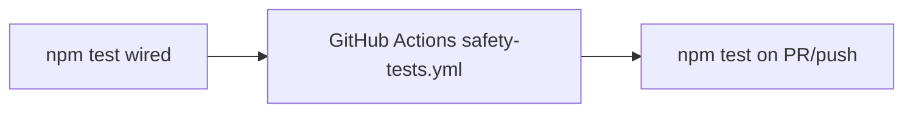

# Q6 — Wire `npm test` to Core Safety Scripts (Plan)

**Sprint:** 1  
**Task:** Q6 (plan only — no code changes in this document)  
**Goal:** Make `npm test` run the four core safety scripts with fail-fast behavior and a clear pass/fail summary.  
**Reference:** [SPRINT_1_PLAN.md](./SPRINT_1_PLAN.md) § Q6  
**Acceptance (from sprint):** `npm test` exits 0 on clean main; exits non-zero if signer guard is intentionally broken in a branch.

**Next task:** Q7 depends on Q6 (`npm test` in GitHub Actions).

---

## What Q6 is supposed to accomplish

Sprint 1 ranks **“no CI safety harness”** as problem **#2**. Today:

- `package.json` has `"test": "echo \"Error: no test specified\" && exit 1"` — `npm test` always fails.
- Four safety scripts already exist and encode the **`live_executor.js` safety contract** (signer guards, scanner→executor handoff, `PIPELINE_DRY_RUN` pipeline path, observation pool semantics).
- Operators and docs ([ACTIVE_MANIFEST.md](../ACTIVE_MANIFEST.md), [OPERATIONS.md](./OPERATIONS.md)) tell people to run these manually — easy to skip under time pressure.

**Q6 does not add new test logic.** It wires existing scripts into **`npm test`** so:

1. Local developers have one command before executor changes.
2. Q7 can run the same entry point in CI without secrets or live RPC.

**Success criterion:** One command, deterministic exit code, fail-fast on first failure, readable summary.

---

## Current state

### `package.json`

```json
"scripts": {
  "test": "echo \"Error: no test specified\" && exit 1"
}
```

No test runner, no devDependency test framework (tests are standalone Node scripts).

### Core safety scripts (canonical — repo root)

| Order | Script | What it guards | Exit on failure |
|-------|--------|----------------|-----------------|
| 1 | `test_signer_guard.js` | Signer load/submit guards, dry-run bypass, no network, no secret leakage in logs | `process.exitCode = 1` |
| 2 | `test_pipeline_candidate_handoff.js` | Scanner → `pipeline_candidates.jsonl` schema; observation handoff; dedupe; LIVE vs `PIPELINE_DRY_RUN` selection | `process.exitCode = 1` |
| 3 | `test_pipeline_dry_run.js` | Full mocked pipeline stages; no signing/submission; source static analysis of forbidden calls | `process.exitCode = 1` |
| 4 | `test_observation_pool.js` | Observation-only audit fields; operational files unchanged; `DRY_RUN` vs pipeline separation | `process.exitCode = 1` |

Order matches [SPRINT_1_PLAN.md](./SPRINT_1_PLAN.md), [ACTIVE_MANIFEST.md](../ACTIVE_MANIFEST.md), and [ORI_MEMORY.md](./ORI_MEMORY.md).

Each script:

- Uses `"use strict"` and async IIFE.
- Requires `./live_executor` (and handoff also requires `./scanner_gmgn_trending`).
- Mocks network via executor test hooks (`__signerGuardTest`, `__pipelineDryRunTest`, `__observationPoolTest`, etc.).
- Prints `… TEST PASSED` on success; `… TEST FAILED:` on stderr on failure.

### Other `test_*.js` files (out of Q6 scope)

`test_step9a_signing.js`, `test_step9b_submission.js`, `test_simulation.js`, `test_rpc_endpoint_resolution.js`, and others are **manual / step-9** tests. Sprint Q6 explicitly lists **only the four above**. Do not auto-include all `test_*.js` glob — that would widen scope and may require secrets or network.

### Documentation / known issues

| Doc | Current note |
|-----|----------------|
| [ACTIVE_MANIFEST.md](../ACTIVE_MANIFEST.md) | “Safety tests (manual until Sprint 1 CI)” with four `node` commands |
| [KNOWN_ISSUES.md](./KNOWN_ISSUES.md) | “No CI test harness for safety gates”; “No npm test script integration” |
| [LESSONS_LEARNED.md](./LESSONS_LEARNED.md) | Manual discipline called out as gap |
| [OPERATIONS.md](./OPERATIONS.md) | Lists safety tests manually (order differs from sprint — cosmetic only) |

No `.github/workflows/` yet (Q7).

---

## Inspection findings (relevant to wiring)

### 1. Tests pass without network or secrets

All four scripts forbid or mock `fetch`/RPC. CI can run with **Node 18+** and `npm install` only.

### 2. Fresh-clone precondition: `execution_audit.jsonl`

| File | Git | Required by |
|------|-----|-------------|
| `execution_audit.jsonl` | **gitignored** | `test_pipeline_dry_run.js` (line 125+ `readFileSync`), `test_observation_pool.js` (line 71+) |

On a clean clone the file may be **absent**; those tests throw `ENOENT` before assertions run.

**Local workspace:** file exists (runtime artifact from prior executor runs).

**Minimal safe mitigation (Q6 implementation):** Test runner **preflight** — create an **empty** `execution_audit.jsonl` if missing (append-only ledger convention; same spirit as `reset_live_safety.js` creating empty `live_trades.jsonl`). Do **not** modify the four test files or executor for this unless preflight proves insufficient.

### 3. Handoff test coupling to `live_config.json`

`test_pipeline_candidate_handoff.js` calls `executor.runCycle()` once (line 209) to assert `OBSERVATION_ERROR` when observation submit throws an untyped error.

`runCycle()` always **`loadConfig()`** from tracked **`live_config.json`**. It proceeds to observation only when:

- `automationEnabled === true`
- `resolveExecutionMode(cfg) === "PIPELINE_DRY_RUN"`
- `emergencyStop === false`

**Tracked `main` config** (committed) has `automationEnabled: true` and `executionMode: "PIPELINE_DRY_RUN"` — handoff test **passes on clean main**.

**Local pitfall:** Running `reset_live_safety.js` sets `automationEnabled: false`. Handoff test then gets `STOPPED_NO_ENTRIES` instead of `OBSERVATION_ERROR` and **fails**. This is environmental, not a Q6 wiring bug.

**Q6 plan:** Runner does **not** mutate `live_config.json`. Document that safety tests assume committed config flags; restore or use clean tree for full pass after safety reset.

### 4. Runtime file integrity checks

Handoff and observation tests hash-protect operational files **if they exist** (`live_trades.jsonl`, `live_positions.json`, `live_errors.jsonl`, `pipeline_candidates.jsonl`, `paper_trades.json`). They assert tests did not modify them. Absent files are skipped — no blocker.

Handoff test uses a **temp directory** + `process.chdir` for scanner writes — does not pollute repo ledgers.

### 5. Current verification snapshot (2026-06-22, this workspace)

| Script | Result | Notes |
|--------|--------|-------|
| `test_signer_guard.js` | **PASS** | |
| `test_pipeline_candidate_handoff.js` | **FAIL** | `automationEnabled: false` locally after `reset_live_safety.js` |
| `test_pipeline_dry_run.js` | **PASS** | Appends audit rows (expected) |
| `test_observation_pool.js` | **PASS** | Appends audit rows (expected) |

On **clean `main`** (committed `live_config.json`, empty or present audit file with preflight), expect **4/4 PASS** after implementation preflight.

---

## Minimal safe change

### Principle

- **Wire only** — change `package.json` and add a thin runner if needed.
- **Do not** edit `live_executor.js`, `monitor.js`, scanner strategy, or `PIPELINE_DRY_RUN` behavior.
- **Do not** edit archive folders or the four test files unless preflight alone cannot satisfy CI (unlikely).

### Recommended approach: small runner + `npm test`

Add **`run_safety_tests.js`** at repo root (matches existing flat script layout):

1. **Preflight:** ensure `execution_audit.jsonl` exists (empty file if missing).
2. **Run in order** (spawn `node <script>` with `stdio: inherit`, `cwd: __dirname`):
   - `test_signer_guard.js`
   - `test_pipeline_candidate_handoff.js`
   - `test_pipeline_dry_run.js`
   - `test_observation_pool.js`
3. **Fail fast:** stop on first non-zero exit; propagate exit code.
4. **Summary:** print pass lines collected or `FAILED at <script> (exit N)` + final `4/4 safety tests passed`.

Update **`package.json`**:

```json
"test": "node run_safety_tests.js"
```

Optional convenience (same commit, no behavior change):

```json
"test:safety": "node run_safety_tests.js"
```

### Alternative (smaller diff, weaker summary)

Single-line `package.json` chain:

```json
"test": "node test_signer_guard.js && node test_pipeline_candidate_handoff.js && node test_pipeline_dry_run.js && node test_pipeline_dry_run.js && node test_observation_pool.js"
```

**Downside:** No unified summary; no `execution_audit.jsonl` preflight (CI may fail on fresh clone); duplicate/error-prone maintenance.

**Recommendation:** Use **`run_safety_tests.js`** — still “minimal,” meets sprint wording for “runner” and “clear pass/fail summary,” and handles the gitignored audit file without touching executor/strategy.

### What we preserve

| Area | Preserved |
|------|-----------|
| Test assertions / order | Unchanged |
| Executor safety contract | Unchanged |
| `PIPELINE_DRY_RUN` semantics | Tests only observe; no prod change |
| Strategy / thesis | Handoff test uses fixed fixture candidates, not live scanner config |
| Non-core tests | Remain manual |
| `live_config.json` | Runner does not rewrite |

---

## Out of scope (Q6)

| Item | Owner |
|------|--------|
| GitHub Actions workflow | **Q7** |
| Fixing handoff test to mock config instead of `loadConfig()` | Optional hardening; not required if clean main passes |
| Including all `test_*.js` | Explicitly excluded by sprint |
| `validate_live_system.js` in `npm test` | Validator, not unit safety contract |
| Strategy / monitor / scanner filter changes | Sprint constraint |
| Archive folder copies | Q4 |

---

## Implementation checklist (for coding pass)

- [ ] Add `run_safety_tests.js` (preflight + ordered spawn + summary)
- [ ] Update `package.json` `"test"` script
- [ ] Run `npm install` (if needed) then `npm test` from repo root
- [ ] Confirm exit 0 on clean tree (`automationEnabled: true` in committed config)
- [ ] Confirm fail-fast: temporarily break signer guard export → `npm test` exits non-zero
- [ ] Update [ACTIVE_MANIFEST.md](../ACTIVE_MANIFEST.md) — replace “manual until CI” with `npm test`
- [ ] Update [KNOWN_ISSUES.md](./KNOWN_ISSUES.md) — mark CI/npm gaps resolved or “Q6 done; Q7 pending”
- [ ] Optional: align [OPERATIONS.md](./OPERATIONS.md) test list order with sprint (cosmetic)
- [ ] Single commit: e.g. “Wire npm test to core safety scripts (Sprint 1 Q6)”

---

## Verification plan

Run from repo root:

```powershell
npm install
npm test
```

**Expected (success):**

```
… SIGNER GUARD TEST PASSED
… PIPELINE CANDIDATE HANDOFF TEST PASSED
… PIPELINE DRY RUN TEST PASSED
… OBSERVATION POOL TEST PASSED
… 4/4 safety tests passed
```

Exit code **0**.

**Fail-fast check (branch experiment — do not merge):**

- Temporarily break `__signerGuardTest` visibility or an assertion in `test_signer_guard.js`.
- `npm test` exits **non-zero** before later scripts run.

**Fresh-clone simulation:**

```powershell
Remove-Item execution_audit.jsonl -ErrorAction SilentlyContinue
npm test
```

Should still pass after runner preflight creates empty audit file.

**Config coupling check:**

- With `automationEnabled: false` in local `live_config.json`, expect handoff failure — document for operators; committed main should remain `true` for dry-run observation (not live arming).

---

## Documentation updates (post-verification)

| File | Change |
|------|--------|
| `ACTIVE_MANIFEST.md` | `npm test` as canonical pre-merge command; keep manual `node test_*.js` as equivalent |
| `KNOWN_ISSUES.md` | Resolve or split “No CI test harness” (Q7 completes CI); resolve “No npm test script integration” after Q6 |
| `LESSONS_LEARNED.md` | Optional one-line note — only if team wants; not required for Q6 minimum |

Do **not** update Q7 workflow in Q6.

---

## Risk assessment

| Risk | Level | Mitigation |
|------|-------|------------|
| CI fails on missing `execution_audit.jsonl` | Medium | Runner preflight empty file |
| Handoff fails after local safety reset | Low | Document config precondition; committed main OK |
| `npm test` slow | Low | Four scripts ~seconds total |
| Accidental scope creep (all test_*.js) | Medium | Hard-code four paths in runner |
| Touching executor/strategy | None | Wire-only constraint |

---

## Relationship to Q7



Q6 delivers the **command**; Q7 delivers **enforcement**. No workflow file in Q6.

---

## Summary

| Question | Answer |
|----------|--------|
| What does Q6 accomplish? | **`npm test` runs four existing safety scripts; fail-fast; clear summary** |
| What changes? | `package.json` + thin `run_safety_tests.js` (recommended) |
| What stays the same? | Test logic, executor, strategy, `PIPELINE_DRY_RUN` |
| Main hidden dependency? | **`execution_audit.jsonl` must exist** (runner preflight); **handoff needs `automationEnabled: true` in committed config** |
| Acceptance? | **`npm test` exit 0 on clean main**; non-zero when guard broken |

**Do not modify application code until this plan is reviewed** — except the runner and `package.json` script, which are the entirety of Q6 implementation.
