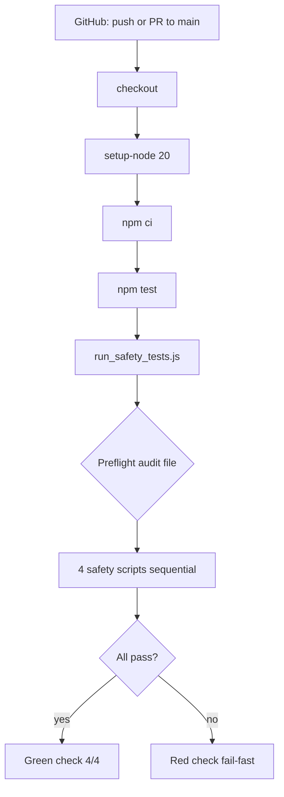

# Q7 — GitHub Actions Safety CI (Plan)

**Sprint:** 1  
**Task:** Q7 (plan only — no code changes in this document)  
**Goal:** Add GitHub Actions CI that runs the Q6 safety test suite on every push and PR to `main`.  
**Reference:** [SPRINT_1_PLAN.md](./SPRINT_1_PLAN.md) § Q7 · [Q6_PLAN.md](./Q6_PLAN.md)  
**Depends on:** Q6 (`npm test` → `run_safety_tests.js`)  
**Acceptance (from sprint):** PR to `main` shows a passing safety workflow; a failing test fails the workflow (branch protection can block merge).

---

## What Q7 is supposed to accomplish

Q6 wired **`npm test`** locally. Q7 **enforces** the same command in CI so:

1. Every PR to `main` runs the four core safety scripts automatically.
2. Pushes to `main` re-verify the safety contract after merge.
3. Ori and operators can treat **green CI** as “signer guard, handoff, pipeline dry-run, and observation pool tests passed” — without secrets, RPC, or live trading.

**Q7 does not change tests, executor, or strategy.** It adds one workflow file (and doc touch-ups after verification).

---

## Current state (post-Q6)

### `package.json`

```json
"scripts": {
  "test": "node run_safety_tests.js"
}
```

Runtime dependencies: `@solana/web3.js`, `axios`, `dotenv`, `express`, `fs-extra`. Safety tests load `live_executor.js` and `scanner_gmgn_trending.js` (axios used by scanner/executor paths). **`npm install` / `npm ci` is required** before tests on a fresh checkout.

### `run_safety_tests.js`

| Behavior | CI relevance |
|----------|----------------|
| Creates empty `execution_audit.jsonl` if missing | Fresh Ubuntu runner has no gitignored audit file — **handled** |
| Runs four scripts in fixed order | Same as local |
| Fail-fast on first non-zero exit | Workflow fails when any script fails |
| Prints `4/4 safety tests passed` | Visible in Actions log |

### Repository CI assets

| Asset | Status |
|-------|--------|
| `.github/workflows/` | **Absent** |
| `package-lock.json` | **Tracked** — use `npm ci` in CI |
| `live_config.json` | **Tracked** — `automationEnabled: true`, `executionMode: "PIPELINE_DRY_RUN"` (handoff test needs this) |
| Secrets / `.env` | **Not required** — tests mock network and env |

### Local vs CI command

**Canonical command (local and CI):**

```bash
npm test
```

Equivalent: `node run_safety_tests.js` (what `npm test` invokes).

---

## CI requirements mapping

| Sprint requirement | How Q7 satisfies it |
|--------------------|---------------------|
| Install dependencies if needed | `npm ci` after checkout |
| Run canonical safety test command | `npm test` |
| Node 18+ | `actions/setup-node` with `node-version: 20` (or `18`) |
| No secrets | No `secrets.*`, no `.env` file |
| PR + push to main | Workflow `on:` triggers |
| Do not touch strategy / `PIPELINE_DRY_RUN` | Workflow-only change |

---

## Minimal safe workflow

**Single file:** `.github/workflows/safety-tests.yml`

Recommended contents (conceptual — implement in coding pass):

```yaml
name: Safety Tests

on:
  push:
    branches: [main]
  pull_request:
    branches: [main]

jobs:
  safety-tests:
    runs-on: ubuntu-latest
    steps:
      - uses: actions/checkout@v4
      - uses: actions/setup-node@v4
        with:
          node-version: 20
          cache: npm
      - run: npm ci
      - run: npm test
```

### Design choices (minimal)

| Choice | Rationale |
|--------|-----------|
| **One job, one workflow** | Sprint scope; no matrix, no extra jobs |
| **`npm ci`** | Deterministic installs from tracked `package-lock.json` |
| **`npm test`** | Single canonical entry point from Q6; do not call `node test_*.js` directly in YAML |
| **Node 20** | Satisfies “18+”; current LTS; matches typical GHA defaults |
| **`cache: npm`** | Optional one-liner in `setup-node`; speeds CI without new deps |
| **`ubuntu-latest`** | Standard; tests are OS-agnostic Node scripts |
| **Triggers: `main` only** | Matches sprint “PR and push to main”; avoids noise on feature branches until PR opened |

### Explicitly out of scope for Q7

| Item | Reason |
|------|--------|
| Editing `run_safety_tests.js` or test scripts | Q6 complete; behavior already CI-ready |
| Editing `live_executor.js`, `monitor.js`, scanner strategy | Sprint constraint |
| `PIPELINE_DRY_RUN` logic changes | Sprint constraint |
| Running all `test_*.js` | Q6 explicitly excluded non-core tests |
| `validate_live_system.js`, linters, deploy | Separate scope |
| Branch protection rules | GitHub repo settings; document as post-merge ops step |
| Secrets, `.env`, RPC keys | Not needed; must not add |
| Archive folder workflows | Q4 — do not run or copy |

---

## How CI run differs from local



| Local pitfall | CI behavior |
|---------------|-------------|
| `live_config.json` changed by `reset_live_safety.js` (`automationEnabled: false`) | CI uses **committed** config from checkout — handoff test passes if main is correct |
| Missing `execution_audit.jsonl` | Runner creates empty file (preflight) |
| No `npm install` | CI always runs `npm ci` first |
| Operator skips manual tests | CI runs on every PR |

---

## Preconditions for green CI

Before merging Q7, confirm **on a clean tree** (same as CI):

1. `npm ci`
2. `npm test` → exit 0, `4/4 safety tests passed`
3. Committed `live_config.json` has `automationEnabled: true` (required by handoff test’s `runCycle()` call)

Q6 already verified this locally after restoring tracked `live_config.json`.

---

## Implementation checklist (coding pass)

- [ ] Add `.github/workflows/safety-tests.yml` (minimal YAML above)
- [ ] Push branch and open PR to `main` (or push to `main` if direct)
- [ ] Confirm Actions tab shows **Safety Tests** workflow green
- [ ] Update [KNOWN_ISSUES.md](./KNOWN_ISSUES.md) — mark “No CI test harness” **resolved** (Q7)
- [ ] Update [ACTIVE_MANIFEST.md](../ACTIVE_MANIFEST.md) — change “Q7 runs the same” from future to present tense if desired
- [ ] Optional: one line in [OPERATIONS.md](./OPERATIONS.md) — “CI runs `npm test` on PRs to main”
- [ ] Single commit: e.g. “Add GitHub Actions safety test workflow (Sprint 1 Q7)”

**Do not commit:** `live_config.json` local edits, runtime `*.jsonl`, or secrets.

---

## Verification plan

### After workflow is added

1. **Push branch** with workflow file to GitHub.
2. **Open PR to `main`** (or push to `main`).
3. In GitHub → Actions → **Safety Tests**:
   - Job completes successfully.
   - Log contains four `=== test_*.js ===` sections and `4/4 safety tests passed`.
4. **Negative check (optional, throwaway branch):** Temporarily break a assertion in `test_signer_guard.js` → workflow fails → revert. Confirms fail-fast reaches CI.

### Acceptance alignment

| Sprint acceptance | Verification |
|-------------------|--------------|
| PR to main shows passing workflow | Green check on sample PR |
| Failing test blocks merge | Red workflow; enable branch protection separately if desired |

Branch protection (“require status checks”) is **repo admin configuration**, not part of the YAML file. Note in ops docs that protection is recommended after first green run.

---

## Documentation updates (post-verification)

| File | Change |
|------|--------|
| `docs/KNOWN_ISSUES.md` | Resolve “No CI test harness for safety gates (partial)” |
| `ACTIVE_MANIFEST.md` | Confirm CI runs `npm test` (already anticipates Q7) |
| `docs/Q6_PLAN.md` | No edit required (historical plan) |

---

## Risk assessment

| Risk | Level | Mitigation |
|------|-------|------------|
| `npm ci` fails (lockfile drift) | Low | Lockfile tracked; run `npm ci` locally before push |
| Handoff fails in CI | Low | Committed `live_config.json` must keep `automationEnabled: true` for test fixture |
| Missing deps at test runtime | Low | `npm ci` installs all `package.json` dependencies |
| Workflow runs on wrong branch | Low | Restrict triggers to `main` |
| Scope creep (all validators, matrix) | Medium | Single job, `npm test` only |
| Accidental secret exposure | None | No secrets in workflow |

---

## Rollback

Delete `.github/workflows/safety-tests.yml` (or disable workflow in GitHub UI). No runtime or executor impact. Local `npm test` unchanged.

---

## Relationship to Sprint 1 exit criteria

From [SPRINT_1_PLAN.md](./SPRINT_1_PLAN.md):

- **SC5:** `npm test` exits 0 — Q6 ✓  
- **SC6:** GitHub Actions on PRs — **Q7**  
- Exit checklist: “Q6 + Q7 green — at least one merged PR exercised CI successfully”

Q7 completes the **enforceable** half of ranked problem #2 (CI safety harness).

---

## Summary

| Question | Answer |
|----------|--------|
| What does Q7 add? | **`.github/workflows/safety-tests.yml`** running **`npm test`** on push/PR to **`main`** |
| Minimal steps? | checkout → setup-node 20 → **`npm ci`** → **`npm test`** |
| Change tests or executor? | **No** |
| Secrets? | **None** |
| Canonical command? | **`npm test`** (via `run_safety_tests.js`) |

**Do not modify application code until this plan is reviewed.**
