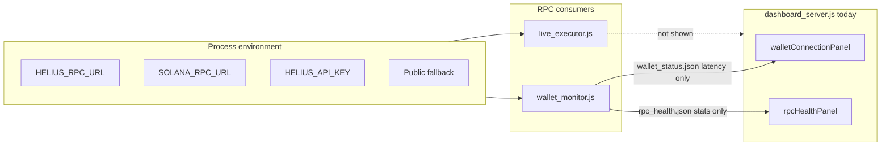

# Q9 — RPC Source Visibility in Dashboard (Plan)

**Sprint:** 1  
**Task:** Q9 (plan only — no code changes in this document)  
**Goal:** Surface active RPC endpoint **source** and a **public-fallback warning** in the dashboard wallet/RPC panels.  
**Reference:** [SPRINT_1_PLAN.md](./SPRINT_1_PLAN.md) § Q9 · Success criterion **SC8**  
**Acceptance (from sprint):** Dashboard clearly labels RPC source; warning visible when no dedicated RPC env is set.

---

## What Q9 is supposed to accomplish

Operators often interpret **slow wallet reads** or **flaky pipeline observation** as bot failure. A common root cause is **public Solana RPC** (`api.mainnet-beta.solana.com`) rate limits when `HELIUS_RPC_URL`, `HELIUS_API_KEY`, or `SOLANA_RPC_URL` are unset.

Today the dashboard shows **latency and connection health** but not **which RPC provider** is in use. Q9 adds **read-only labels and warnings** so operators can distinguish infrastructure limits from strategy or executor bugs.

| Q9 does | Q9 does not |
|---------|-------------|
| Display RPC provider source in wallet/RPC UI | Change RPC selection logic |
| Warn when public fallback is active | Require dedicated RPC (Sprint 3 / A4) |
| Redact API keys in displayed URLs | Load secrets into the dashboard |
| Preserve all execution behavior | Touch strategy or `PIPELINE_DRY_RUN` |

---

## Current state (inspected)

### RPC resolution — `live_executor.js` (authoritative for executor)

`resolveRpcEndpoint(cfg, options)` (lines ~371–438):

**Candidate priority:**

1. `HELIUS_RPC_URL`
2. `SOLANA_RPC_URL`
3. `HELIUS_API_KEY` → derived `https://mainnet.helius-rpc.com/?api-key=…`
4. If none valid (or all are public hostnames): **`PUBLIC_FALLBACK`** → `https://api.mainnet-beta.solana.com`

**Public hostnames rejected when `requireDedicated: true`:**  
`api.mainnet-beta.solana.com`, `api.devnet.solana.com`, `api.testnet.solana.com`

| `requireDedicated` | Behavior when no dedicated env |
|--------------------|--------------------------------|
| `false` | Uses public fallback; `publicFallbackUsed: true` |
| `true` | Throws (simulation, priority fee, submission, etc.) |

**Used by:**

- Pipeline simulation / priority fee: `requireDedicated: true`
- Wallet balance in executor (`getWalletBalanceSol`): `requireDedicated: !isAnyDryRun(cfg)` — in `PIPELINE_DRY_RUN`, allows public fallback for reads
- Readiness check: tries `requireDedicated: true` for simulation purpose

**Exports:** `resolveRpcEndpoint` is available on test surfaces (`__simulationTest`, `__submissionTest`) but **not** on the top-level `module.exports` object the dashboard already loads for stats.

### Wallet monitor — `wallet_monitor.js`

`getRpcUrl()` mirrors the same env priority (lines 68–73), then falls back to public mainnet-beta.

Writes:

- `wallet_status.json` — connection, balance, latency (**no RPC provider field**)
- `rpc_health.json` — ping stats only (**no endpoint or provider field**)

Dashboard panels read these files but **cannot infer RPC source** from them today.

### Dashboard — root `dashboard_server.js`

| Panel | File inputs | RPC source shown? |
|-------|-------------|-------------------|
| `walletConnectionPanel()` | `wallet_status.json`, `wallet_history.jsonl` | **No** — latency/connected only |
| `rpcHealthPanel()` | `rpc_health.json` | **No** — aggregate latency/failures only |
| `phase1ReadinessPanel()` | `liveExecutor.readinessChecks()` | Partial — “Dedicated RPC configured…” boolean, not provider label |

Archive copies of `dashboard_server.js` exist — **do not edit** (Q4).

### Environment — `.env.example`

Documents `HELIUS_RPC_URL`, `HELIUS_API_KEY`, `SOLANA_RPC_URL` (and unused `RPC_URL` — not read by executor or wallet_monitor).

### Tests

- `test_rpc_endpoint_resolution.js` — thorough RPC resolution tests; **not** in `npm test` / Q6 suite
- Q9 should not expand CI scope unless explicitly requested

### Known issue

[KNOWN_ISSUES.md](./KNOWN_ISSUES.md) — **Public RPC rate limits false negatives** lists “surface RPC source in dashboard” as the solution.

---

## Gap summary



Operators see **RED — DISCONNECTED** or high latency without knowing **public RPC** is the cause.

---

## Minimal safe change

**Scope:** Root **`dashboard_server.js` only** (display layer). No executor logic changes required for Q9.

### 1. Add dashboard helper: `resolveRpcSourceForDisplay(options)`

Implement **read-only** env resolution in the dashboard, matching executor/monitor priority:

```javascript
// Mirror live_executor.js resolveRpcEndpoint candidate order — keep in sync.
function resolveRpcSourceForDisplay({ requireDedicated = false } = {}) {
  const PUBLIC = "https://api.mainnet-beta.solana.com";
  const isPublic = (url) => { /* same hostnames as executor */ };
  const candidates = [
    ["HELIUS_RPC_URL", process.env.HELIUS_RPC_URL],
    ["SOLANA_RPC_URL", process.env.SOLANA_RPC_URL],
    ["HELIUS_API_KEY_DERIVED", process.env.HELIUS_API_KEY
      ? `https://mainnet.helius-rpc.com/?api-key=${process.env.HELIUS_API_KEY}` : null]
  ];
  const selected = candidates.find(([, u]) => u && !isPublic(u));
  if (!selected) {
    if (requireDedicated) {
      return { provider: null, publicFallbackUsed: false, dedicatedMissing: true, endpointRedacted: null };
    }
    return { provider: "PUBLIC_FALLBACK", publicFallbackUsed: true, dedicatedMissing: false, endpointRedacted: redactRpcUrl(PUBLIC) };
  }
  return { provider: selected[0], publicFallbackUsed: false, dedicatedMissing: false, endpointRedacted: redactRpcUrl(selected[1]) };
}
```

Add `redactRpcUrl()` — strip/redact `api-key=` query params (same intent as executor `redactSecrets`).

**Why duplicate instead of exporting from executor?**

- Q9 sprint text is dashboard-only; avoids any `live_executor.js` diff.
- Dashboard already loads `liveExecutor` optionally; resolution depends on **`process.env` in the dashboard process**, which matches wallet_monitor when both are started from the same shell / `.env`.

**Optional tighter coupling (if duplication is rejected during review):**

- Export `resolveRpcEndpoint` on main `module.exports` (**export-only**, not logic change). Dashboard calls `liveExecutor.resolveRpcEndpoint({}, opts)`. Still no change to resolution behavior.

**Out of minimal scope:**

- Editing `wallet_monitor.js` to persist `rpcProvider` in `rpc_health.json` (accurate if monitor and dashboard env differ — defer unless needed)
- Enforcing dedicated RPC (Sprint 3 A4)

### 2. Update `walletConnectionPanel()`

Add:

- **RPC source** card: provider label + redacted host (e.g. `HELIUS_RPC_URL · helius-rpc…`)
- **Warning banner** when `provider === "PUBLIC_FALLBACK"` or `publicFallbackUsed`:

  > Public Solana RPC in use for wallet balance reads — rate limits may cause false DISCONNECTED status. Set `HELIUS_RPC_URL` or `SOLANA_RPC_URL` in `.env`.

Use existing styles: `wc-stale` / new `wc-warn-banner` consistent with `le-warning-banner` pattern elsewhere in the file.

### 3. Update `rpcHealthPanel()`

Add the same **RPC source** row and **public fallback warning** (wallet monitor uses the same `getRpcUrl()` priority).

Clarify subtitle: metrics reflect **wallet_monitor.js** pings; source label reflects **env at dashboard render time** (typically the same if `.env` is shared).

### 4. Optional: two-path labels (recommended, still minimal)

Show **two** source lines — matches operator mental model from [MODE_TRANSITION.md](./MODE_TRANSITION.md) / architecture docs:

| Path | Resolution | Label purpose |
|------|------------|---------------|
| **Wallet / balance read** | `requireDedicated: false` | What wallet_monitor uses today |
| **Pipeline simulation** | `requireDedicated: true` | Shows dedicated provider **or** “No dedicated RPC — pipeline stages would abort” |

Second line is **informational** in `PIPELINE_DRY_RUN` (does not change executor). Helps explain why observation fails when env is empty even if wallet panel sometimes works.

### 5. Documentation touch-ups (post-implementation)

| File | Change |
|------|--------|
| [KNOWN_ISSUES.md](./KNOWN_ISSUES.md) | Mark **Public RPC rate limits** partially resolved / dashboard surfaced |
| [OPERATIONS.md](./OPERATIONS.md) | One line: dashboard RPC panel shows source; link to `.env.example` |
| [ACTIVE_MANIFEST.md](../ACTIVE_MANIFEST.md) | Optional note under dashboard |

**Not required:** new npm test; `test_rpc_endpoint_resolution.js` stays manual.

---

## Preserve behavior

| Area | Q9 impact |
|------|-----------|
| `live_executor.js` RPC logic | Unchanged (default plan) |
| `wallet_monitor.js` | Unchanged |
| `PIPELINE_DRY_RUN` / strategy | Unchanged |
| Dashboard control buttons / automation | Unchanged — display only |
| Env vars | Unchanged — dashboard reads, never writes |

Dashboard must **not** print raw API keys or signer secrets.

---

## Risks

| Risk | Level | Mitigation |
|------|-------|------------|
| **Env mismatch** — dashboard vs wallet_monitor different env | Medium | Document that label reflects dashboard process env; optional future: persist provider in `rpc_health.json` |
| **Logic drift** — dashboard duplicate vs executor | Medium | Comment “keep in sync with `live_executor.js`”; optional export-only coupling |
| **False confidence** — dedicated URL that is still public hostname | Low | Reuse same `isPublicSolanaRpcEndpoint` hostname set |
| **Scope creep** — enforce dedicated RPC in UI | Medium | Warning only; no blocking gates in Q9 |
| **Leaking API keys in UI** | High if mishandled | `redactRpcUrl()` on all displayed endpoints |
| **Editing archive dashboard copies** | Low | Root `dashboard_server.js` only |

---

## Acceptance criteria

| # | Criterion | Verification |
|---|-----------|--------------|
| AC1 | Wallet panel shows **RPC source** label | Visual / HTML inspect |
| AC2 | RPC health panel shows **RPC source** label | Visual / HTML inspect |
| AC3 | **Public fallback warning** visible when no dedicated env | Unset `HELIUS_*` and `SOLANA_RPC_URL`; restart dashboard |
| AC4 | Warning **absent** when `HELIUS_RPC_URL` or valid dedicated `SOLANA_RPC_URL` set | Set env; reload dashboard |
| AC5 | API keys **redacted** in displayed URLs | Set `HELIUS_API_KEY`; confirm `api-key=***` or similar |
| AC6 | **No executor / strategy / mode behavior change** | `git diff` — `dashboard_server.js` (+ optional docs) only |
| AC7 | **SC8** — operator can name RPC source without reading source | Reviewer quiz |
| AC8 | Archive folders untouched | No diff under `automation/`, etc. |

**Manual test script (coding pass):**

```powershell
# 1. No dedicated RPC
#    Clear HELIUS_RPC_URL, HELIUS_API_KEY, SOLANA_RPC_URL from shell or .env
node dashboard_server.js
#    Open http://localhost:3000 — expect PUBLIC_FALLBACK warning in wallet + RPC panels

# 2. Dedicated RPC
#    Set HELIUS_RPC_URL=https://mainnet.helius-rpc.com/?api-key=test
#    Restart dashboard — expect HELIUS_RPC_URL label, no public warning
```

---

## Implementation checklist

- [ ] Add `resolveRpcSourceForDisplay()` + `redactRpcUrl()` to `dashboard_server.js`
- [ ] Update `walletConnectionPanel()` — source card + public warning banner
- [ ] Update `rpcHealthPanel()` — source card + public warning banner
- [ ] Optional: pipeline simulation dedicated-RPC status line
- [ ] Manual verification per acceptance table
- [ ] Update `KNOWN_ISSUES.md` (and optionally OPERATIONS)
- [ ] Single commit: e.g. “Surface RPC source and public fallback warning in dashboard (Sprint 1 Q9)”

---

## Rollback

Revert the dashboard (and doc) commit. No runtime or RPC behavior impact.

---

## Summary

| Question | Answer |
|----------|--------|
| What does Q9 add? | **RPC provider label + public fallback warning** in wallet/RPC panels |
| Minimal code touch? | **`dashboard_server.js` only** (env mirror helper + panel HTML) |
| Executor changes? | **Not required** (optional export-only if avoiding duplication) |
| Key operator message? | **“DISCONNECTED” may be public RPC rate limits, not bot broken”** |

**Do not modify application code until this plan is reviewed.**
