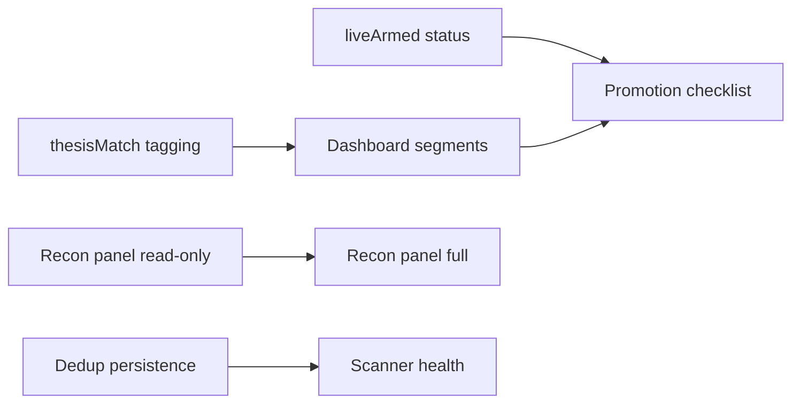

# Sprint 2 Plan — Honest Measurement (M1–M4, M6–M8)

**Sprint:** 2 of 4 (Phase 1 — Understanding and Stabilization)  
**Module:** TracktaOS Module 1 — Solana Momentum Bot  
**Duration target:** 2–3 weeks  
**Operating constraint:** `PIPELINE_DRY_RUN` — no live arming, no strategy changes

**Parent plan:** [STABILIZATION_PLAN.md](./STABILIZATION_PLAN.md)  
**Entry review:** [SPRINT_1_REVIEW.md](./SPRINT_1_REVIEW.md)  
**Ori briefing:** [ORI_MEMORY.md](./ORI_MEMORY.md)  
**Issue registry:** [KNOWN_ISSUES.md](./KNOWN_ISSUES.md) · **Deep dive:** [ENGINEERING_REVIEW.md](./ENGINEERING_REVIEW.md)

---

# Mission

Sprint 1 made the system **start correctly, measure in the right files, and fail safely in CI**. Sprint 2 makes measurement **honest** — operators and Ori can distinguish research noise from thesis-eligible signal, see reconciliation and arming posture without reading raw JSONL, and trust observation dedup across restarts.

Sprint 2 does **not** fix file races (Sprint 4 / A1), quarantine archive trees (Sprint 3 / M9), or require dedicated RPC (Sprint 3 / A4). It adds **visibility and persistence** so promotion conversations use the right numbers.

**One-line mission:** **Segment stats by thesis, surface reconciliation and arming truth, and persist observation infrastructure** — without changing filters, exits, or arming live trading.

---

# Success Criteria

Sprint 2 is complete when all of the following are verifiably true:

| # | Criterion | Verification |
|---|-----------|--------------|
| SC1 | Every new scanner handoff row carries explicit `thesisMatch` (and supporting thesis fields where useful) | Inspect `pipeline_candidates.jsonl` + paper rows after scanner run |
| SC2 | Dashboard default stats split **all paper** vs **thesis-eligible** vs **pipeline observation** pools | Visual review; Ori can answer “what would live have taken?” |
| SC3 | Pair/intent observation dedup survives executor restart without duplicate pipeline work or lost cooldown | Restart test + audit comparison |
| SC4 | Scanner exposes health signals: last scan time, trending row counts, GMGN error counts | Dashboard or status file; zero-row alert when market active |
| SC5 | Reconciliation panel reads `pending_reconciliation.jsonl` with runbook links | Non-empty file drill; panel shows row summary |
| SC6 | `--status` and dashboard show single computed **`liveArmed`** (or equivalent) disarmed summary | No live gate armed in `PIPELINE_DRY_RUN` |
| SC7 | Promotion checklist UI/docs tie paper → pipeline → live gates to [MODE_TRANSITION.md](./MODE_TRANSITION.md) | Operator walkthrough without reading executor source |
| SC8 | `npm test` + CI remain green; `node live_executor.js --status` still `PIPELINE_DRY_RUN` | Post-sprint smoke |
| SC9 | No strategy filter merge; symmetric exits unchanged | Code review + DECISIONS unchanged |
| SC10 | KNOWN_ISSUES updated for thesis visibility, dedup, reconciliation UX (partial or resolved as shipped) | Doc review |

---

# Quick Wins

Highest-leverage, lowest-risk items — ship early to unblock medium work. Ordered by leverage.

| Priority | ID | Work item | Resolves | Effort | Why first |
|----------|-----|-----------|----------|--------|-----------|
| **1** | **M7** | Computed **`liveArmed`** in `live_executor.js --status` + dashboard readiness strip | Env/config confusion; false “fully disarmed” confidence | **S–M** | Read-only aggregation; no gate changes; immediate operator clarity |
| **2** | **M6a** | Read-only **reconciliation panel** (list `pending_reconciliation.jsonl`, link `RECONCILIATION_RUNBOOK.md`) | Reconciliation UX gap (rank 8 partial) | **S–M** | Critical safety surface; display-only first pass |
| **3** | **Doc** | Document thesis bands in OPERATIONS + dashboard legend (scanner wide vs executor narrow) | Thesis drift narrative | **S** | Supports M1/M2 before code lands |
| **4** | **M4a** | Scanner writes **`scanner_health.json`** snapshot (`lastScanAt`, row counts, GMGN errors) | Silent scanner failure | **S** | No GMGN rewrite; file consumed by dashboard later |

**Minimum viable Sprint 2 (time-constrained):** M7 + M6a + M1 + M2.

---

# Medium-Term Work

Core Sprint 2 deliverables from [STABILIZATION_PLAN.md](./STABILIZATION_PLAN.md) § Medium-term fixes. Ordered by leverage after quick wins.

| Priority | ID | Work item | Resolves | Depends on | Effort |
|----------|-----|----------|----------|------------|--------|
| **1** | **M1** | Persist **`thesisMatch`** on scanner handoff rows (`pipeline_candidates.jsonl`, paper trade rows) using executor thesis rules (score 80–89, MC ≤ $250k, bot/top-10 bands) | Thesis/scanner drift (rank 3) | — | **M** |
| **2** | **M2** | Dashboard **thesis-segmented stats**: paper all / thesis-eligible / pipeline observation (`thesisMatch` vs `non_thesis_observation`) | False live readiness; Ori priority #4 | M1 | **M** |
| **3** | **M6** | Full **reconciliation dashboard panel** — row age, stage, txSig redacted, drill actions documented (no auto-retry) | Ambiguous on-chain UX | M6a | **M** |
| **4** | **M3** | Persist **pair cooldown map** (or audit-complete dedup) so `observedPipelinePairTimestamps` survives restart | In-memory dedup loss | — | **M** |
| **5** | **M4** | **Scanner health metrics** in dashboard — zero trending rows alert, per-interval GMGN failures | GMGN CLI fragility | M4a | **M** |
| **6** | **M8** | **Promotion checklist** panel — paper / pipeline / live gates tied to `LIVE_AUTHORIZATION_RECORD.md` + MODE_TRANSITION | Paper ≠ live edge | M2, M7 | **M** |

### Task detail (engineers)

#### M1 — `thesisMatch` on handoff rows

- **Scanner** (`scanner_gmgn_trending.js`): after scoring, compute `thesisMatch: boolean` using **executor thesis bounds** (import shared helper or duplicate with “keep in sync” comment — prefer small shared module at root if minimal).
- **Write path:** append to `pipeline_candidates.jsonl` and paper trade row at log time.
- **Do not** narrow scanner filters to match executor — visibility only ([DECISIONS.md](./DECISIONS.md) two-layer filters).
- **Tests:** extend `test_pipeline_candidate_handoff.js` or add focused test for tagged rows.

#### M2 — Dashboard segmentation

- Panels for win rate, open count, recent activity **by segment** (not one aggregate paper number).
- Pipeline panel distinguishes `thesisMatch: true` observations vs `non_thesis_observation` from audit payload.
- Default view should **not** lead with unsegmented paper wins.

#### M3 — Dedup persistence

- Persist cooldown state to small JSON snapshot (e.g. `observation_dedup.json`) **or** fully derive from `execution_audit.jsonl` on startup with documented completeness requirements.
- Preserve append-only audit philosophy; do not rewrite historical audit lines.
- **Tests:** restart simulation in `test_observation_pool.js` or new test.

#### M4 — Scanner health

- Emit metrics each scan cycle; dashboard stale alert if `lastScanAt` > 2× watch interval while `--watch` expected running.
- Distinguish “empty market” vs “GMGN CLI failed” via error counters.

#### M6 — Reconciliation panel

- Read `pending_reconciliation.jsonl`; show open row count prominently on main dashboard.
- Link each row type to [RECONCILIATION_RUNBOOK.md](./RECONCILIATION_RUNBOOK.md).
- **No** automated retry, **no** auto-clear — reconciliation-over-retry is invariant.

#### M7 — `liveArmed` computed status

- Single boolean (or enum) combining: `executionMode`, `dryRunMode`, `automationEnabled`, `emergencyStop`, signer env presence, `FOMO_ENABLE_LIVE_SUBMISSION`, dedicated RPC readiness.
- Display in `--status` and dashboard; **does not** change gate logic.

#### M8 — Promotion checklist

- Read-only checklist UI: which gates pass/fail for paper → pipeline → live promotion narrative.
- Explicit banner: **Sprint 2 does not authorize live** — checklist is visibility for future authorization workflow.

### Recommended execution order

```text
M7 → M6a → M1 → M2 → M6 → M3 → M4a → M4 → M8
         └─ Doc (thesis bands) can parallel M1
```



---

# Architectural Work

**Not in Sprint 2 scope.** Listed so engineers do not half-implement structural fixes while adding visibility.

| ID | Work item | Sprint | Why deferred |
|----|-----------|--------|--------------|
| **A1** | Unified state module (atomic append, locked config) | **4** | Large refactor; Sprint 2 must not patch races ad hoc |
| **A2** | Process supervisor + restart policy | **4** | Depends A1 partial + M5 heartbeats |
| **A3** | Config change audit + optional auth | **3** | After M7 visibility |
| **A4** | Dedicated RPC required for readiness | **3** | Env provisioning; Q9 gave warnings only |
| **A5** | Multi-source exit pricing (Jupiter vs DexScreener) | **Pre-live** | Strategy-adjacent; not dry-run blocker |
| **A6** | Block automation when reconciliation non-empty | **4** | Requires M6 UX + A1 stable writes |
| **M5** | Process heartbeats (`last_scan_at`, `last_cycle_at`) | **3** | Ops reliability; follows Q1 path fix |
| **M9** | Archive quarantine (`automation/`, etc.) | **3** | Packaging; Q3/Q4 documented only |
| **M10** | Legacy scanners to `archive/` | **3** | After M9 |

**Sprint 2 rule:** If a task requires changing write semantics for `paper_trades.json` or `live_config.json` beyond additive fields, **stop** — that belongs in A1 (Sprint 4).

---

# Risks

| Risk | Level | Mitigation |
|------|-------|------------|
| **Thesis helper drift** — scanner `thesisMatch` disagrees with executor live gate | Medium | Shared helper or test asserting parity; document bounds in one place |
| **Scope creep into filter merge** | High | M1 tags only; no scanner threshold changes; DECISIONS two-layer preserved |
| **False live readiness after M2** | Medium | M8 checklist + Ori briefing; default dashboard shows thesis segment first |
| **Dedup file race (M3)** | Medium | Minimal snapshot writes; full fix waits A1; document restart behavior |
| **Reconciliation panel encourages retry** | High | Copy and UI: link runbook; never add “retry trade” button in Sprint 2 |
| **Dashboard auth still absent** | Medium | Localhost-only ops; document shared-hosting blocker (unchanged) |
| **File races during Sprint 2** | High | Do not claim overnight reliability; avoid concurrent stress claims until A1 |
| **CI regression on handoff tests** | Medium | Extend safety suite only with Ori approval; keep four core tests green |
| **Archive folder edits** | Medium | Root scripts only; manifest preflight |

---

# Things Not To Touch

Sprint 2 scope is **measurement and infrastructure visibility**. Do not expand into live arming, strategy, or structural rewrites.

## Safety and execution contract

| Protected area | Reason |
|----------------|--------|
| **`PIPELINE_DRY_RUN` as default** | Core decision; observation still accumulating |
| **Live arming gate stack** | Do not simplify `FOMO_ENABLE_LIVE_SUBMISSION`, signer env, size caps |
| **Symmetric exits (+10% / −5% / 20 min)** | Strategy, not stabilization |
| **Two-layer filters** | Add `thesisMatch` visibility — do not merge scanner and executor filters |
| **−50% anomaly guard** | Capital preservation on bad price data |
| **Reconciliation-over-retry** | Never auto-retry ambiguous txSig |
| **Emergency stop = full halt** | Product decision — document in M8, do not change semantics |
| **Append-only audit files** | No rewrite of `execution_audit.jsonl`, `live_trades.jsonl`, control events |

## Code and data boundaries

| Protected area | Reason |
|----------------|--------|
| **Archive folder code** | No edits under `automation/`, `hardreset/`, etc. |
| **A1 state layer** | Sprint 4 — no half measures in Sprint 2 |
| **A4 / A5 / A6 enforcement** | Sprint 3–4 / pre-live |
| **Strategy scoring weights / timeouts / targets** | Wait for M2 segmented stats |
| **New scanner versions** | Only `scanner_gmgn_trending.js` |
| **Compounding / martingale / multi-position** | Hard-rejected in config |
| **Committing runtime JSON** | Local-only per Q10 |

## Process

| Protected area | Reason |
|----------------|--------|
| **`executionMode: LIVE` experiments** | Forbidden in shared env during Phase 1 |
| **Enabling live submission to “test quickly”** | Incident-class behavior |
| **Ori arming live** | Humans authorize; Ori advises only |

**If Sprint 2 work appears to require a protected change:** stop, log [DECISIONS.md](./DECISIONS.md), escalate — do not silently widen scope.

---

# Exit Criteria

Sprint 2 is complete when hard gates pass and Sprint 3 (operational reliability) may begin.

## Entry prerequisites (from Sprint 1)

- [x] Q1–Q10 complete on `main`
- [x] CI safety workflow present (`npm test` four scripts)
- [x] Startup path issue resolved in KNOWN_ISSUES
- [ ] **Confirm latest GitHub Actions run green on `main`** (operator/Ori)
- [ ] **Ori sign-off** on Sprint 1 review (recommended)

## Required (hard gates)

- [ ] **M1 + M2 complete** — `thesisMatch` persisted and dashboard segmented by default
- [ ] **M6 complete** — reconciliation panel live with runbook links
- [ ] **M7 complete** — `liveArmed` / disarmed summary in `--status` + dashboard
- [ ] **M3 complete** — dedup persistence verified across restart
- [ ] **SC8 + SC9** — `PIPELINE_DRY_RUN` smoke; strategy/filters unchanged
- [ ] **CI green** — no safety test regressions on executor/scanner/dashboard touch paths
- [ ] **KNOWN_ISSUES.md updated** — thesis drift, dedup, reconciliation UX progress

## Recommended (soft gates)

- [ ] **M4 complete** — scanner health visible; stale scan detectable within 5 minutes
- [ ] **M8 complete** — promotion checklist published
- [ ] **Ori weekly metrics** — thesis-eligible ratio tracked; reconciliation queue empty or explained

## Explicitly not required for Sprint 3 entry

- File race elimination (A1) — Sprint 4
- Archive physical quarantine (M9) — Sprint 3
- Dedicated RPC mandatory (A4) — Sprint 3
- Process supervisor (A2) — Sprint 4
- Multi-source exit pricing (A5) — pre-live
- Dashboard authentication — post–shared-hosting decision

## Sprint 3 preview (do not start until exit criteria met)

| Next | Focus |
|------|--------|
| M5 | Heartbeat files + stale process alerts |
| M9–M10 | Archive quarantine; legacy scanner retirement |
| A3 | Config change audit trail |
| A4 | Dedicated RPC required for pipeline readiness |

---

# Metrics

Ori should monitor these **weekly during Sprint 2** (daily if active scanner/executor merges).

## Sprint 2 delivery metrics

| Metric | Target | Source |
|--------|--------|--------|
| Tasks M1–M4, M6–M8 complete | 7/7 (or documented deferral) | Sprint board / PR list |
| CI on main | Green | GitHub Actions |
| `npm test` before merge | 100% pass | Developer discipline |
| Dashboard shows thesis segments | Yes | SC2 review |
| Open reconciliation rows | Zero or runbook-assigned | `pending_reconciliation.jsonl` |

## Operational health metrics (unchanged)

| Metric | Healthy | Warning | Source |
|--------|---------|---------|--------|
| `executionMode` | `PIPELINE_DRY_RUN` | `LIVE` without checklist | `--status` |
| Thesis-eligible paper ratio | Understood, reported | Aggregate paper wins cited alone | M2 panels |
| Pipeline observations / day | Non-zero in active market | Zero 24h+ while scanner runs | `execution_audit.jsonl` |
| Observation abort rate | Stable known codes | New codes or 100% abort | Audit tail |
| JSONL parse errors | 0 | Any | `validate_data.js` |
| `liveArmed` display | Clearly **false** | Ambiguous or hidden | M7 |
| Scanner last scan age | < 2× interval | Stale > 5 min | M4 |

## Questions Ori asks each Sprint 2 check-in

1. Are paper stats segmented by **thesisMatch** before anyone cites win rate?
2. Is **`pending_reconciliation.jsonl` empty** — and if not, who owns resolution?
3. Does **`liveArmed`** show disarmed clearly after any dashboard session?
4. Are engineers still editing **root** scripts only?
5. Is anyone proposing **filter merge** or **live arming** before A1 and M2 data exist?
6. Did dedup behavior change after executor restart — any duplicate pipeline observations?

---

# Leverage summary

| Rank | Task | Leverage for TracktaOS |
|------|------|------------------------|
| 1 | **M1 + M2** | Stops false validation from wide paper logs — Ori priority #4 |
| 2 | **M6** | Surfaces highest-stress capital ambiguity without auto-retry |
| 3 | **M7** | Single disarmed truth for operators and `--status` |
| 4 | **M3** | Honest pipeline observation counts across restarts |
| 5 | **M4** | Detects silent scanner death vs empty market |
| 6 | **M8** | Channels promotion narrative through gates, not enthusiasm |

---

# Related documents

- [STABILIZATION_PLAN.md](./STABILIZATION_PLAN.md) — Phase 1 work streams A1–A6, M1–M10
- [SPRINT_1_PLAN.md](./SPRINT_1_PLAN.md) · [SPRINT_1_REVIEW.md](./SPRINT_1_REVIEW.md)
- [MODE_TRANSITION.md](./MODE_TRANSITION.md) — mode behavior (do not flip live in Sprint 2)
- [OPERATIONS.md](./OPERATIONS.md) · [ACTIVE_MANIFEST.md](../ACTIVE_MANIFEST.md)
- [DECISIONS.md](./DECISIONS.md) · [ROADMAP.md](./ROADMAP.md)

---

*Sprint 2 · Honest measurement M1–M4, M6–M8 · TracktaOS Module 1 · Phase 1 Stabilization*
